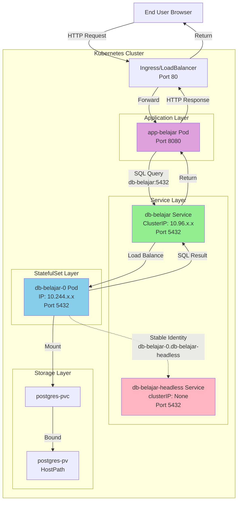

# Kubernetes Deployment Configuration

## File Order

Aplikasikan file YAML dalam urutan berikut:

```bash
kubectl apply -f 01-configmap.yml
kubectl apply -f 02-secret.yml
kubectl apply -f 03-pv.yml
kubectl apply -f 04-pvc.yml
kubectl apply -f 05-database.yml
kubectl apply -f 06-webapp.yml
```

## StatefulSet untuk Database

### Kenapa Database Menggunakan StatefulSet?

Database PostgreSQL menggunakan **StatefulSet** bukan Deployment karena:

1. **Stable Network Identity**
   - Setiap pod mendapat hostname yang konsisten: `db-belajar-0`, `db-belajar-1`, dst
   - Hostname tidak berubah meskipun pod restart

2. **Ordered Deployment/Scaling**
   - Pod dibuat dan dihapus secara berurutan
   - Pod `db-belajar-1` hanya dibuat setelah `db-belajar-0` ready
   - Saat scale down, pod dengan index tertinggi dihapus terlebih dahulu

3. **Persistent Storage**
   - StatefulSet menggunakan pre-created PVC (`postgres-pvc`)
   - Volume tetap ada meskipun pod restart
   - Data tidak hilang saat StatefulSet di-scale atau di-delete

### Service Architecture

File `05-database.yml` mendefinisikan 2 service:

#### 1. Headless Service (`db-belajar-headless`)

**Apa itu Headless Service?**

Headless Service adalah service Kubernetes tanpa ClusterIP (`clusterIP: None`). Berbeda dengan service normal yang melakukan load balancing, headless service memberikan DNS langsung ke setiap pod individual.

**Cara Deklarasi:**

```yaml
apiVersion: v1
kind: Service
metadata:
  name: db-belajar-headless
spec:
  clusterIP: None          # Ini yang membuat service menjadi headless
  ports:
  - port: 5432
    targetPort: 5432
  selector:
    app: postgres
```

**Kegunaan:**

- **Wajib untuk StatefulSet**: StatefulSet memerlukan headless service untuk stable network identity
- **Stable DNS per Pod**: Setiap pod mendapat DNS predictable:
  - `db-belajar-0.db-belajar-headless.default.svc.cluster.local`
  - `db-belajar-1.db-belajar-headless.default.svc.cluster.local` (jika scaled)
- **Direct Pod Access**: Aplikasi bisa mengakses pod tertentu secara langsung (berguna untuk master-replica setup)
- **Pod Discovery**: DNS query ke headless service mengembalikan semua IP pod (bukan ClusterIP)

**Kapan Digunakan:**

- Aplikasi perlu tahu identitas pod spesifik
- Database dengan master-replica setup (read/write splitting)
- Distributed systems yang perlu peer discovery

#### 2. Regular Service (`db-belajar`)

**Cara Deklarasi:**

```yaml
apiVersion: v1
kind: Service
metadata:
  name: db-belajar
spec:
  type: ClusterIP          # Service biasa dengan ClusterIP
  ports:
  - port: 5432
    targetPort: 5432
  selector:
    app: postgres
```

**Kegunaan:**

- **Untuk koneksi aplikasi**: Webapp menggunakan service ini
- **Load balancing**: Mendistribusikan traffic ke semua pod postgres
- **Simple endpoint**: `db-belajar.default.svc.cluster.local:5432` atau singkatnya `db-belajar:5432`
- **Abstraksi**: Aplikasi tidak perlu tahu pod mana yang melayani request

#### Perbedaan Penggunaan Kedua Service

| Aspek | Headless Service | Regular Service |
|-------|-----------------|----------------|
| ClusterIP | None | Ada (auto-assigned) |
| Load Balancing | Tidak ada | Ada |
| DNS Resolution | Semua pod IPs | Single ClusterIP |
| Digunakan oleh | StatefulSet internal | Aplikasi client |
| Endpoint | `pod-name.service-name` | `service-name` |
| Use Case | Stable pod identity | Simple client connection |

#### Request Flow Diagram



**Penjelasan Flow:**

1. **User → Ingress → WebApp**: User mengakses aplikasi via browser
2. **WebApp → Regular Service**: Aplikasi connect ke `db-belajar:5432` (regular service)
3. **Regular Service → Pod**: Service melakukan load balancing ke pod database
4. **Pod ← Headless Service**: Headless service memberikan stable DNS identity untuk pod (`db-belajar-0.db-belajar-headless`)
5. **Pod → Storage**: Pod mengakses persistent storage via PVC
6. **Response**: Data mengalir balik melalui jalur yang sama

**Catatan Penting:**

- WebApp **selalu menggunakan regular service** (`db-belajar`) untuk koneksi
- Headless service **hanya untuk StatefulSet** internal management
- Warning "SessionAffinity ignored" pada headless service adalah **normal** dan bisa diabaikan

### Volume Management

StatefulSet ini menggunakan **pre-created PVC** (bukan `volumeClaimTemplates`):

```yaml
spec:
  template:
    spec:
      volumes:
      - name: postgres-storage
        persistentVolumeClaim:
          claimName: postgres-pvc    # PVC yang sudah dibuat di 04-pvc.yml
      containers:
      - name: postgres
        volumeMounts:
        - name: postgres-storage
          mountPath: /var/lib/postgresql/data
```

**Kenapa menggunakan pre-created PVC?**

- Lebih sederhana untuk single replica setup
- PVC dan PV sudah ada dan bound sebelum StatefulSet dibuat
- Tidak perlu StorageClass khusus

**Alternative: volumeClaimTemplates**

Untuk multi-replica setup yang butuh PVC per pod, gunakan:

```yaml
volumeClaimTemplates:
- metadata:
    name: postgres-storage
  spec:
    accessModes: [ "ReadWriteOnce" ]
    resources:
      requests:
        storage: 1Gi
```

Ini akan membuat PVC otomatis: `postgres-storage-db-belajar-0`, `postgres-storage-db-belajar-1`, dst.

### PostgreSQL PGDATA Configuration

```yaml
env:
- name: PGDATA
  value: /var/lib/postgresql/data/pgdata
```

PostgreSQL memerlukan subdirectory dalam volume mount untuk menghindari error saat volume tidak kosong.

## Deployment vs StatefulSet

| Aspek | Deployment | StatefulSet |
|-------|-----------|-------------|
| Pod Name | random suffix | ordered index |
| Network Identity | tidak stabil | stabil |
| Volume | manual PVC | volumeClaimTemplates |
| Scaling | parallel | ordered |
| Use Case | stateless apps | stateful apps (DB, queue) |

## Cleanup

Untuk menghapus semua resource:

```bash
kubectl delete -f 06-webapp.yml
kubectl delete -f 05-database.yml
kubectl delete -f 04-pvc.yml
kubectl delete -f 03-pv.yml
kubectl delete -f 02-secret.yml
kubectl delete -f 01-configmap.yml
```

**Catatan**:

- PVC (`postgres-pvc`) tidak otomatis terhapus saat StatefulSet dihapus
- Jika menggunakan `volumeClaimTemplates`, PVC auto-generated juga harus dihapus manual
