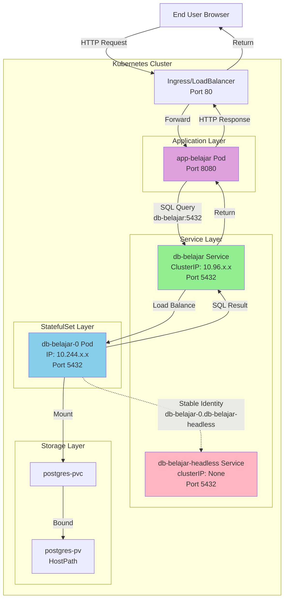

# Kubernetes Deployment Configuration

## Table of Contents

- [File Order](#file-order)
- [Penjelasan Komponen](#penjelasan-komponen)
- [StatefulSet untuk Database](#statefulset-untuk-database)
- [Mengakses Aplikasi di Berbagai Environment](#mengakses-aplikasi-di-berbagai-environment)
  - [Kind Cluster](#1-kind-cluster-podman-desktop--docker)
  - [Docker Desktop Kubernetes](#2-docker-desktop-kubernetes)
  - [Minikube](#3-minikube)
  - [K3s](#4-k3s-local-deployment)
  - [Port-forward (Universal)](#5-port-forward-universal-method)
- [Verifikasi Deployment](#verifikasi-deployment)
- [Troubleshooting](#troubleshooting)
- [Update Konfigurasi](#update-konfigurasi)
- [Persiapan Metrics Server untuk HPA](#persiapan-metrics-server-untuk-hpa)
  - [Kind Cluster](#1-kind-cluster-podman-desktop--docker-1)
  - [Docker Desktop Kubernetes](#2-docker-desktop-kubernetes-1)
  - [Minikube](#3-minikube-1)
  - [K3s](#4-k3s-1)
- [Scaling](#scaling)
  - [Manual Scaling](#manual-scaling)
  - [Horizontal Pod Autoscaler (HPA)](#horizontal-pod-autoscaler-hpa)
  - [Testing HPA dengan Load Testing](#testing-hpa-dengan-load-testing)
- [Deployment Strategies](#deployment-strategies)
  - [Rolling Update](#1-rolling-update-default)
  - [Recreate](#2-recreate-strategy)
  - [Blue-Green](#3-blue-green-deployment)
  - [Canary](#4-canary-deployment)
  - [A/B Testing](#5-ab-testing)
  - [Advanced Tools](#advanced-tools)
- [Cleanup](#cleanup)
- [Best Practices](#best-practices)

## File Order

Aplikasikan file YAML dalam urutan berikut:

```bash
kubectl apply -f 01-configmap.yml
kubectl apply -f 02-secret.yml
kubectl apply -f 03-pv.yml
kubectl apply -f 04-pvc.yml
kubectl apply -f 05-database.yml
kubectl apply -f 06-webapp.yml
```

**Catatan**: File `06-webapp.yml` default menggunakan `type: NodePort` yang compatible dengan Kind cluster. Untuk environment lain, lihat bagian [Mengakses Aplikasi di Berbagai Environment](#mengakses-aplikasi-di-berbagai-environment) atau gunakan contoh file di folder `examples/`:
- `examples/06-webapp-loadbalancer.yml` - untuk Docker Desktop K8s, Minikube, atau K3s
- `examples/06-webapp-clusterip.yml` - untuk port-forward atau Ingress

## Penjelasan Komponen

### 1. ConfigMap (01-configmap.yml)

ConfigMap menyimpan **konfigurasi non-sensitif** dalam bentuk key-value pairs:

- `POSTGRES_DB` - nama database
- `POSTGRES_USER` - username database
- `SPRING_DATASOURCE_URL` - connection string aplikasi ke database

ConfigMap bersifat **plain text** dan bisa dilihat siapa saja yang punya akses ke cluster.

### 2. Secret (02-secret.yml)

Secret menyimpan **data sensitif** seperti password, token, atau API key:

- `POSTGRES_PASSWORD` - password database

Secret di-encode dengan base64 (bukan enkripsi). Di production, gunakan enkripsi at-rest dan RBAC untuk membatasi akses.

### 3. PersistentVolume (03-pv.yml)

PersistentVolume (PV) adalah resource storage di cluster:

- Kapasitas: 1Gi
- Access mode: ReadWriteOnce (hanya bisa di-mount oleh satu node)
- Storage class: manual
- Type: hostPath (menggunakan folder di node, **tidak cocok untuk production**)

### 4. PersistentVolumeClaim (04-pvc.yml)

PersistentVolumeClaim (PVC) adalah request storage oleh pod. Pod menggunakan PVC untuk mendapatkan akses ke PV.

### 5. Database StatefulSet & Services (05-database.yml)

File ini berisi tiga resource:

**StatefulSet:**
- Menjalankan PostgreSQL 17 Alpine
- Mengambil konfigurasi dari ConfigMap dan Secret
- Mount PVC (`postgres-pvc`) ke `/var/lib/postgresql/data`
- Menggunakan pre-created PVC untuk single replica

**Headless Service (`db-belajar-headless`):**
- Untuk StatefulSet internal management
- Memberikan stable DNS identity per pod

**Regular Service (`db-belajar`):**
- Type: ClusterIP (hanya bisa diakses dari dalam cluster)
- Port: 5432
- Digunakan oleh aplikasi untuk koneksi

### 6. Webapp Deployment & Service (06-webapp.yml)

File ini berisi dua resource:

**Deployment:**
- Menjalankan aplikasi Spring Boot
- Mengambil connection string dari ConfigMap
- Connect ke database menggunakan service `db-belajar`
- Resource requests/limits **tidak defined** di default config (opsional untuk basic usage, **required untuk HPA**)

**Service:**
- Type: NodePort (bisa diakses dari luar cluster)
- Port internal: 8080
- NodePort: 30001 (port untuk akses dari luar)

#### Resource Requests dan Limits

Resource requests dan limits mengontrol berapa banyak CPU dan memory yang bisa digunakan pod.

**Apa itu Requests dan Limits?**

```yaml
resources:
  requests:
    cpu: 100m      # Minimum CPU yang dijamin tersedia
    memory: 128Mi  # Minimum memory yang dijamin tersedia
  limits:
    cpu: 500m      # Maximum CPU yang boleh digunakan
    memory: 512Mi  # Maximum memory yang boleh digunakan
```

**Requests (Guaranteed Resources):**
- Kubernetes scheduler menggunakan requests untuk memutuskan di node mana pod akan ditempatkan
- Node harus memiliki available resources >= requests
- Container **dijamin** mendapat resources sesuai requests
- Digunakan oleh HPA untuk calculate utilization percentage

**Limits (Maximum Resources):**
- Maximum resources yang boleh digunakan container
- Jika container exceed CPU limit: **throttled** (diperlambat)
- Jika container exceed memory limit: **OOMKilled** (pod direstart)
- Protect node dari resource exhaustion

**Hubungan dengan HPA:**
- HPA **WAJIB** ada resource requests untuk CPU-based autoscaling
- HPA menghitung: `CPU Utilization = (Current CPU Usage / CPU Request) * 100%`
- Tanpa requests, HPA tidak bisa calculate percentage dan akan show `<unknown>`

#### Satuan CPU: Millicore

**Apa itu Millicore?**

Millicore (millicpu) adalah unit untuk mengukur CPU resources di Kubernetes.

**Konversi:**
- `1 CPU core = 1000 millicore`
- `1000m = 1 CPU core`
- `100m = 0.1 CPU core (10%)`
- `500m = 0.5 CPU core (50%)`
- `250m = 0.25 CPU core (25%)`

**Notasi yang valid:**
- `100m` - 100 millicore
- `0.1` - 0.1 CPU core (sama dengan 100m)
- `1` - 1 CPU core (sama dengan 1000m)
- `2.5` - 2.5 CPU core (sama dengan 2500m)

**Contoh Penggunaan:**
```yaml
resources:
  requests:
    cpu: 100m      # Pod butuh minimal 0.1 core (10% dari 1 core)
    memory: 128Mi  # Pod butuh minimal 128 MiB memory
  limits:
    cpu: 500m      # Pod maksimal pakai 0.5 core (50% dari 1 core)
    memory: 512Mi  # Pod maksimal pakai 512 MiB memory
```

**Best Practices:**
- **Development**: Requests kecil (50m-100m), limits moderate (200m-500m)
- **Production**: Set berdasarkan monitoring actual usage + buffer 20-30%
- **HPA**: Requests harus realistic agar HPA trigger dengan baik
- **CPU-intensive apps**: Requests dan limits lebih besar (500m-2000m)
- **Memory-intensive apps**: Focus pada memory requests/limits

#### Satuan Memory

**Units yang valid:**
- `E, P, T, G, M, K` - Decimal (1000-based)
- `Ei, Pi, Ti, Gi, Mi, Ki` - Binary (1024-based)

**Contoh:**
- `128Mi` = 128 Mebibytes = 128 * 1024 * 1024 bytes
- `1Gi` = 1 Gibibyte = 1024 Mebibytes
- `512M` = 512 Megabytes = 512 * 1000 * 1000 bytes

**Recommended menggunakan binary units (Mi, Gi) untuk consistency.**

#### Monitoring Resource Usage

```bash
# Lihat actual resource usage pods
kubectl top pods

# Output contoh:
# NAME                          CPU(cores)   MEMORY(bytes)
# app-belajar-5995d99576-abc123 25m          156Mi

# Lihat resource requests/limits yang defined
kubectl describe pod <pod-name> | grep -A 5 "Limits\|Requests"
```

#### Menambahkan Resources ke Existing Deployment

```bash
# Patch deployment untuk add resources
kubectl patch deployment app-belajar --type='json' -p='[
  {
    "op": "add",
    "path": "/spec/template/spec/containers/0/resources",
    "value": {
      "requests": {
        "cpu": "100m",
        "memory": "128Mi"
      },
      "limits": {
        "cpu": "500m",
        "memory": "512Mi"
      }
    }
  }
]'

# Pods akan direstart dengan resource config baru
kubectl get pods -w
```

Atau gunakan example files di `examples/` yang sudah include resource requests/limits.

## StatefulSet untuk Database

### Kenapa Database Menggunakan StatefulSet?

Database PostgreSQL menggunakan **StatefulSet** bukan Deployment karena:

1. **Stable Network Identity**
   - Setiap pod mendapat hostname yang konsisten: `db-belajar-0`, `db-belajar-1`, dst
   - Hostname tidak berubah meskipun pod restart

2. **Ordered Deployment/Scaling**
   - Pod dibuat dan dihapus secara berurutan
   - Pod `db-belajar-1` hanya dibuat setelah `db-belajar-0` ready
   - Saat scale down, pod dengan index tertinggi dihapus terlebih dahulu

3. **Persistent Storage**
   - StatefulSet menggunakan pre-created PVC (`postgres-pvc`)
   - Volume tetap ada meskipun pod restart
   - Data tidak hilang saat StatefulSet di-scale atau di-delete

### Service Architecture

File `05-database.yml` mendefinisikan 2 service:

#### 1. Headless Service (`db-belajar-headless`)

**Apa itu Headless Service?**

Headless Service adalah service Kubernetes tanpa ClusterIP (`clusterIP: None`). Berbeda dengan service normal yang melakukan load balancing, headless service memberikan DNS langsung ke setiap pod individual.

**Cara Deklarasi:**

```yaml
apiVersion: v1
kind: Service
metadata:
  name: db-belajar-headless
spec:
  clusterIP: None          # Ini yang membuat service menjadi headless
  ports:
  - port: 5432
    targetPort: 5432
  selector:
    app: postgres
```

**Kegunaan:**

- **Wajib untuk StatefulSet**: StatefulSet memerlukan headless service untuk stable network identity
- **Stable DNS per Pod**: Setiap pod mendapat DNS predictable:
  - `db-belajar-0.db-belajar-headless.default.svc.cluster.local`
  - `db-belajar-1.db-belajar-headless.default.svc.cluster.local` (jika scaled)
- **Direct Pod Access**: Aplikasi bisa mengakses pod tertentu secara langsung (berguna untuk master-replica setup)
- **Pod Discovery**: DNS query ke headless service mengembalikan semua IP pod (bukan ClusterIP)

**Kapan Digunakan:**

- Aplikasi perlu tahu identitas pod spesifik
- Database dengan master-replica setup (read/write splitting)
- Distributed systems yang perlu peer discovery

#### 2. Regular Service (`db-belajar`)

**Cara Deklarasi:**

```yaml
apiVersion: v1
kind: Service
metadata:
  name: db-belajar
spec:
  type: ClusterIP          # Service biasa dengan ClusterIP
  ports:
  - port: 5432
    targetPort: 5432
  selector:
    app: postgres
```

**Kegunaan:**

- **Untuk koneksi aplikasi**: Webapp menggunakan service ini
- **Load balancing**: Mendistribusikan traffic ke semua pod postgres
- **Simple endpoint**: `db-belajar.default.svc.cluster.local:5432` atau singkatnya `db-belajar:5432`
- **Abstraksi**: Aplikasi tidak perlu tahu pod mana yang melayani request

#### Perbedaan Penggunaan Kedua Service

| Aspek | Headless Service | Regular Service |
|-------|-----------------|----------------|
| ClusterIP | None | Ada (auto-assigned) |
| Load Balancing | Tidak ada | Ada |
| DNS Resolution | Semua pod IPs | Single ClusterIP |
| Digunakan oleh | StatefulSet internal | Aplikasi client |
| Endpoint | `pod-name.service-name` | `service-name` |
| Use Case | Stable pod identity | Simple client connection |

#### Request Flow Diagram



**Penjelasan Flow:**

1. **User → Ingress → WebApp**: User mengakses aplikasi via browser
2. **WebApp → Regular Service**: Aplikasi connect ke `db-belajar:5432` (regular service)
3. **Regular Service → Pod**: Service melakukan load balancing ke pod database
4. **Pod ← Headless Service**: Headless service memberikan stable DNS identity untuk pod (`db-belajar-0.db-belajar-headless`)
5. **Pod → Storage**: Pod mengakses persistent storage via PVC
6. **Response**: Data mengalir balik melalui jalur yang sama

**Catatan Penting:**

- WebApp **selalu menggunakan regular service** (`db-belajar`) untuk koneksi
- Headless service **hanya untuk StatefulSet** internal management
- Warning "SessionAffinity ignored" pada headless service adalah **normal** dan bisa diabaikan

### Volume Management

StatefulSet ini menggunakan **pre-created PVC** (bukan `volumeClaimTemplates`):

```yaml
spec:
  template:
    spec:
      volumes:
      - name: postgres-storage
        persistentVolumeClaim:
          claimName: postgres-pvc    # PVC yang sudah dibuat di 04-pvc.yml
      containers:
      - name: postgres
        volumeMounts:
        - name: postgres-storage
          mountPath: /var/lib/postgresql/data
```

**Kenapa menggunakan pre-created PVC?**

- Lebih sederhana untuk single replica setup
- PVC dan PV sudah ada dan bound sebelum StatefulSet dibuat
- Tidak perlu StorageClass khusus

**Alternative: volumeClaimTemplates**

Untuk multi-replica setup yang butuh PVC per pod, gunakan:

```yaml
volumeClaimTemplates:
- metadata:
    name: postgres-storage
  spec:
    accessModes: [ "ReadWriteOnce" ]
    resources:
      requests:
        storage: 1Gi
```

Ini akan membuat PVC otomatis: `postgres-storage-db-belajar-0`, `postgres-storage-db-belajar-1`, dst.

### PostgreSQL PGDATA Configuration

```yaml
env:
- name: PGDATA
  value: /var/lib/postgresql/data/pgdata
```

PostgreSQL memerlukan subdirectory dalam volume mount untuk menghindari error saat volume tidak kosong.

## Deployment vs StatefulSet

| Aspek | Deployment | StatefulSet |
|-------|-----------|-------------|
| Pod Name | random suffix | ordered index |
| Network Identity | tidak stabil | stabil |
| Volume | manual PVC | volumeClaimTemplates |
| Scaling | parallel | ordered |
| Use Case | stateless apps | stateful apps (DB, queue) |

## Mengakses Aplikasi di Berbagai Environment

Service type yang digunakan untuk expose aplikasi berbeda-beda tergantung environment Kubernetes yang digunakan.

### Summary Table

| Environment | Database Service | WebApp Service | Extra Steps | Notes |
|------------|------------------|----------------|-------------|-------|
| **Kind (Podman/Docker)** | ClusterIP | NodePort + port mapping | Config cluster dengan `extraPortMappings` | Butuh konfigurasi saat create cluster |
| **Docker Desktop K8s** | ClusterIP | LoadBalancer | Tidak ada | LoadBalancer otomatis exposed di localhost |
| **Minikube** | ClusterIP | LoadBalancer | `minikube tunnel` (keep running) | Atau gunakan `minikube service` |
| **K3s** | ClusterIP | LoadBalancer atau Ingress | Tidak ada | ServiceLB (Klipper) dan Traefik pre-installed |
| **Port-forward** | ClusterIP | ClusterIP | `kubectl port-forward` | Works di semua environment |

### 1. Kind Cluster (Podman Desktop / Docker)

Kind tidak support LoadBalancer secara native. Ada beberapa opsi:

#### Opsi A: NodePort dengan Port Mapping (Recommended untuk Dev)

**Step 1**: Gunakan cluster config file `examples/kind-config.yaml` yang sudah tersedia:

```yaml
kind: Cluster
apiVersion: kind.x-k8s.io/v1alpha4
nodes:
- role: control-plane
  extraPortMappings:
  - containerPort: 30001
    hostPort: 8080
    listenAddress: "0.0.0.0"
    protocol: TCP
```

**Step 2**: Create cluster dengan config:

```bash
# Dengan Docker
kind create cluster --config examples/kind-config.yaml

# Dengan Podman (experimental)
KIND_EXPERIMENTAL_PROVIDER=podman kind create cluster --config examples/kind-config.yaml
```

**Step 3**: Deploy aplikasi dengan NodePort service (file sudah menggunakan NodePort 30001):

```bash
kubectl apply -f k8s/
```

**Step 4**: Akses aplikasi:

```
http://localhost:8080/api/product
```

#### Opsi B: Port-forward (Paling Simple)

Tidak perlu konfigurasi cluster khusus:

```bash
kubectl port-forward service/app-belajar 8080:8080
```

Akses di `http://localhost:8080/api/product`

#### Opsi C: LoadBalancer dengan Cloud Provider Kind (Advanced)

Install Cloud Provider Kind untuk support LoadBalancer:

```bash
# Install cloud-provider-kind
go install sigs.k8s.io/cloud-provider-kind@latest

# Run controller (keep running di terminal terpisah)
cloud-provider-kind
```

Ubah service type menjadi LoadBalancer di `06-webapp.yml`.

### 2. Docker Desktop Kubernetes

Docker Desktop memiliki LoadBalancer support built-in yang sangat mudah digunakan.

**Step 1**: Ubah webapp service type menjadi LoadBalancer di `06-webapp.yml`:

```yaml
apiVersion: v1
kind: Service
metadata:
  name: app-belajar
spec:
  type: LoadBalancer    # Ubah dari NodePort
  ports:
  - port: 8080
    targetPort: 8080
  selector:
    app: belajar-app
```

**Step 2**: Deploy aplikasi:

```bash
kubectl apply -f k8s/
```

**Step 3**: Verify service:

```bash
kubectl get svc app-belajar
```

Output akan menunjukkan EXTERNAL-IP: `localhost`

**Step 4**: Akses aplikasi:

```
http://localhost:8080/api/product
```

**PENTING**: Docker Desktop hanya bisa expose **SATU** LoadBalancer service. Jika ada service LoadBalancer lain, akan stuck di `Pending`.

**Alternative**: Tetap gunakan NodePort atau port-forward jika butuh multiple exposed services.

### 3. Minikube

Minikube support LoadBalancer dengan command `minikube tunnel`.

#### Opsi A: LoadBalancer dengan Minikube Tunnel

**Step 1**: Ubah webapp service type menjadi LoadBalancer di `06-webapp.yml`:

```yaml
apiVersion: v1
kind: Service
metadata:
  name: app-belajar
spec:
  type: LoadBalancer
  ports:
  - port: 8080
    targetPort: 8080
  selector:
    app: belajar-app
```

**Step 2**: Deploy aplikasi:

```bash
kubectl apply -f k8s/
```

**Step 3**: Jalankan minikube tunnel (di terminal terpisah, keep running):

```bash
minikube tunnel
```

Command ini butuh **sudo/root privileges** karena membuat network route.

**Step 4**: Cek EXTERNAL-IP:

```bash
kubectl get svc app-belajar
```

Output akan menunjukkan EXTERNAL-IP (misal: `10.96.x.x`)

**Step 5**: Akses aplikasi:

```
http://<EXTERNAL-IP>:8080/api/product
```

#### Opsi B: NodePort dengan Minikube Service

Jika tetap menggunakan NodePort (tidak perlu ubah file):

```bash
# Get URL untuk akses service
minikube service app-belajar --url

# Atau langsung buka di browser
minikube service app-belajar
```

#### Opsi C: Port-forward

```bash
kubectl port-forward service/app-belajar 8080:8080
```

### 4. K3s (Local Deployment)

K3s adalah environment yang paling production-like dengan built-in ServiceLB (Klipper) dan Traefik Ingress.

#### Opsi A: LoadBalancer (Recommended)

K3s sudah include ServiceLB (Klipper) yang otomatis handle LoadBalancer services.

**Step 1**: Ubah webapp service type menjadi LoadBalancer di `06-webapp.yml`:

```yaml
apiVersion: v1
kind: Service
metadata:
  name: app-belajar
spec:
  type: LoadBalancer
  ports:
  - port: 8080
    targetPort: 8080
  selector:
    app: belajar-app
```

**Step 2**: Deploy aplikasi:

```bash
kubectl apply -f k8s/
```

**Step 3**: Cek EXTERNAL-IP:

```bash
kubectl get svc app-belajar
```

EXTERNAL-IP akan otomatis assigned (biasanya IP node).

**Step 4**: Akses aplikasi:

```
http://<EXTERNAL-IP>:8080/api/product
```

#### Opsi B: Ingress dengan Traefik (Production-like)

K3s sudah include Traefik Ingress Controller.

**Step 1**: Gunakan Ingress resource di `examples/07-ingress.yml`:

```yaml
apiVersion: networking.k8s.io/v1
kind: Ingress
metadata:
  name: app-belajar-ingress
  annotations:
    traefik.ingress.kubernetes.io/router.entrypoints: web
spec:
  rules:
  - host: belajar.local
    http:
      paths:
      - path: /
        pathType: Prefix
        backend:
          service:
            name: app-belajar
            port:
              number: 8080
```

**Step 2**: Gunakan ClusterIP service (copy dari `examples/06-webapp-clusterip.yml`):

```bash
cp examples/06-webapp-clusterip.yml 06-webapp.yml
```

**Step 3**: Deploy:

```bash
kubectl apply -f k8s/
kubectl apply -f examples/07-ingress.yml
```

**Step 4**: Tambahkan ke `/etc/hosts`:

```bash
echo "127.0.0.1 belajar.local" | sudo tee -a /etc/hosts
```

**Step 5**: Akses aplikasi:

```
http://belajar.local/api/product
```

### 5. Port-forward (Universal Method)

Metode ini bekerja di **semua environment** tanpa perubahan konfigurasi:

```bash
# Port-forward webapp
kubectl port-forward service/app-belajar 8080:8080

# Akses di browser
http://localhost:8080/api/product
```

**Keuntungan**:
- Tidak perlu ubah service type
- Works di semua environment
- Bagus untuk development/debugging

**Kekurangan**:
- Harus keep terminal running
- Hanya bisa diakses dari localhost
- Tidak cocok untuk sharing dengan team

### Rekomendasi per Use Case

**Local Development (Solo)**:
- Port-forward: Paling simple dan universal

**Local Development (Team/Demo)**:
- Docker Desktop K8s: LoadBalancer works out-of-box
- Minikube: `minikube service` command
- K3s: LoadBalancer atau Ingress

**Learning Production Setup**:
- K3s dengan Ingress: Paling mirip production

**CI/CD Testing**:
- Kind dengan NodePort + port mapping: Reproducible cluster config

## Verifikasi Deployment

### Cek Status Resource

```bash
# Cek semua pods
kubectl get pods

# Cek semua services
kubectl get svc

# Cek ConfigMap dan Secret
kubectl get configmap
kubectl get secret

# Cek PV dan PVC
kubectl get pv,pvc
```

### Lihat Detail dan Logs

```bash
# Detail pod tertentu
kubectl describe pod <nama-pod>

# Log database
kubectl logs statefulset/db-belajar

# Log aplikasi
kubectl logs deployment/app-belajar

# Follow log (terus update)
kubectl logs -f deployment/app-belajar
```

### Lihat Isi ConfigMap dan Secret

```bash
# Lihat ConfigMap
kubectl get configmap belajar-config -o yaml

# Lihat Secret (encoded)
kubectl get secret belajar-secret -o yaml

# Decode secret untuk melihat nilai asli
kubectl get secret belajar-secret -o jsonpath='{.data.POSTGRES_PASSWORD}' | base64 -d
```

## Troubleshooting

### Pod Tidak Bisa Start

```bash
# Lihat events untuk pod yang error
kubectl describe pod <nama-pod>

# Lihat log pod yang error
kubectl logs <nama-pod>

# Lihat previous log jika pod crash
kubectl logs <nama-pod> --previous
```

### Database Tidak Bisa Diakses

```bash
# Cek apakah service database sudah running
kubectl get svc db-belajar

# Test koneksi dari pod aplikasi
kubectl exec -it deployment/app-belajar -- /bin/sh
# Di dalam pod:
ping db-belajar
```

### PVC Pending/Tidak Bind ke PV

```bash
# Cek status PVC
kubectl get pvc

# Cek detail PVC
kubectl describe pvc postgres-pvc

# Cek apakah ada PV yang available
kubectl get pv
```

Common issues:
- StorageClass tidak ditemukan
- PV sudah bound ke PVC lain
- Access mode tidak match
- Kapasitas storage tidak mencukupi

## Update Konfigurasi

### Update ConfigMap

```bash
# Edit ConfigMap
kubectl edit configmap belajar-config

# Atau update dari file
kubectl apply -f 01-configmap.yml

# Restart pod agar membaca konfigurasi baru
kubectl rollout restart deployment/app-belajar
```

### Update Secret

```bash
# Edit Secret
kubectl edit secret belajar-secret

# Restart pod agar membaca secret baru
kubectl rollout restart statefulset/db-belajar
```

### Update Image Aplikasi

```bash
# Set image baru
kubectl set image deployment/app-belajar belajar-app=endymuhardin/belajar-container:v2

# Monitor rollout
kubectl rollout status deployment/app-belajar

# Rollback jika ada masalah
kubectl rollout undo deployment/app-belajar
```

## Persiapan Metrics Server untuk HPA

Horizontal Pod Autoscaler (HPA) membutuhkan Metrics Server untuk mendapatkan data CPU dan memory usage. Setup berbeda untuk setiap environment.

### Apa itu Metrics Server?

Metrics Server adalah komponen cluster yang mengumpulkan resource metrics dari Kubelet dan menyediakannya melalui Metrics API untuk digunakan oleh:
- Horizontal Pod Autoscaler (HPA)
- Vertical Pod Autoscaler (VPA)
- `kubectl top` command

### 1. Kind Cluster (Podman Desktop / Docker)

Kind **tidak include** Metrics Server. Perlu install manual.

**Step 1**: Install Metrics Server:

```bash
kubectl apply -f https://github.com/kubernetes-sigs/metrics-server/releases/latest/download/components.yaml
```

**Step 2**: Patch deployment untuk allow insecure TLS (required untuk local cluster):

```bash
kubectl patch deployment metrics-server -n kube-system --type='json' -p='[
  {
    "op": "add",
    "path": "/spec/template/spec/containers/0/args/-",
    "value": "--kubelet-insecure-tls"
  },
  {
    "op": "add",
    "path": "/spec/template/spec/containers/0/args/-",
    "value": "--kubelet-preferred-address-types=InternalIP"
  }
]'
```

**Step 3**: Verify installation:

```bash
# Tunggu pod running
kubectl get pods -n kube-system | grep metrics-server

# Test metrics API
kubectl top nodes
kubectl top pods
```

### 2. Docker Desktop Kubernetes

Docker Desktop **tidak include** Metrics Server. Perlu install manual.

**Step 1**: Install Metrics Server:

```bash
kubectl apply -f https://github.com/kubernetes-sigs/metrics-server/releases/latest/download/components.yaml
```

**Step 2**: Patch deployment untuk allow insecure TLS:

```bash
kubectl patch deployment metrics-server -n kube-system --type='json' -p='[
  {
    "op": "add",
    "path": "/spec/template/spec/containers/0/args/-",
    "value": "--kubelet-insecure-tls"
  }
]'
```

**Step 3**: Verify installation:

```bash
# Tunggu pod running (bisa sampai 1-2 menit)
kubectl get pods -n kube-system -w | grep metrics-server

# Test metrics API
kubectl top nodes
kubectl top pods
```

**Troubleshooting**: Jika `kubectl top` error "metrics not available yet", tunggu beberapa menit untuk metrics server collect data pertama kali.

### 3. Minikube

Minikube sudah include Metrics Server, tapi **disabled by default**.

**Step 1**: Enable metrics-server addon:

```bash
minikube addons enable metrics-server
```

**Step 2**: Verify installation:

```bash
# Cek addon enabled
minikube addons list | grep metrics-server

# Test metrics API (tunggu ~30 detik setelah enable)
kubectl top nodes
kubectl top pods
```

**Sangat mudah!** Hanya 1 command untuk enable.

### 4. K3s

K3s **already include** Metrics Server dan **enabled by default**.

**Tidak perlu install apa-apa!** Langsung bisa digunakan.

**Verify installation:**

```bash
# Cek metrics-server pod
kubectl get pods -n kube-system | grep metrics-server

# Test metrics API
kubectl top nodes
kubectl top pods
```

**Catatan**: Jika saat install K3s menggunakan flag `--disable metrics-server`, perlu install manual atau reinstall K3s tanpa flag tersebut.

### Summary Metrics Server Setup

| Environment | Status | Setup Command |
|------------|--------|---------------|
| **Kind** | Not installed | `kubectl apply -f ...` + patch |
| **Docker Desktop K8s** | Not installed | `kubectl apply -f ...` + patch |
| **Minikube** | Installed, disabled | `minikube addons enable metrics-server` |
| **K3s** | Installed, enabled | No setup needed |

### Troubleshooting Metrics Server

**Error: "metrics not available yet"**
```bash
# Tunggu 1-2 menit untuk metrics server collect data
# Cek pod status
kubectl get pods -n kube-system | grep metrics-server

# Cek logs jika ada error
kubectl logs -n kube-system deployment/metrics-server
```

**Error: "unable to fetch metrics"**
```bash
# Untuk Kind/Docker Desktop, pastikan --kubelet-insecure-tls sudah ditambahkan
kubectl get deployment metrics-server -n kube-system -o yaml | grep kubelet-insecure-tls
```

**Pod stuck di ContainerCreating**
```bash
# Cek events
kubectl describe pod -n kube-system <metrics-server-pod-name>
```

## Scaling

### Manual Scaling

```bash
# Scale aplikasi web menjadi 3 replicas
kubectl scale deployment app-belajar --replicas=3

# Verifikasi
kubectl get deployments
kubectl get pods

# Scale down menjadi 1
kubectl scale deployment app-belajar --replicas=1
```

**PERINGATAN**: Database StatefulSet tidak bisa di-scale horizontal sembarangan. Butuh setup replication/clustering yang proper.

### Horizontal Pod Autoscaler (HPA)

HPA secara otomatis scale pod berdasarkan CPU atau memory usage.

#### Prerequisites HPA

**1. Metrics Server harus terinstall** (lihat [Persiapan Metrics Server](#persiapan-metrics-server-untuk-hpa))

**2. Deployment harus memiliki resource requests**

HPA **WAJIB** ada resource requests untuk calculate CPU percentage. Update deployment:

```yaml
apiVersion: apps/v1
kind: Deployment
metadata:
  name: app-belajar
spec:
  template:
    spec:
      containers:
      - name: app
        image: endymuhardin/belajar-container:latest
        resources:
          requests:
            cpu: 100m      # 100 millicore (0.1 CPU core)
            memory: 128Mi
          limits:
            cpu: 500m      # Max 500 millicore (0.5 CPU core)
            memory: 512Mi
```

Atau patch existing deployment:

```bash
kubectl patch deployment app-belajar --type='json' -p='[
  {
    "op": "add",
    "path": "/spec/template/spec/containers/0/resources",
    "value": {
      "requests": {
        "cpu": "100m",
        "memory": "128Mi"
      },
      "limits": {
        "cpu": "500m",
        "memory": "512Mi"
      }
    }
  }
]'
```

#### Setup HPA

**Cara 1: Using kubectl autoscale command**

```bash
# Setup autoscaler (min 1, max 5 replicas, target CPU 50%)
kubectl autoscale deployment app-belajar --min=1 --max=5 --cpu-percent=50

# Lihat status HPA
kubectl get hpa

# Detail HPA
kubectl describe hpa app-belajar

# Watch HPA real-time
kubectl get hpa app-belajar -w
```

**Cara 2: Using YAML manifest**

Buat file `hpa.yml`:

```yaml
apiVersion: autoscaling/v2
kind: HorizontalPodAutoscaler
metadata:
  name: app-belajar-hpa
spec:
  scaleTargetRef:
    apiVersion: apps/v1
    kind: Deployment
    name: app-belajar
  minReplicas: 1
  maxReplicas: 10
  metrics:
  - type: Resource
    resource:
      name: cpu
      target:
        type: Utilization
        averageUtilization: 50
  - type: Resource
    resource:
      name: memory
      target:
        type: Utilization
        averageUtilization: 80
  behavior:
    scaleDown:
      stabilizationWindowSeconds: 300  # Wait 5 min before scale down
      policies:
      - type: Percent
        value: 50
        periodSeconds: 60
    scaleUp:
      stabilizationWindowSeconds: 0    # Scale up immediately
      policies:
      - type: Percent
        value: 100
        periodSeconds: 30
      - type: Pods
        value: 2
        periodSeconds: 60
```

Apply:

```bash
kubectl apply -f hpa.yml
```

#### Testing HPA dengan Load Testing

**PENTING**: Aplikasi Spring Boot ini relatif ringan dan mungkin tidak cepat mengkonsumsi CPU. Untuk test HPA lebih efektif, aplikasi perlu dimodifikasi dengan operasi CPU-intensive (misalnya: kriptografi, kompresi, atau kalkulasi kompleks di request handler).

**Opsi 1: Load Test dari Pod di Cluster (Recommended)**

Jalankan load test dari dalam cluster untuk hasil lebih akurat:

```bash
# Deploy pod untuk load testing
kubectl run load-generator --image=busybox --restart=Never -- /bin/sh -c "while true; do wget -q -O- http://app-belajar:8080/api/product; done"

# Atau gunakan hey (lebih powerful)
kubectl run load-generator --image=williamyeh/hey:latest --restart=Never -- \
  -z 5m -c 50 http://app-belajar:8080/api/product

# Watch HPA response
kubectl get hpa app-belajar -w

# Lihat pod scaling
kubectl get pods -l app=belajar-app -w

# Cleanup setelah test
kubectl delete pod load-generator
```

**Opsi 2: Load Test dengan Apache Bench (dari host)**

Jika aplikasi accessible dari host (LoadBalancer/NodePort):

```bash
# Install apache bench
# macOS: brew install httpd
# Ubuntu: apt-get install apache2-utils
# Fedora: dnf install httpd-tools

# Test dengan 1000 requests, 50 concurrent
ab -n 1000 -c 50 http://localhost:8080/api/product

# Continuous load test (5 minutes)
ab -t 300 -c 50 http://localhost:8080/api/product
```

**Opsi 3: Load Test dengan hey (lebih baik dari ab)**

```bash
# Install hey
# macOS: brew install hey
# Linux: go install github.com/rakyll/hey@latest

# Test dengan 200 requests per second selama 5 menit
hey -z 5m -q 200 http://localhost:8080/api/product

# Test dengan 50 concurrent workers
hey -z 5m -c 50 http://localhost:8080/api/product

# Watch metrics
kubectl top pods
kubectl get hpa -w
```

**Opsi 4: Load Test dengan port-forward**

Jika menggunakan ClusterIP service:

```bash
# Terminal 1: Port-forward
kubectl port-forward service/app-belajar 8080:8080

# Terminal 2: Watch HPA
kubectl get hpa app-belajar -w

# Terminal 3: Load test
hey -z 5m -c 50 http://localhost:8080/api/product
```

#### Deploy Load Test Pod dengan Deployment

Untuk load test yang lebih controlled:

```yaml
apiVersion: apps/v1
kind: Deployment
metadata:
  name: load-generator
spec:
  replicas: 3  # Sesuaikan untuk load yang diinginkan
  selector:
    matchLabels:
      app: load-generator
  template:
    metadata:
      labels:
        app: load-generator
    spec:
      containers:
      - name: load-gen
        image: busybox
        command: ["/bin/sh"]
        args:
          - -c
          - "while true; do wget -q -O- http://app-belajar:8080/api/product; done"
```

```bash
# Deploy load generator
kubectl apply -f load-generator.yml

# Watch HPA dan pods
watch 'kubectl get hpa && echo && kubectl get pods'

# Hapus load generator
kubectl delete -f load-generator.yml
```

#### Monitoring HPA Behavior

```bash
# Lihat current metrics
kubectl get hpa

# Output:
# NAME          REFERENCE                TARGETS   MINPODS   MAXPODS   REPLICAS   AGE
# app-belajar   Deployment/app-belajar   45%/50%   1         5         2          5m

# Watch real-time
kubectl get hpa -w

# Detailed events
kubectl describe hpa app-belajar

# Pod resource usage
kubectl top pods -l app=belajar-app

# Node resource usage
kubectl top nodes
```

#### Expected HPA Behavior

**Scale Up:**
1. Load test dimulai
2. CPU usage naik > 50%
3. HPA detect high usage (~30 detik)
4. New pods created
5. Load distributed ke lebih banyak pods
6. CPU usage per pod turun

**Scale Down:**
1. Load test dihentikan
2. CPU usage turun < 50%
3. HPA wait stabilization window (5 menit default)
4. Pods scaled down gradually
5. Kembali ke minReplicas

#### Troubleshooting HPA

**HPA shows `<unknown>` targets:**

```bash
# Cek apakah resource requests sudah defined
kubectl get deployment app-belajar -o jsonpath='{.spec.template.spec.containers[0].resources}'

# Jika empty, tambahkan resource requests
```

**HPA tidak scale meskipun CPU tinggi:**

```bash
# Cek metrics server
kubectl top pods

# Cek HPA status
kubectl describe hpa app-belajar

# Lihat events
kubectl get events --sort-by='.lastTimestamp' | grep HorizontalPodAutoscaler
```

**Pods tidak naik meskipun HPA trigger:**

```bash
# Cek apakah sudah hit maxReplicas
kubectl get hpa

# Cek resource availability di node
kubectl top nodes
kubectl describe nodes
```

#### Cleanup HPA

```bash
# Hapus HPA
kubectl delete hpa app-belajar
# atau
kubectl delete -f hpa.yml

# Hapus load generator (jika ada)
kubectl delete deployment load-generator
```

#### Catatan untuk Aplikasi Production-Ready

Aplikasi current (`endymuhardin/belajar-container`) mungkin terlalu ringan untuk test HPA dengan efektif. Untuk production atau testing yang lebih realistis, pertimbangkan:

1. **Tambahkan CPU-intensive operations:**
   - Kriptografi (bcrypt hashing)
   - Image processing/compression
   - Complex calculations
   - JSON serialization/deserialization dengan dataset besar

2. **Gunakan custom metrics:**
   - Request per second (RPS)
   - Request latency
   - Queue depth
   - Custom business metrics

3. **Implement readiness/liveness probes:**
   - Ensure pods are ready before receiving traffic
   - Auto-restart unhealthy pods

### Load Balancing

Service otomatis melakukan load balancing ke semua replicas:

```bash
# Lihat endpoints yang di-manage oleh service
kubectl get endpoints app-belajar

# Test load balancing (akses berulang kali)
for i in {1..10}; do
  curl http://localhost:10001/api/product
done

# Lihat log dari semua replicas
kubectl logs -l app=belajar-app --tail=20
```

## Deployment Strategies

Kubernetes mendukung berbagai strategi deployment untuk minimize downtime dan risk saat update aplikasi.

### 1. Rolling Update (Default)

Rolling Update adalah strategi default di Kubernetes. Pods di-update secara bertahap tanpa downtime.

**Cara Kerja:**
1. Create new pods dengan versi baru (sesuai maxSurge)
2. Wait until new pods ready
3. Terminate old pods (sesuai maxUnavailable)
4. Repeat sampai semua pods updated

**Konfigurasi:**

```yaml
apiVersion: apps/v1
kind: Deployment
metadata:
  name: app-belajar
spec:
  replicas: 3
  strategy:
    type: RollingUpdate
    rollingUpdate:
      maxSurge: 1        # Max pods tambahan saat update
      maxUnavailable: 0  # Max pods yang boleh unavailable
  template:
    spec:
      containers:
      - name: app
        image: endymuhardin/belajar-container:v2
```

**Parameters:**

**maxSurge:**
- Maximum pods tambahan yang bisa dibuat saat update
- Bisa integer (1, 2, 3) atau percentage (25%, 50%)
- Default: 25%
- Higher value = faster update tapi butuh lebih banyak resources

**maxUnavailable:**
- Maximum pods yang boleh unavailable saat update
- Bisa integer atau percentage
- Default: 25%
- Tidak boleh 0 bersamaan dengan maxSurge: 0

**Skenario Best Practices:**

```yaml
# Zero-Downtime (High Availability)
maxSurge: 1
maxUnavailable: 0
# Always maintain full capacity, create new pod before terminating old

# Fast Update (Resource Constrained)
maxSurge: 0
maxUnavailable: 1
# No extra pods, terminate one before creating new

# Balanced
maxSurge: 1
maxUnavailable: 1
# Default behavior, balance speed and availability

# Aggressive Update
maxSurge: 100%
maxUnavailable: 0
# Double pods temporarily, update all at once (costly)
```

**Execute Rolling Update:**

```bash
# Update image version
kubectl set image deployment/app-belajar app=endymuhardin/belajar-container:v2

# Watch rollout
kubectl rollout status deployment/app-belajar

# Monitor pods
kubectl get pods -w

# Rollout history
kubectl rollout history deployment/app-belajar

# Rollback to previous version
kubectl rollout undo deployment/app-belajar

# Rollback to specific revision
kubectl rollout undo deployment/app-belajar --to-revision=2

# Pause rollout (untuk investigation)
kubectl rollout pause deployment/app-belajar

# Resume rollout
kubectl rollout resume deployment/app-belajar
```

**Advantages:**
- Zero downtime
- Automatic rollback jika health check fail
- Gradual update minimize risk

**Disadvantages:**
- Both versions running simultaneously
- Rollback tidak instant (perlu rolling back)
- Bisa ada temporary inconsistency

### 2. Recreate Strategy

Terminate semua pods lama, lalu create semua pods baru.

**Konfigurasi:**

```yaml
apiVersion: apps/v1
kind: Deployment
metadata:
  name: app-belajar
spec:
  replicas: 3
  strategy:
    type: Recreate
  template:
    spec:
      containers:
      - name: app
        image: endymuhardin/belajar-container:v2
```

**Kapan Digunakan:**
- Aplikasi tidak bisa run 2 versi bersamaan
- Database migration yang breaking
- Stateful apps dengan shared state
- Dev/test environments

**Advantages:**
- Simple dan straightforward
- No mixed versions
- No resource overhead

**Disadvantages:**
- **Downtime** selama update
- All-or-nothing (no gradual rollout)

**Execute:**

```bash
kubectl apply -f deployment-recreate.yml

# Monitor
kubectl get pods -w
```

### 3. Blue-Green Deployment

Maintain 2 production environments (blue = current, green = new). Switch traffic setelah new version tested.

**Implementation di Kubernetes:**

Blue-Green di K8s native dilakukan dengan:
1. Deploy new version sebagai deployment terpisah
2. Test new version
3. Update service selector untuk route traffic ke new version

**Setup:**

**Step 1**: Deploy Blue (current version):

```yaml
apiVersion: apps/v1
kind: Deployment
metadata:
  name: app-belajar-blue
  labels:
    app: belajar-app
spec:
  replicas: 3
  selector:
    matchLabels:
      app: belajar-app
      version: blue
  template:
    metadata:
      labels:
        app: belajar-app
        version: blue
    spec:
      containers:
      - name: app
        image: endymuhardin/belajar-container:v1
```

**Step 2**: Service awalnya pointing ke blue:

```yaml
apiVersion: v1
kind: Service
metadata:
  name: app-belajar
spec:
  selector:
    app: belajar-app
    version: blue  # Traffic ke blue
  ports:
  - port: 8080
    targetPort: 8080
```

**Step 3**: Deploy Green (new version):

```yaml
apiVersion: apps/v1
kind: Deployment
metadata:
  name: app-belajar-green
  labels:
    app: belajar-app
spec:
  replicas: 3
  selector:
    matchLabels:
      app: belajar-app
      version: green
  template:
    metadata:
      labels:
        app: belajar-app
        version: green
    spec:
      containers:
      - name: app
        image: endymuhardin/belajar-container:v2
```

**Step 4**: Test green environment:

```bash
# Deploy green
kubectl apply -f deployment-green.yml

# Wait until ready
kubectl wait --for=condition=ready pod -l version=green --timeout=300s

# Test green directly (port-forward)
kubectl port-forward deployment/app-belajar-green 9090:8080

# Test in browser: http://localhost:9090/api/product
```

**Step 5**: Switch traffic dari blue ke green:

```bash
# Update service selector
kubectl patch service app-belajar -p '{"spec":{"selector":{"version":"green"}}}'

# Verify
kubectl get service app-belajar -o yaml | grep -A 2 selector

# Monitor
kubectl get endpoints app-belajar
```

**Step 6**: Rollback jika ada issue:

```bash
# Switch back to blue
kubectl patch service app-belajar -p '{"spec":{"selector":{"version":"blue"}}}'
```

**Step 7**: Cleanup old version:

```bash
# Setelah yakin green version stable
kubectl delete deployment app-belajar-blue
```

**Advantages:**
- Instant traffic switch
- Easy rollback (just switch selector)
- Zero downtime
- Full testing di production environment sebelum switch

**Disadvantages:**
- **Double resources** during transition
- Database migration complexity
- Both versions must be compatible dengan same database schema

### 4. Canary Deployment

Deploy new version ke subset kecil user dulu, gradually increase traffic jika stable.

**Implementation Options:**

#### Option A: Native Kubernetes (Manual Replica Control)

Control traffic dengan adjust replica count.

```yaml
# v1 (stable) - 9 replicas
apiVersion: apps/v1
kind: Deployment
metadata:
  name: app-belajar-v1
spec:
  replicas: 9
  selector:
    matchLabels:
      app: belajar-app
      version: v1
  template:
    metadata:
      labels:
        app: belajar-app
        version: v1
    spec:
      containers:
      - name: app
        image: endymuhardin/belajar-container:v1
---
# v2 (canary) - 1 replica (10% traffic)
apiVersion: apps/v1
kind: Deployment
metadata:
  name: app-belajar-v2
spec:
  replicas: 1
  selector:
    matchLabels:
      app: belajar-app
      version: v2
  template:
    metadata:
      labels:
        app: belajar-app
        version: v2
    spec:
      containers:
      - name: app
        image: endymuhardin/belajar-container:v2
---
# Service select both versions
apiVersion: v1
kind: Service
metadata:
  name: app-belajar
spec:
  selector:
    app: belajar-app  # No version selector = both versions
  ports:
  - port: 8080
    targetPort: 8080
```

**Gradually increase canary traffic:**

```bash
# Start: 10% canary (1 replica canary, 9 replicas stable)
kubectl scale deployment app-belajar-v2 --replicas=1
kubectl scale deployment app-belajar-v1 --replicas=9

# Monitor metrics
kubectl top pods -l app=belajar-app
kubectl logs -l version=v2 --tail=100

# Increase to 25% (1:3 ratio)
kubectl scale deployment app-belajar-v2 --replicas=1
kubectl scale deployment app-belajar-v1 --replicas=3

# Increase to 50% (1:1 ratio)
kubectl scale deployment app-belajar-v2 --replicas=2
kubectl scale deployment app-belajar-v1 --replicas=2

# Full rollout to 100%
kubectl scale deployment app-belajar-v2 --replicas=3
kubectl scale deployment app-belajar-v1 --replicas=0

# Cleanup old version
kubectl delete deployment app-belajar-v1
```

#### Option B: NGINX Ingress Controller (Weight-based)

Lebih precise traffic control dengan Ingress annotations.

```yaml
# Main ingress (stable version)
apiVersion: networking.k8s.io/v1
kind: Ingress
metadata:
  name: app-belajar-stable
spec:
  ingressClassName: nginx
  rules:
  - host: belajar.local
    http:
      paths:
      - path: /
        pathType: Prefix
        backend:
          service:
            name: app-belajar-v1
            port:
              number: 8080
---
# Canary ingress (new version)
apiVersion: networking.k8s.io/v1
kind: Ingress
metadata:
  name: app-belajar-canary
  annotations:
    nginx.ingress.kubernetes.io/canary: "true"
    nginx.ingress.kubernetes.io/canary-weight: "10"  # 10% traffic
spec:
  ingressClassName: nginx
  rules:
  - host: belajar.local
    http:
      paths:
      - path: /
        pathType: Prefix
        backend:
          service:
            name: app-belajar-v2
            port:
              number: 8080
```

**Gradually increase:**

```bash
# Start with 10%
kubectl patch ingress app-belajar-canary -p '{"metadata":{"annotations":{"nginx.ingress.kubernetes.io/canary-weight":"10"}}}'

# Increase to 25%
kubectl patch ingress app-belajar-canary -p '{"metadata":{"annotations":{"nginx.ingress.kubernetes.io/canary-weight":"25"}}}'

# Increase to 50%
kubectl patch ingress app-belajar-canary -p '{"metadata":{"annotations":{"nginx.ingress.kubernetes.io/canary-weight":"50"}}}'

# Promote to stable (100%)
kubectl delete ingress app-belajar-canary
kubectl patch ingress app-belajar-stable --type='json' -p='[{"op":"replace","path":"/spec/rules/0/http/paths/0/backend/service/name","value":"app-belajar-v2"}]'
```

**NGINX Canary Annotations:**

```yaml
# Weight-based (percentage)
nginx.ingress.kubernetes.io/canary-weight: "10"

# Header-based (untuk testing specific user)
nginx.ingress.kubernetes.io/canary-by-header: "X-Canary"
nginx.ingress.kubernetes.io/canary-by-header-value: "enabled"

# Cookie-based
nginx.ingress.kubernetes.io/canary-by-cookie: "canary"
```

#### Option C: Istio Service Mesh (Advanced)

Paling sophisticated dengan VirtualService dan DestinationRule.

```yaml
apiVersion: networking.istio.io/v1beta1
kind: VirtualService
metadata:
  name: app-belajar
spec:
  hosts:
  - app-belajar
  http:
  - match:
    - headers:
        x-canary:
          exact: "true"
    route:
    - destination:
        host: app-belajar
        subset: v2
  - route:
    - destination:
        host: app-belajar
        subset: v1
      weight: 90
    - destination:
        host: app-belajar
        subset: v2
      weight: 10
---
apiVersion: networking.istio.io/v1beta1
kind: DestinationRule
metadata:
  name: app-belajar
spec:
  host: app-belajar
  subsets:
  - name: v1
    labels:
      version: v1
  - name: v2
    labels:
      version: v2
```

**Advantages:**
- Minimal risk (small subset user)
- Real production testing
- Gradual rollout
- Easy rollback
- Metrics-driven decisions

**Disadvantages:**
- Complex implementation
- Need monitoring/observability
- Requires traffic splitting capability
- Longer deployment time

### 5. A/B Testing

Mirip canary tapi fokus pada feature testing dan user behavior analysis.

**Implementation dengan Header/Cookie routing:**

```yaml
apiVersion: networking.k8s.io/v1
kind: Ingress
metadata:
  name: app-belajar-variant-a
spec:
  rules:
  - host: belajar.local
    http:
      paths:
      - path: /
        pathType: Prefix
        backend:
          service:
            name: app-belajar-a
            port:
              number: 8080
---
apiVersion: networking.k8s.io/v1
kind: Ingress
metadata:
  name: app-belajar-variant-b
  annotations:
    nginx.ingress.kubernetes.io/canary: "true"
    nginx.ingress.kubernetes.io/canary-by-cookie: "variant"
    nginx.ingress.kubernetes.io/canary-by-cookie-value: "b"
spec:
  rules:
  - host: belajar.local
    http:
      paths:
      - path: /
        pathType: Prefix
        backend:
          service:
            name: app-belajar-b
            port:
              number: 8080
```

### Advanced Tools

#### Argo Rollouts

Kubernetes controller untuk advanced deployment strategies.

**Features:**
- Blue-Green deployments
- Canary deployments dengan analysis
- Progressive delivery
- Automated rollback berdasarkan metrics
- Integration dengan Prometheus, Datadog, New Relic

**Install:**

```bash
kubectl create namespace argo-rollouts
kubectl apply -n argo-rollouts -f https://github.com/argoproj/argo-rollouts/releases/latest/download/install.yaml
```

**Example Rollout:**

```yaml
apiVersion: argoproj.io/v1alpha1
kind: Rollout
metadata:
  name: app-belajar
spec:
  replicas: 5
  strategy:
    canary:
      steps:
      - setWeight: 20
      - pause: {duration: 1m}
      - setWeight: 40
      - pause: {duration: 1m}
      - setWeight: 60
      - pause: {duration: 1m}
      - setWeight: 80
      - pause: {duration: 1m}
  selector:
    matchLabels:
      app: belajar-app
  template:
    metadata:
      labels:
        app: belajar-app
    spec:
      containers:
      - name: app
        image: endymuhardin/belajar-container:v2
```

#### Flagger

Automated canary deployments dengan Istio, Linkerd, atau NGINX.

**Features:**
- Automated canary analysis
- Prometheus metrics-based decisions
- Slack/Teams notifications
- Automatic rollback

### Comparison Matrix

| Strategy | Downtime | Complexity | Resource Cost | Rollback Speed | Risk Level | Best For |
|----------|----------|------------|---------------|----------------|------------|----------|
| **Rolling Update** | None | Low | Low | Medium | Low-Medium | Most apps |
| **Recreate** | Yes | Very Low | Low | Slow | High | Dev/Test, Stateful apps |
| **Blue-Green** | None | Medium | High (2x) | Instant | Low | Critical apps |
| **Canary** | None | High | Medium | Fast | Very Low | User-facing apps |
| **A/B Testing** | None | High | Medium | Fast | Very Low | Feature experiments |

### Choosing the Right Strategy

**Rolling Update - Pilih jika:**
- Aplikasi stateless
- Need zero downtime
- Limited resources
- Simple deployment workflow

**Recreate - Pilih jika:**
- Aplikasi stateful dengan shared state
- Database migration breaking changes
- Dev/test environment
- Downtime acceptable

**Blue-Green - Pilih jika:**
- Need instant rollback capability
- Have enough resources (2x)
- Zero downtime critical
- Full production testing needed

**Canary - Pilih jika:**
- User-facing application
- Want gradual rollout
- Need real-world testing
- Have monitoring/observability

**A/B Testing - Pilih jika:**
- Testing new features
- Need user behavior data
- Multiple variants to compare

### Testing Deployment Strategies

```bash
# Watch deployment progress
watch kubectl get pods

# Monitor rollout
kubectl rollout status deployment/app-belajar

# Check revision history
kubectl rollout history deployment/app-belajar

# View specific revision
kubectl rollout history deployment/app-belajar --revision=2

# Test with load
kubectl run -it --rm load-test --image=busybox --restart=Never -- sh
# Inside pod:
while true; do wget -q -O- http://app-belajar:8080/api/product && echo ""; sleep 1; done

# Monitor logs during deployment
kubectl logs -f -l app=belajar-app --all-containers=true

# Check service endpoints
kubectl get endpoints app-belajar -w
```

## Cleanup

### Hapus Semua Resource

```bash
kubectl delete -f 06-webapp.yml
kubectl delete -f 05-database.yml
kubectl delete -f 04-pvc.yml
kubectl delete -f 03-pv.yml
kubectl delete -f 02-secret.yml
kubectl delete -f 01-configmap.yml
```

Atau sekaligus:

```bash
kubectl delete -f .
```

**Catatan**:

- PVC (`postgres-pvc`) tidak otomatis terhapus saat StatefulSet dihapus
- Jika menggunakan `volumeClaimTemplates`, PVC auto-generated juga harus dihapus manual

## Best Practices

### Scaling Applications

**Aplikasi Web (Stateless):**
- Aman untuk di-scale horizontal (multiple replicas)
- Pastikan aplikasi tidak menyimpan state di memory/disk lokal
- Session harus di-share (Redis, database) atau gunakan stateless auth (JWT)

**Database (Stateful):**
- **JANGAN** scale horizontal sembarangan
- Gunakan StatefulSet dengan proper replication setup
- Untuk PostgreSQL: gunakan tools seperti Patroni, Stolon, atau managed database
- Consider read replicas untuk read-heavy workloads

### Security

**Storage:**
- hostPath PV **tidak cocok untuk production**
- Gunakan storage provider yang proper:
  - Cloud provider storage (AWS EBS, GCP Persistent Disk, Azure Disk)
  - Network storage (NFS, Ceph, GlusterFS)
  - Storage class dengan dynamic provisioning

**Secrets:**
- Secret hanya di-encode base64, **bukan di-encrypt**
- Untuk production:
  - Enable encryption at rest di cluster
  - Gunakan external secret management (Vault, AWS Secrets Manager)
  - Implement RBAC untuk membatasi akses
  - Jangan commit secrets ke git
  - Gunakan secret rotation

**Network:**
- Implement NetworkPolicies untuk isolasi traffic
- Gunakan TLS untuk komunikasi antar service
- Restrict access dengan RBAC
