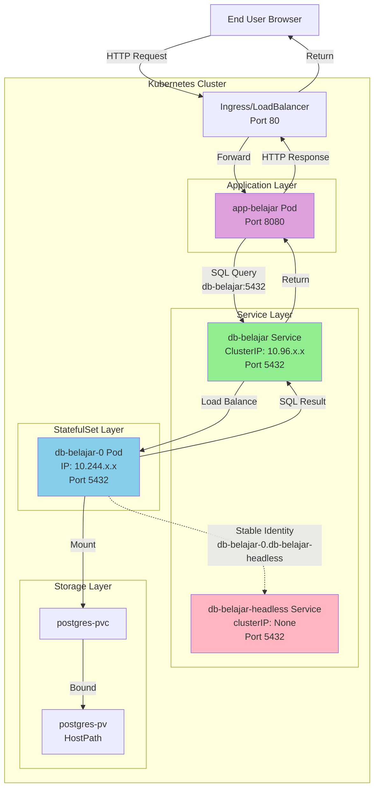

# Kubernetes Deployment Configuration

## Table of Contents

- [File Order](#file-order)
- [Penjelasan Komponen](#penjelasan-komponen)
- [StatefulSet untuk Database](#statefulset-untuk-database)
- [Mengakses Aplikasi di Berbagai Environment](#mengakses-aplikasi-di-berbagai-environment)
  - [Kind Cluster](#1-kind-cluster-podman-desktop--docker)
  - [Docker Desktop Kubernetes](#2-docker-desktop-kubernetes)
  - [Minikube](#3-minikube)
  - [K3s](#4-k3s-local-deployment)
  - [Port-forward (Universal)](#5-port-forward-universal-method)
- [Verifikasi Deployment](#verifikasi-deployment)
- [Troubleshooting](#troubleshooting)
- [Update Konfigurasi](#update-konfigurasi)
- [Scaling](#scaling)
- [Cleanup](#cleanup)
- [Best Practices](#best-practices)

## File Order

Aplikasikan file YAML dalam urutan berikut:

```bash
kubectl apply -f 01-configmap.yml
kubectl apply -f 02-secret.yml
kubectl apply -f 03-pv.yml
kubectl apply -f 04-pvc.yml
kubectl apply -f 05-database.yml
kubectl apply -f 06-webapp.yml
```

**Catatan**: File `06-webapp.yml` default menggunakan `type: NodePort` yang compatible dengan Kind cluster. Untuk environment lain, lihat bagian [Mengakses Aplikasi di Berbagai Environment](#mengakses-aplikasi-di-berbagai-environment) atau gunakan contoh file di folder `examples/`:
- `examples/06-webapp-loadbalancer.yml` - untuk Docker Desktop K8s, Minikube, atau K3s
- `examples/06-webapp-clusterip.yml` - untuk port-forward atau Ingress

## Penjelasan Komponen

### 1. ConfigMap (01-configmap.yml)

ConfigMap menyimpan **konfigurasi non-sensitif** dalam bentuk key-value pairs:

- `POSTGRES_DB` - nama database
- `POSTGRES_USER` - username database
- `SPRING_DATASOURCE_URL` - connection string aplikasi ke database

ConfigMap bersifat **plain text** dan bisa dilihat siapa saja yang punya akses ke cluster.

### 2. Secret (02-secret.yml)

Secret menyimpan **data sensitif** seperti password, token, atau API key:

- `POSTGRES_PASSWORD` - password database

Secret di-encode dengan base64 (bukan enkripsi). Di production, gunakan enkripsi at-rest dan RBAC untuk membatasi akses.

### 3. PersistentVolume (03-pv.yml)

PersistentVolume (PV) adalah resource storage di cluster:

- Kapasitas: 1Gi
- Access mode: ReadWriteOnce (hanya bisa di-mount oleh satu node)
- Storage class: manual
- Type: hostPath (menggunakan folder di node, **tidak cocok untuk production**)

### 4. PersistentVolumeClaim (04-pvc.yml)

PersistentVolumeClaim (PVC) adalah request storage oleh pod. Pod menggunakan PVC untuk mendapatkan akses ke PV.

### 5. Database StatefulSet & Services (05-database.yml)

File ini berisi tiga resource:

**StatefulSet:**
- Menjalankan PostgreSQL 17 Alpine
- Mengambil konfigurasi dari ConfigMap dan Secret
- Mount PVC (`postgres-pvc`) ke `/var/lib/postgresql/data`
- Menggunakan pre-created PVC untuk single replica

**Headless Service (`db-belajar-headless`):**
- Untuk StatefulSet internal management
- Memberikan stable DNS identity per pod

**Regular Service (`db-belajar`):**
- Type: ClusterIP (hanya bisa diakses dari dalam cluster)
- Port: 5432
- Digunakan oleh aplikasi untuk koneksi

### 6. Webapp Deployment & Service (06-webapp.yml)

File ini berisi dua resource:

**Deployment:**
- Menjalankan aplikasi Spring Boot
- Mengambil connection string dari ConfigMap
- Connect ke database menggunakan service `db-belajar`

**Service:**
- Type: NodePort (bisa diakses dari luar cluster)
- Port internal: 8080
- NodePort: 30001 (port untuk akses dari luar)

## StatefulSet untuk Database

### Kenapa Database Menggunakan StatefulSet?

Database PostgreSQL menggunakan **StatefulSet** bukan Deployment karena:

1. **Stable Network Identity**
   - Setiap pod mendapat hostname yang konsisten: `db-belajar-0`, `db-belajar-1`, dst
   - Hostname tidak berubah meskipun pod restart

2. **Ordered Deployment/Scaling**
   - Pod dibuat dan dihapus secara berurutan
   - Pod `db-belajar-1` hanya dibuat setelah `db-belajar-0` ready
   - Saat scale down, pod dengan index tertinggi dihapus terlebih dahulu

3. **Persistent Storage**
   - StatefulSet menggunakan pre-created PVC (`postgres-pvc`)
   - Volume tetap ada meskipun pod restart
   - Data tidak hilang saat StatefulSet di-scale atau di-delete

### Service Architecture

File `05-database.yml` mendefinisikan 2 service:

#### 1. Headless Service (`db-belajar-headless`)

**Apa itu Headless Service?**

Headless Service adalah service Kubernetes tanpa ClusterIP (`clusterIP: None`). Berbeda dengan service normal yang melakukan load balancing, headless service memberikan DNS langsung ke setiap pod individual.

**Cara Deklarasi:**

```yaml
apiVersion: v1
kind: Service
metadata:
  name: db-belajar-headless
spec:
  clusterIP: None          # Ini yang membuat service menjadi headless
  ports:
  - port: 5432
    targetPort: 5432
  selector:
    app: postgres
```

**Kegunaan:**

- **Wajib untuk StatefulSet**: StatefulSet memerlukan headless service untuk stable network identity
- **Stable DNS per Pod**: Setiap pod mendapat DNS predictable:
  - `db-belajar-0.db-belajar-headless.default.svc.cluster.local`
  - `db-belajar-1.db-belajar-headless.default.svc.cluster.local` (jika scaled)
- **Direct Pod Access**: Aplikasi bisa mengakses pod tertentu secara langsung (berguna untuk master-replica setup)
- **Pod Discovery**: DNS query ke headless service mengembalikan semua IP pod (bukan ClusterIP)

**Kapan Digunakan:**

- Aplikasi perlu tahu identitas pod spesifik
- Database dengan master-replica setup (read/write splitting)
- Distributed systems yang perlu peer discovery

#### 2. Regular Service (`db-belajar`)

**Cara Deklarasi:**

```yaml
apiVersion: v1
kind: Service
metadata:
  name: db-belajar
spec:
  type: ClusterIP          # Service biasa dengan ClusterIP
  ports:
  - port: 5432
    targetPort: 5432
  selector:
    app: postgres
```

**Kegunaan:**

- **Untuk koneksi aplikasi**: Webapp menggunakan service ini
- **Load balancing**: Mendistribusikan traffic ke semua pod postgres
- **Simple endpoint**: `db-belajar.default.svc.cluster.local:5432` atau singkatnya `db-belajar:5432`
- **Abstraksi**: Aplikasi tidak perlu tahu pod mana yang melayani request

#### Perbedaan Penggunaan Kedua Service

| Aspek | Headless Service | Regular Service |
|-------|-----------------|----------------|
| ClusterIP | None | Ada (auto-assigned) |
| Load Balancing | Tidak ada | Ada |
| DNS Resolution | Semua pod IPs | Single ClusterIP |
| Digunakan oleh | StatefulSet internal | Aplikasi client |
| Endpoint | `pod-name.service-name` | `service-name` |
| Use Case | Stable pod identity | Simple client connection |

#### Request Flow Diagram



**Penjelasan Flow:**

1. **User → Ingress → WebApp**: User mengakses aplikasi via browser
2. **WebApp → Regular Service**: Aplikasi connect ke `db-belajar:5432` (regular service)
3. **Regular Service → Pod**: Service melakukan load balancing ke pod database
4. **Pod ← Headless Service**: Headless service memberikan stable DNS identity untuk pod (`db-belajar-0.db-belajar-headless`)
5. **Pod → Storage**: Pod mengakses persistent storage via PVC
6. **Response**: Data mengalir balik melalui jalur yang sama

**Catatan Penting:**

- WebApp **selalu menggunakan regular service** (`db-belajar`) untuk koneksi
- Headless service **hanya untuk StatefulSet** internal management
- Warning "SessionAffinity ignored" pada headless service adalah **normal** dan bisa diabaikan

### Volume Management

StatefulSet ini menggunakan **pre-created PVC** (bukan `volumeClaimTemplates`):

```yaml
spec:
  template:
    spec:
      volumes:
      - name: postgres-storage
        persistentVolumeClaim:
          claimName: postgres-pvc    # PVC yang sudah dibuat di 04-pvc.yml
      containers:
      - name: postgres
        volumeMounts:
        - name: postgres-storage
          mountPath: /var/lib/postgresql/data
```

**Kenapa menggunakan pre-created PVC?**

- Lebih sederhana untuk single replica setup
- PVC dan PV sudah ada dan bound sebelum StatefulSet dibuat
- Tidak perlu StorageClass khusus

**Alternative: volumeClaimTemplates**

Untuk multi-replica setup yang butuh PVC per pod, gunakan:

```yaml
volumeClaimTemplates:
- metadata:
    name: postgres-storage
  spec:
    accessModes: [ "ReadWriteOnce" ]
    resources:
      requests:
        storage: 1Gi
```

Ini akan membuat PVC otomatis: `postgres-storage-db-belajar-0`, `postgres-storage-db-belajar-1`, dst.

### PostgreSQL PGDATA Configuration

```yaml
env:
- name: PGDATA
  value: /var/lib/postgresql/data/pgdata
```

PostgreSQL memerlukan subdirectory dalam volume mount untuk menghindari error saat volume tidak kosong.

## Deployment vs StatefulSet

| Aspek | Deployment | StatefulSet |
|-------|-----------|-------------|
| Pod Name | random suffix | ordered index |
| Network Identity | tidak stabil | stabil |
| Volume | manual PVC | volumeClaimTemplates |
| Scaling | parallel | ordered |
| Use Case | stateless apps | stateful apps (DB, queue) |

## Mengakses Aplikasi di Berbagai Environment

Service type yang digunakan untuk expose aplikasi berbeda-beda tergantung environment Kubernetes yang digunakan.

### Summary Table

| Environment | Database Service | WebApp Service | Extra Steps | Notes |
|------------|------------------|----------------|-------------|-------|
| **Kind (Podman/Docker)** | ClusterIP | NodePort + port mapping | Config cluster dengan `extraPortMappings` | Butuh konfigurasi saat create cluster |
| **Docker Desktop K8s** | ClusterIP | LoadBalancer | Tidak ada | LoadBalancer otomatis exposed di localhost |
| **Minikube** | ClusterIP | LoadBalancer | `minikube tunnel` (keep running) | Atau gunakan `minikube service` |
| **K3s** | ClusterIP | LoadBalancer atau Ingress | Tidak ada | ServiceLB (Klipper) dan Traefik pre-installed |
| **Port-forward** | ClusterIP | ClusterIP | `kubectl port-forward` | Works di semua environment |

### 1. Kind Cluster (Podman Desktop / Docker)

Kind tidak support LoadBalancer secara native. Ada beberapa opsi:

#### Opsi A: NodePort dengan Port Mapping (Recommended untuk Dev)

**Step 1**: Gunakan cluster config file `examples/kind-config.yaml` yang sudah tersedia:

```yaml
kind: Cluster
apiVersion: kind.x-k8s.io/v1alpha4
nodes:
- role: control-plane
  extraPortMappings:
  - containerPort: 30001
    hostPort: 8080
    listenAddress: "0.0.0.0"
    protocol: TCP
```

**Step 2**: Create cluster dengan config:

```bash
# Dengan Docker
kind create cluster --config examples/kind-config.yaml

# Dengan Podman (experimental)
KIND_EXPERIMENTAL_PROVIDER=podman kind create cluster --config examples/kind-config.yaml
```

**Step 3**: Deploy aplikasi dengan NodePort service (file sudah menggunakan NodePort 30001):

```bash
kubectl apply -f k8s/
```

**Step 4**: Akses aplikasi:

```
http://localhost:8080/api/product
```

#### Opsi B: Port-forward (Paling Simple)

Tidak perlu konfigurasi cluster khusus:

```bash
kubectl port-forward service/app-belajar 8080:8080
```

Akses di `http://localhost:8080/api/product`

#### Opsi C: LoadBalancer dengan Cloud Provider Kind (Advanced)

Install Cloud Provider Kind untuk support LoadBalancer:

```bash
# Install cloud-provider-kind
go install sigs.k8s.io/cloud-provider-kind@latest

# Run controller (keep running di terminal terpisah)
cloud-provider-kind
```

Ubah service type menjadi LoadBalancer di `06-webapp.yml`.

### 2. Docker Desktop Kubernetes

Docker Desktop memiliki LoadBalancer support built-in yang sangat mudah digunakan.

**Step 1**: Ubah webapp service type menjadi LoadBalancer di `06-webapp.yml`:

```yaml
apiVersion: v1
kind: Service
metadata:
  name: app-belajar
spec:
  type: LoadBalancer    # Ubah dari NodePort
  ports:
  - port: 8080
    targetPort: 8080
  selector:
    app: belajar-app
```

**Step 2**: Deploy aplikasi:

```bash
kubectl apply -f k8s/
```

**Step 3**: Verify service:

```bash
kubectl get svc app-belajar
```

Output akan menunjukkan EXTERNAL-IP: `localhost`

**Step 4**: Akses aplikasi:

```
http://localhost:8080/api/product
```

**PENTING**: Docker Desktop hanya bisa expose **SATU** LoadBalancer service. Jika ada service LoadBalancer lain, akan stuck di `Pending`.

**Alternative**: Tetap gunakan NodePort atau port-forward jika butuh multiple exposed services.

### 3. Minikube

Minikube support LoadBalancer dengan command `minikube tunnel`.

#### Opsi A: LoadBalancer dengan Minikube Tunnel

**Step 1**: Ubah webapp service type menjadi LoadBalancer di `06-webapp.yml`:

```yaml
apiVersion: v1
kind: Service
metadata:
  name: app-belajar
spec:
  type: LoadBalancer
  ports:
  - port: 8080
    targetPort: 8080
  selector:
    app: belajar-app
```

**Step 2**: Deploy aplikasi:

```bash
kubectl apply -f k8s/
```

**Step 3**: Jalankan minikube tunnel (di terminal terpisah, keep running):

```bash
minikube tunnel
```

Command ini butuh **sudo/root privileges** karena membuat network route.

**Step 4**: Cek EXTERNAL-IP:

```bash
kubectl get svc app-belajar
```

Output akan menunjukkan EXTERNAL-IP (misal: `10.96.x.x`)

**Step 5**: Akses aplikasi:

```
http://<EXTERNAL-IP>:8080/api/product
```

#### Opsi B: NodePort dengan Minikube Service

Jika tetap menggunakan NodePort (tidak perlu ubah file):

```bash
# Get URL untuk akses service
minikube service app-belajar --url

# Atau langsung buka di browser
minikube service app-belajar
```

#### Opsi C: Port-forward

```bash
kubectl port-forward service/app-belajar 8080:8080
```

### 4. K3s (Local Deployment)

K3s adalah environment yang paling production-like dengan built-in ServiceLB (Klipper) dan Traefik Ingress.

#### Opsi A: LoadBalancer (Recommended)

K3s sudah include ServiceLB (Klipper) yang otomatis handle LoadBalancer services.

**Step 1**: Ubah webapp service type menjadi LoadBalancer di `06-webapp.yml`:

```yaml
apiVersion: v1
kind: Service
metadata:
  name: app-belajar
spec:
  type: LoadBalancer
  ports:
  - port: 8080
    targetPort: 8080
  selector:
    app: belajar-app
```

**Step 2**: Deploy aplikasi:

```bash
kubectl apply -f k8s/
```

**Step 3**: Cek EXTERNAL-IP:

```bash
kubectl get svc app-belajar
```

EXTERNAL-IP akan otomatis assigned (biasanya IP node).

**Step 4**: Akses aplikasi:

```
http://<EXTERNAL-IP>:8080/api/product
```

#### Opsi B: Ingress dengan Traefik (Production-like)

K3s sudah include Traefik Ingress Controller.

**Step 1**: Gunakan Ingress resource di `examples/07-ingress.yml`:

```yaml
apiVersion: networking.k8s.io/v1
kind: Ingress
metadata:
  name: app-belajar-ingress
  annotations:
    traefik.ingress.kubernetes.io/router.entrypoints: web
spec:
  rules:
  - host: belajar.local
    http:
      paths:
      - path: /
        pathType: Prefix
        backend:
          service:
            name: app-belajar
            port:
              number: 8080
```

**Step 2**: Gunakan ClusterIP service (copy dari `examples/06-webapp-clusterip.yml`):

```bash
cp examples/06-webapp-clusterip.yml 06-webapp.yml
```

**Step 3**: Deploy:

```bash
kubectl apply -f k8s/
kubectl apply -f examples/07-ingress.yml
```

**Step 4**: Tambahkan ke `/etc/hosts`:

```bash
echo "127.0.0.1 belajar.local" | sudo tee -a /etc/hosts
```

**Step 5**: Akses aplikasi:

```
http://belajar.local/api/product
```

### 5. Port-forward (Universal Method)

Metode ini bekerja di **semua environment** tanpa perubahan konfigurasi:

```bash
# Port-forward webapp
kubectl port-forward service/app-belajar 8080:8080

# Akses di browser
http://localhost:8080/api/product
```

**Keuntungan**:
- Tidak perlu ubah service type
- Works di semua environment
- Bagus untuk development/debugging

**Kekurangan**:
- Harus keep terminal running
- Hanya bisa diakses dari localhost
- Tidak cocok untuk sharing dengan team

### Rekomendasi per Use Case

**Local Development (Solo)**:
- Port-forward: Paling simple dan universal

**Local Development (Team/Demo)**:
- Docker Desktop K8s: LoadBalancer works out-of-box
- Minikube: `minikube service` command
- K3s: LoadBalancer atau Ingress

**Learning Production Setup**:
- K3s dengan Ingress: Paling mirip production

**CI/CD Testing**:
- Kind dengan NodePort + port mapping: Reproducible cluster config

## Verifikasi Deployment

### Cek Status Resource

```bash
# Cek semua pods
kubectl get pods

# Cek semua services
kubectl get svc

# Cek ConfigMap dan Secret
kubectl get configmap
kubectl get secret

# Cek PV dan PVC
kubectl get pv,pvc
```

### Lihat Detail dan Logs

```bash
# Detail pod tertentu
kubectl describe pod <nama-pod>

# Log database
kubectl logs statefulset/db-belajar

# Log aplikasi
kubectl logs deployment/app-belajar

# Follow log (terus update)
kubectl logs -f deployment/app-belajar
```

### Lihat Isi ConfigMap dan Secret

```bash
# Lihat ConfigMap
kubectl get configmap belajar-config -o yaml

# Lihat Secret (encoded)
kubectl get secret belajar-secret -o yaml

# Decode secret untuk melihat nilai asli
kubectl get secret belajar-secret -o jsonpath='{.data.POSTGRES_PASSWORD}' | base64 -d
```

## Troubleshooting

### Pod Tidak Bisa Start

```bash
# Lihat events untuk pod yang error
kubectl describe pod <nama-pod>

# Lihat log pod yang error
kubectl logs <nama-pod>

# Lihat previous log jika pod crash
kubectl logs <nama-pod> --previous
```

### Database Tidak Bisa Diakses

```bash
# Cek apakah service database sudah running
kubectl get svc db-belajar

# Test koneksi dari pod aplikasi
kubectl exec -it deployment/app-belajar -- /bin/sh
# Di dalam pod:
ping db-belajar
```

### PVC Pending/Tidak Bind ke PV

```bash
# Cek status PVC
kubectl get pvc

# Cek detail PVC
kubectl describe pvc postgres-pvc

# Cek apakah ada PV yang available
kubectl get pv
```

Common issues:
- StorageClass tidak ditemukan
- PV sudah bound ke PVC lain
- Access mode tidak match
- Kapasitas storage tidak mencukupi

## Update Konfigurasi

### Update ConfigMap

```bash
# Edit ConfigMap
kubectl edit configmap belajar-config

# Atau update dari file
kubectl apply -f 01-configmap.yml

# Restart pod agar membaca konfigurasi baru
kubectl rollout restart deployment/app-belajar
```

### Update Secret

```bash
# Edit Secret
kubectl edit secret belajar-secret

# Restart pod agar membaca secret baru
kubectl rollout restart statefulset/db-belajar
```

### Update Image Aplikasi

```bash
# Set image baru
kubectl set image deployment/app-belajar belajar-app=endymuhardin/belajar-container:v2

# Monitor rollout
kubectl rollout status deployment/app-belajar

# Rollback jika ada masalah
kubectl rollout undo deployment/app-belajar
```

## Scaling

### Manual Scaling

```bash
# Scale aplikasi web menjadi 3 replicas
kubectl scale deployment app-belajar --replicas=3

# Verifikasi
kubectl get deployments
kubectl get pods

# Scale down menjadi 1
kubectl scale deployment app-belajar --replicas=1
```

**PERINGATAN**: Database StatefulSet tidak bisa di-scale horizontal sembarangan. Butuh setup replication/clustering yang proper.

### Horizontal Pod Autoscaler

```bash
# Setup autoscaler (min 1, max 5 replicas, target CPU 50%)
kubectl autoscale deployment app-belajar --min=1 --max=5 --cpu-percent=50

# Lihat status HPA
kubectl get hpa

# Hapus autoscaler
kubectl delete hpa app-belajar
```

**Catatan**: HPA membutuhkan metrics-server yang terinstall di cluster.

### Load Balancing

Service otomatis melakukan load balancing ke semua replicas:

```bash
# Lihat endpoints yang di-manage oleh service
kubectl get endpoints app-belajar

# Test load balancing (akses berulang kali)
for i in {1..10}; do
  curl http://localhost:10001/api/product
done

# Lihat log dari semua replicas
kubectl logs -l app=belajar-app --tail=20
```

## Cleanup

### Hapus Semua Resource

```bash
kubectl delete -f 06-webapp.yml
kubectl delete -f 05-database.yml
kubectl delete -f 04-pvc.yml
kubectl delete -f 03-pv.yml
kubectl delete -f 02-secret.yml
kubectl delete -f 01-configmap.yml
```

Atau sekaligus:

```bash
kubectl delete -f .
```

**Catatan**:

- PVC (`postgres-pvc`) tidak otomatis terhapus saat StatefulSet dihapus
- Jika menggunakan `volumeClaimTemplates`, PVC auto-generated juga harus dihapus manual

## Best Practices

### Scaling Applications

**Aplikasi Web (Stateless):**
- Aman untuk di-scale horizontal (multiple replicas)
- Pastikan aplikasi tidak menyimpan state di memory/disk lokal
- Session harus di-share (Redis, database) atau gunakan stateless auth (JWT)

**Database (Stateful):**
- **JANGAN** scale horizontal sembarangan
- Gunakan StatefulSet dengan proper replication setup
- Untuk PostgreSQL: gunakan tools seperti Patroni, Stolon, atau managed database
- Consider read replicas untuk read-heavy workloads

### Security

**Storage:**
- hostPath PV **tidak cocok untuk production**
- Gunakan storage provider yang proper:
  - Cloud provider storage (AWS EBS, GCP Persistent Disk, Azure Disk)
  - Network storage (NFS, Ceph, GlusterFS)
  - Storage class dengan dynamic provisioning

**Secrets:**
- Secret hanya di-encode base64, **bukan di-encrypt**
- Untuk production:
  - Enable encryption at rest di cluster
  - Gunakan external secret management (Vault, AWS Secrets Manager)
  - Implement RBAC untuk membatasi akses
  - Jangan commit secrets ke git
  - Gunakan secret rotation

**Network:**
- Implement NetworkPolicies untuk isolasi traffic
- Gunakan TLS untuk komunikasi antar service
- Restrict access dengan RBAC
