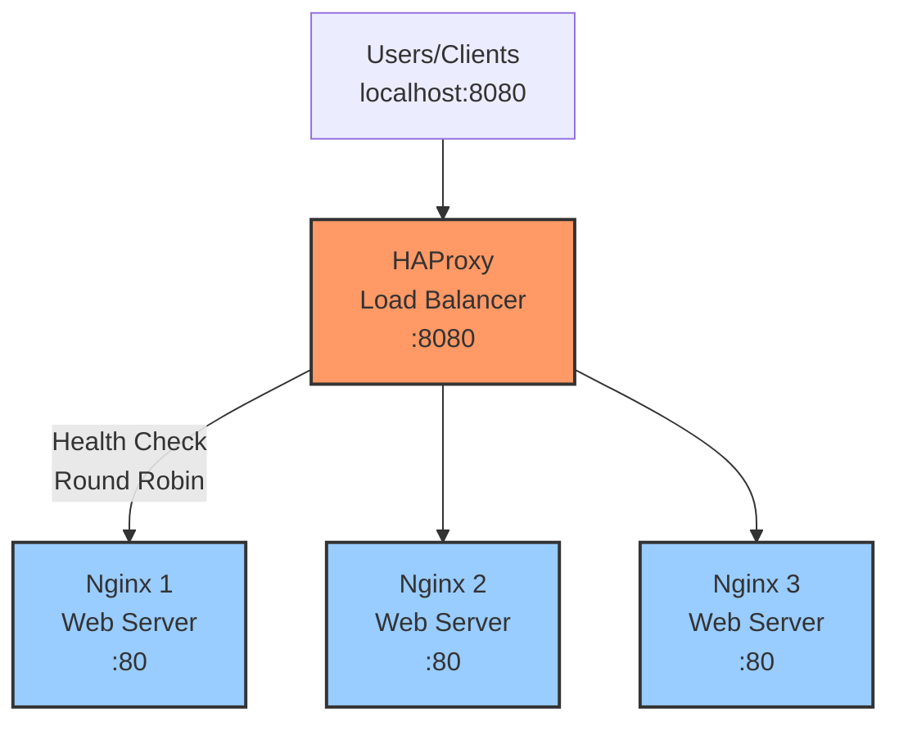
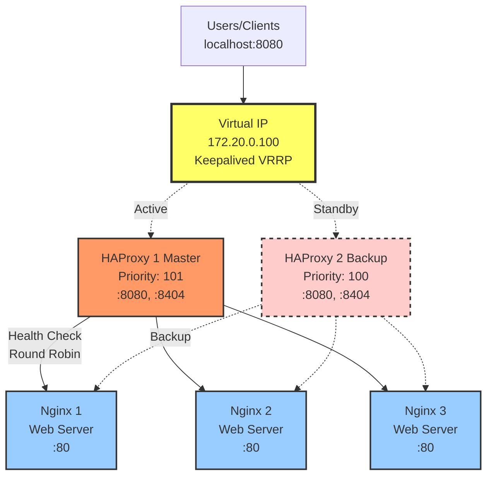
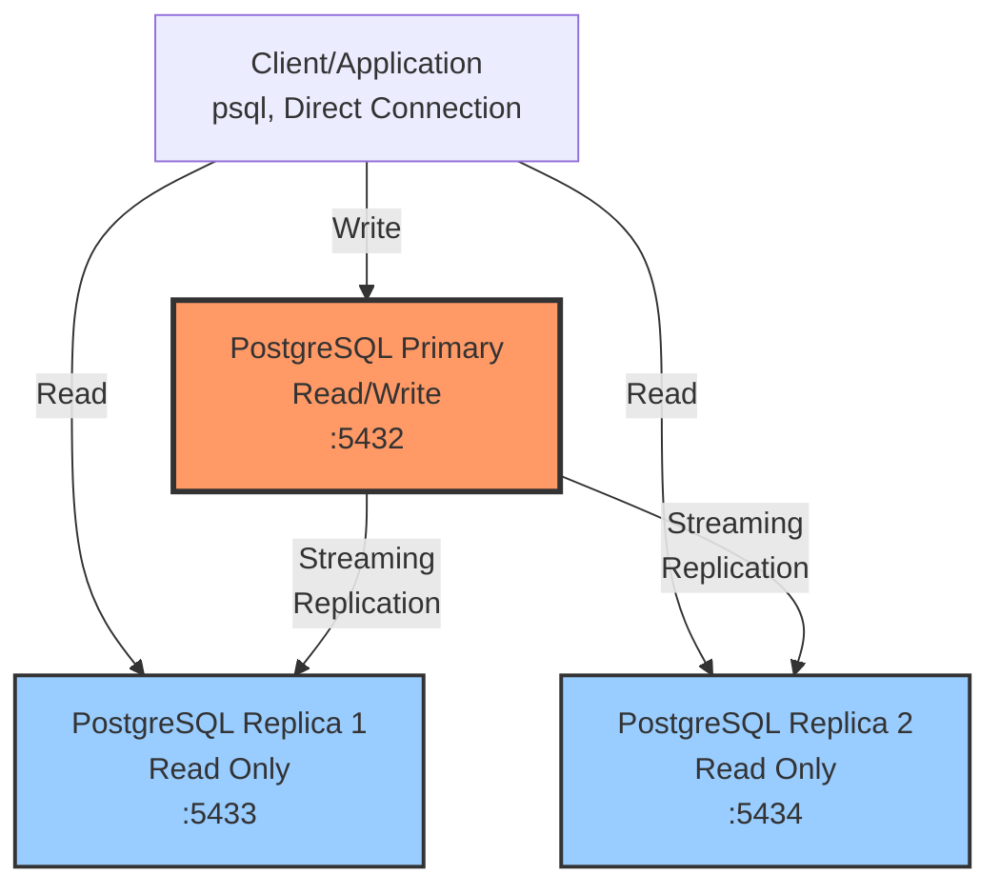
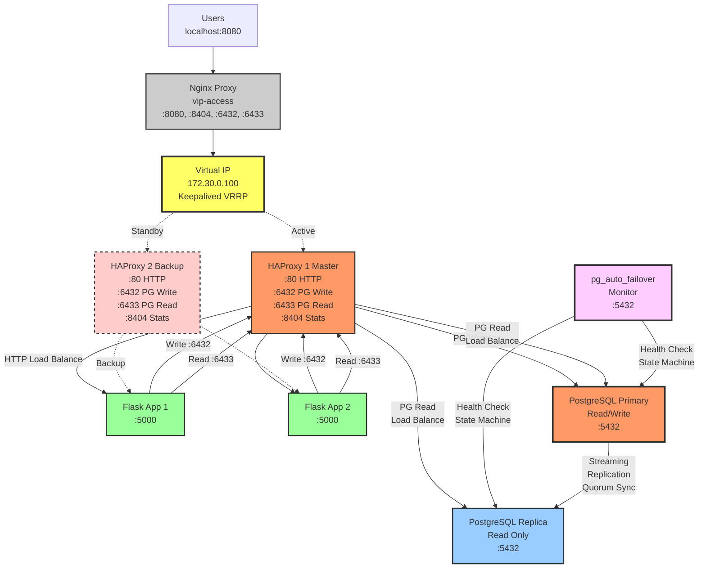
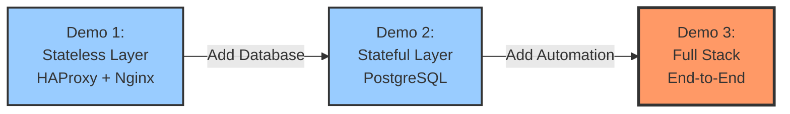

# Demo Workshop High Availability

Demonstrasi hands-on untuk memahami konsep, prinsip, dan teknik High Availability dalam sistem production.

## Gambaran Umum

Workshop ini mencakup 3 demo komprehensif yang mendemonstrasikan HA di berbagai layer aplikasi:

1. **Demo 1**: Stateless Layer HA (HAProxy + Nginx)
2. **Demo 2**: Stateful Layer HA (PostgreSQL Replication)
3. **Demo 3**: Full Stack HA End-to-End (Integrasi lengkap)

## Struktur Workshop

### Demo 1: High Availability Layer Stateless
📁 `demo-1-stateless-ha/`

**Konsep yang dipelajari**:
- Load balancing dengan HAProxy
- Health checks dan automatic failover
- Virtual IP dengan Keepalived (VRRP)
- Active-passive redundancy
- Split-brain prevention

**Technology Stack**:
- HAProxy 2.9
- Nginx Alpine
- Keepalived
- Docker Compose

**Durasi**: 60-90 menit

**Progression**:
1. **Part 1**: Single HAProxy → Multiple Nginx (HA level aplikasi)
2. **Part 2**: HA HAProxy pair (dengan Keepalived) → Multiple Nginx (HA stack stateless lengkap)

#### Arsitektur

**Part 1: Single HAProxy**


**Part 2: HA HAProxy with Keepalived**


[📖 Dokumentasi Lengkap](demo-1-stateless-ha/README.md)

---

### Demo 2: High Availability Layer Stateful
📁 `demo-2-stateful-ha/`

**Konsep yang dipelajari**:
- PostgreSQL streaming replication
- Arsitektur primary-replica
- Strategi read scaling
- Monitoring replication lag
- Prosedur manual failover
- Trade-off data durability vs performance
- Skenario split-brain

**Technology Stack**:
- PostgreSQL 16
- Docker Compose

**Durasi**: 90-120 menit

**Demo Utama**:
1. Setup replication dasar
2. Read scaling dengan replicas
3. Failure primary & manual failover
4. Replication lag di bawah beban
5. Pencegahan split-brain

#### Arsitektur



**Fitur Utama**:
- **Asynchronous Replication**: Replica lag di belakang primary
- **Manual Failover**: Membutuhkan perintah `pg_promote()`
- **Read Scaling**: Distribusi query read ke replicas
- **Direct Connection**: Akses psql client sederhana untuk pembelajaran

[📖 Dokumentasi Lengkap](demo-2-stateful-ha/README.md)

---

### Demo 3: Full Stack High Availability (End-to-End)
📁 `demo-3-full-stack-ha/`

**Konsep yang dipelajari**:
- Arsitektur HA multi-tier lengkap
- Redundansi load balancer
- Redundansi application layer
- **Automatic database failover** dengan pg_auto_failover
- Skenario failover end-to-end

**Technology Stack**:
- HAProxy 2.9 (HA pair dengan Keepalived)
- Python Flask (dengan Flyway migrations)
- **PostgreSQL 17 dengan pg_auto_failover**
- Docker Compose

**Durasi**: 120-150 menit

**Prasyarat**: Build custom PostgreSQL 17 image (5-10 menit)

#### Arsitektur



**Fitur Utama**:
- **Automatic Failover**: pg_auto_failover mendeteksi failure dan mempromosikan replica (~30s)
- **Zero Config Failover**: Aplikasi failover secara transparan via routing HAProxy
- **Read/Write Splitting**: HAProxy routing write ke primary, read ke kedua node
- **Full Stack Redundancy**: Setiap layer memiliki redundansi (LB, App, DB)
- **Automated Schema Management**: Migrasi Flyway berjalan saat startup

[📖 Dokumentasi Lengkap](demo-3-full-stack-ha/README.md) | [🚀 Quick Start](demo-3-full-stack-ha/QUICKSTART.md)

---

## Quick Start

### Prasyarat

```bash
# Wajib
- Docker Desktop atau Podman
- Docker Compose
- 8GB RAM minimum
- 20GB free disk space

# Opsional (untuk testing)
- PostgreSQL client tools
- curl, wget
- watch command
```

### Setup

```bash
# Clone repository
cd belajar-ha

# Demo 1: Stateless HA
cd demo-1-stateless-ha
# Lihat demo-1-stateless-ha/README.md untuk instruksi detail

# Demo 2: Stateful HA
cd ../demo-2-stateful-ha
# Lihat demo-2-stateful-ha/README.md untuk instruksi detail

# Demo 3: Full Stack HA
cd ../demo-3-full-stack-ha
# Lihat demo-3-full-stack-ha/README.md dan QUICKSTART.md untuk instruksi detail
```

---

## Alur Pembelajaran

### Alur Workshop yang Disarankan

#### Sesi 1: Dasar Stateless HA (45 menit)
1. Pengenalan konsep HA
2. Demo 1 Part 1: Load balancing HAProxy
3. Hands-on: Matikan instance Nginx, amati failover
4. Latihan: Modifikasi parameter health check

#### Sesi 2: Stateless HA Lengkap (45 menit)
1. Pengenalan VRRP dan Virtual IPs
2. Demo 1 Part 2: Keepalived + HAProxy
3. Hands-on: Matikan instance HAProxy, amati failover VIP
4. Diskusi: Skenario split-brain

#### Istirahat (15 menit)

#### Sesi 3: Pengenalan Stateful HA (60 menit)
1. Tantangan stateful HA
2. Dasar CAP Theorem
3. Demo 2: Setup replication PostgreSQL
4. Hands-on: Test replication, monitoring lag
5. Latihan: Generate load, amati behavior

#### Sesi 4: Failover & Topik Lanjutan (60 menit)
1. Prosedur manual failover
2. Demo 2: Skenario failure primary
3. Split-brain di database
4. Pertimbangan production
5. Diskusi: Tools automatic failover

#### Penutupan (15 menit)
- Tanya jawab
- Ringkasan best practices
- Langkah selanjutnya (Patroni, Kubernetes, Cloud HA)

---

## Gambaran Umum Arsitektur

Workshop ini mendemonstrasikan HA di tiga layer yang berbeda:

### Progresi Layer



**Demo 1** fokus pada redundansi load balancer dan scaling aplikasi.

**Demo 2** memperkenalkan replikasi database dan tantangan stateful HA.

**Demo 3** menggabungkan kedua layer dengan orkestrasi automatic failover.

Lihat bagian individual demo di atas untuk diagram arsitektur detail.

---

## Konsep Utama yang Dicakup

### 1. Fundamental High Availability
- **Redundancy**: Multiple instances dari setiap komponen
- **Failover**: Switching otomatis ke backup
- **Health Checks**: Deteksi failure
- **Load Distribution**: Penyebaran pekerjaan di seluruh instances
- **Single Point of Failure (SPOF)**: Eliminasi bottleneck

### 2. Stateless vs Stateful HA

| Aspek | Stateless | Stateful |
|--------|-----------|----------|
| **Kompleksitas** | Rendah | Tinggi |
| **Waktu Failover** | Cepat (< 3s) | Lebih lambat (30-60s) |
| **Risiko Data Loss** | Tidak ada | Mungkin terjadi |
| **Scaling** | Mudah (add instances) | Kompleks (replication) |
| **State Management** | No local state | Must sync state |
| **Contoh** | Web servers, API gateways | Databases, caches |

### 3. CAP Theorem (Konteks Database)
- **Consistency**: Semua node melihat data yang sama
- **Availability**: Sistem merespons request
- **Partition Tolerance**: Bekerja meski ada masalah network

**Pilihan PostgreSQL**: CP (Consistency + Partition Tolerance)
- Memprioritaskan konsistensi data
- Mungkin mengorbankan availability selama network partition

### 4. Skenario Failure
- **Process crash**: Aplikasi mati
- **Host failure**: Crash hardware/OS server
- **Network partition**: Kehilangan konektivitas
- **Cascading failure**: Satu failure memicu yang lain
- **Split-brain**: Multiple nodes mengira mereka primary

### 5. Metrics & SLOs
- **Uptime**: Persentase waktu sistem available
- **MTBF**: Mean Time Between Failures
- **MTTR**: Mean Time To Recovery
- **RPO**: Recovery Point Objective (data loss)
- **RTO**: Recovery Time Objective (downtime)

---

## Panduan Troubleshooting

### Masalah Umum

#### Port Sudah Digunakan
```bash
# Cek apa yang menggunakan port
lsof -i :8080

# Kill prosesnya atau ubah port di docker-compose.yml
```

#### Docker Out of Memory
```bash
# Tambah alokasi memory Docker Desktop
# Docker Desktop → Settings → Resources → Memory → 8GB minimum
```

#### Container Tidak Mau Start
```bash
# Cek logs
docker compose logs

# Rebuild images
docker compose down
docker compose up -d --build
```

#### Scripts Permission Denied
```bash
# Buat scripts executable
chmod +x *.sh
```

#### Replikasi PostgreSQL Tidak Bekerja
```bash
# Cek logs
docker logs postgres-replica1

# Verifikasi primary sehat
docker exec postgres-primary pg_isready

# Cek status replication
docker exec postgres-primary psql -U postgres -c "SELECT * FROM pg_stat_replication;"
```

---

## Best Practices untuk Fasilitator Workshop

### Persiapan (1 hari sebelumnya)
- [ ] Test semua demo di environment Docker yang bersih
- [ ] Siapkan slide backup untuk menjelaskan konsep
- [ ] Setup proyektor/screen sharing
- [ ] Print command cheat sheets untuk peserta
- [ ] Verifikasi konektivitas internet (untuk pull images)

### Selama Workshop
- [ ] Mulai setiap demo dari awal (tanpa pre-built containers)
- [ ] Dorong peserta untuk eksperimen dan break things
- [ ] Gunakan terminal terpisah untuk monitoring vs control
- [ ] Pause setelah setiap skenario failure untuk diskusi
- [ ] Terima pertanyaan setelah setiap bagian

### Tips
- Gunakan command `watch` untuk monitoring kontinyu
- Buka HAProxy stats dashboard di layar besar
- Tunjukkan skenario sukses dan failure
- Tekankan mentalitas "break things to learn"
- Bandingkan costs (resources, kompleksitas) vs benefits

---

## Topik Lanjutan (Opsional)

### Setelah menyelesaikan semua demo, pertimbangkan untuk eksplorasi:

#### Tools Automatic Failover
- **pg_auto_failover**: Automatic failover PostgreSQL (didemonstrasikan di Demo 3)
- **Patroni**: PostgreSQL HA dengan automatic failover
- **Consul**: Service discovery dan health checking
- **etcd**: Distributed configuration store

#### Solusi HA Cloud
- AWS: RDS Multi-AZ, ALB, Auto Scaling
- GCP: Cloud SQL HA, Cloud Load Balancing
- DigitalOcean: Managed Databases, Load Balancers

#### Kubernetes HA
- ReplicaSets untuk stateless apps
- StatefulSets untuk stateful apps
- Service mesh (Istio, Linkerd)

#### Monitoring & Alerting
- Prometheus + Grafana
- ELK Stack
- Integrasi PagerDuty

---

## Checklist Production

Saat mengimplementasikan HA di production:

### Infrastructure
- [ ] Multiple availability zones/regions
- [ ] Automated backups
- [ ] Disaster recovery plan
- [ ] Redundansi network
- [ ] Redundansi power

### Aplikasi
- [ ] Health check endpoints
- [ ] Graceful shutdown
- [ ] Connection retry logic
- [ ] Circuit breakers
- [ ] Konfigurasi timeout

### Database
- [ ] Monitoring replication lag
- [ ] Testing automated failover
- [ ] Verifikasi backup
- [ ] Deteksi data corruption
- [ ] Kapabilitas point-in-time recovery

### Monitoring
- [ ] Monitoring uptime
- [ ] Performance metrics
- [ ] Tracking error rate
- [ ] Capacity planning
- [ ] Alert escalation policies

### Prosedur
- [ ] Runbooks untuk failure umum
- [ ] Failover drills reguler
- [ ] Incident response plan
- [ ] Proses post-mortem
- [ ] Update dokumentasi

---

## Pertimbangan Biaya

### Resource Demo 1
- CPU: 2 cores
- RAM: 2GB
- Storage: 1GB
- **Biaya**: ~$20/bulan (single DigitalOcean droplet)

### Resource Demo 2
- CPU: 4 cores
- RAM: 4GB
- Storage: 20GB
- **Biaya**: ~$40/bulan (single DigitalOcean droplet)

### Production HA (Tipikal)
- Multiple regions: 2-3x base cost
- Komponen redundan: 2-3x resource cost
- Infrastruktur monitoring: +20% cost
- **Total multiplier**: 4-6x biaya single instance

**Trade-off**: Biaya lebih tinggi untuk availability yang lebih baik

---

## Kriteria Sukses

Di akhir workshop ini, peserta harus dapat:

### Pemahaman
- [ ] Menjelaskan perbedaan stateless dan stateful HA
- [ ] Mendeskripsikan cara kerja load balancing
- [ ] Memahami konsep replikasi
- [ ] Mengidentifikasi single points of failure
- [ ] Menghitung persentase availability

### Keterampilan
- [ ] Setup basic load balancer
- [ ] Konfigurasi health checks
- [ ] Deploy replikasi PostgreSQL
- [ ] Melakukan manual failover
- [ ] Monitoring kesehatan sistem

### Aplikasi
- [ ] Mendesain arsitektur HA untuk aplikasi sederhana
- [ ] Memilih strategi HA yang sesuai
- [ ] Estimasi biaya dan benefit HA
- [ ] Menulis runbooks dasar
- [ ] Merencanakan disaster recovery

---

## Catatan Penting Container Runtime

### DHCP dan DNS Considerations

Ketika menggunakan Docker Desktop atau Podman Desktop, container yang di-restart akan mendapatkan alamat IP baru dari DHCP. Ini dapat menyebabkan masalah dengan layanan yang melakukan cache DNS resolution.

**Semua demo telah dikonfigurasi untuk menangani masalah ini**, namun penting untuk memahami:

- **HAProxy**: Memerlukan konfigurasi `resolvers` untuk DNS dinamis
- **PostgreSQL**: Menangani perubahan IP secara native (tidak perlu konfigurasi)
- **Keepalived**: Memerlukan konfigurasi keamanan script yang tepat

**📖 Dokumentasi Lengkap**: [CONTAINER-RUNTIME-NOTES-ID.md](./CONTAINER-RUNTIME-NOTES-ID.md)

Dokumentasi ini mencakup:
- ✅ Penjelasan lengkap masalah DHCP/DNS
- ✅ Analisis per demo dan solusinya
- ✅ Perbedaan Docker vs Podman
- ✅ Konfigurasi keamanan Keepalived
- ✅ Troubleshooting decision tree
- ✅ Best practices untuk production

**Baca dokumentasi ini jika**:
- Mengalami masalah backend DOWN setelah container restart
- Menggunakan Podman (perlu update IP DNS server)
- Melihat error "SECURITY VIOLATION" di log keepalived
- Ingin memahami bagaimana setiap komponen menangani perubahan IP

---

## Sumber Belajar Tambahan

### Dokumentasi
- [HAProxy Best Practices](http://www.haproxy.org/#docs)
- [PostgreSQL HA Documentation](https://www.postgresql.org/docs/current/high-availability.html)
- [VRRP RFC 5798](https://tools.ietf.org/html/rfc5798)

### Buku
- "Site Reliability Engineering" (Google)
- "Database Reliability Engineering" (O'Reilly)
- "The Art of Capacity Planning" (O'Reilly)

### Kursus Online
- Linux Academy: HA and Fault Tolerance
- Udemy: PostgreSQL High Availability
- Coursera: Cloud Computing Specialization

### Tools
- [Chaos Monkey](https://netflix.github.io/chaosmonkey/) - Failure injection
- [Locust](https://locust.io/) - Load testing
- [Grafana](https://grafana.com/) - Monitoring dashboards

---

## Feedback & Perbaikan

Materi workshop ini terus ditingkatkan. Feedback sangat diterima:

- GitHub Issues: [Repository issues](https://github.com/endymuhardin/training-sre-junior-2025-02)
- Email: [endy.muhardin@gmail.com]

---

## Lisensi

Materi workshop ini disediakan untuk tujuan edukasi.

---

## Credits

Dibuat untuk SRE Junior Training 2025 - Batch 2

**Author**: [Endy Muhardin]
**Last Updated**: 2025-11-07
**Version**: 1.0
