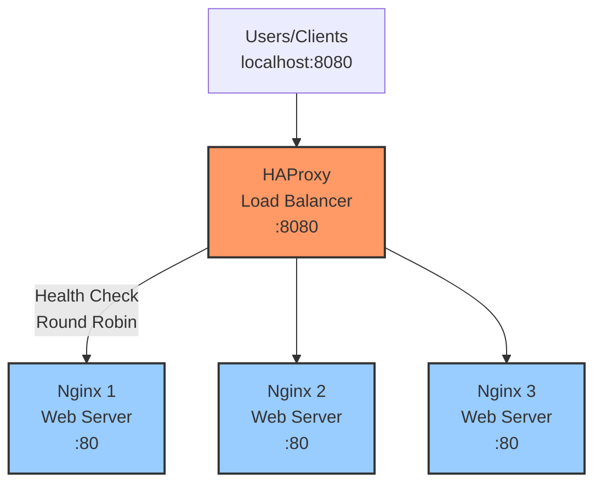
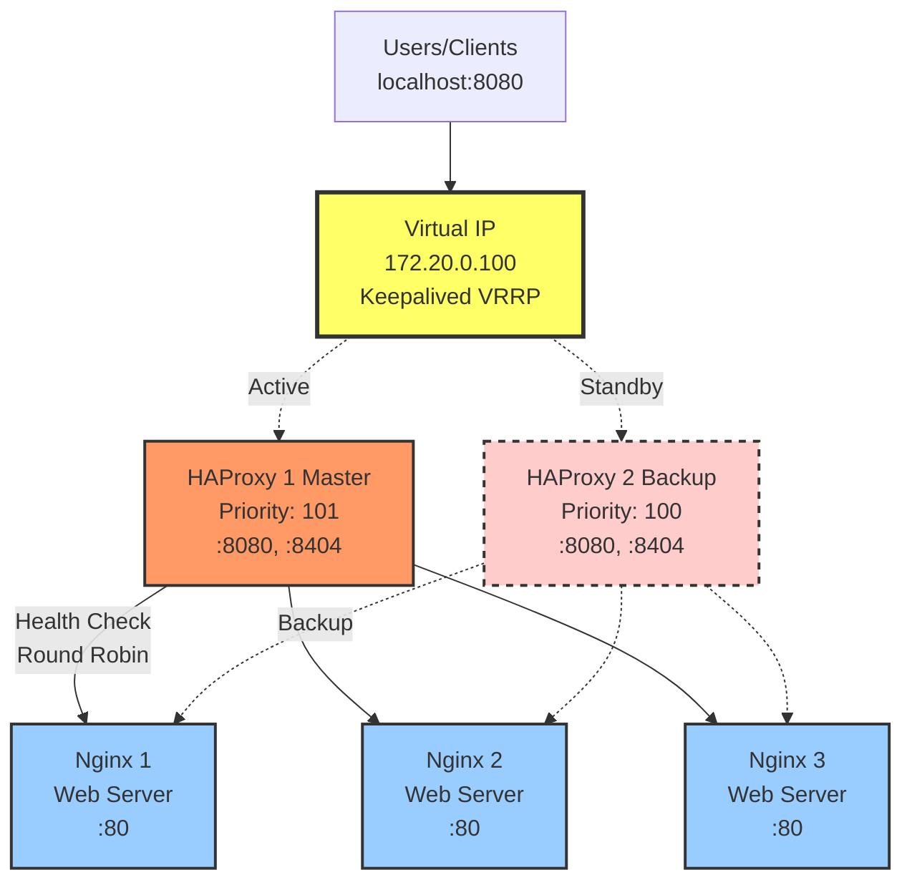

# Demo 1: Stateless Layer High Availability

Demonstrasi High Availability pada stateless layer menggunakan HAProxy dan Nginx.

> **Catatan**: Demo ini memiliki 2 bagian (Part 1 dan Part 2) yang menggunakan compose file berbeda. Keduanya **tidak dijalankan bersamaan** - pilih salah satu sesuai konsep yang ingin dipelajari.

## Arsitektur

### Part 1: Application Layer HA (docker-compose-1.yml)



### Part 2: Full Stack HA (docker-compose-2.yml)



## Konsep HA yang Didemonstrasikan

### Part 1:
- **Load Balancing**: Distribusi traffic ke multiple backends
- **Health Checks**: Deteksi otomatis instance yang gagal
- **Automatic Failover**: Traffic dialihkan saat instance down
- **Round Robin**: Algoritma distribusi sederhana

### Part 2:
- **Virtual IP (VIP)**: Single entry point yang dapat berpindah
- **VRRP Protocol**: Virtual Router Redundancy Protocol
- **Active-Passive HA**: Master/Backup configuration
- **Automatic Promotion**: Backup menjadi master saat master down
- **Split-Brain Prevention**: Authentication dan priority

---

## Cara Kerja Failover: Deep Dive

### 1. HAProxy Health Check: Deteksi Node Failure

HAProxy secara aktif memonitor kesehatan backend server untuk mendeteksi kegagalan dan secara otomatis menghapus instance yang gagal dari pool.

#### Konfigurasi di `haproxy.cfg`

**Backend Configuration (haproxy.cfg:45-52)**:
```haproxy
backend nginx_backend
    balance roundrobin
    option httpchk GET /
    http-check expect status 200

    server nginx1 nginx1:80 check inter 2s fall 3 rise 2 resolvers docker init-addr libc,none
    server nginx2 nginx2:80 check inter 2s fall 3 rise 2 resolvers docker init-addr libc,none
    server nginx3 nginx3:80 check inter 2s fall 3 rise 2 resolvers docker init-addr libc,none
```

#### Parameter Health Check:

| Parameter | Lokasi | Nilai | Fungsi |
|-----------|--------|-------|--------|
| `option httpchk GET /` | haproxy.cfg:47 | GET request ke root path | Tipe health check yang digunakan |
| `http-check expect status 200` | haproxy.cfg:48 | HTTP 200 OK | Response yang dianggap sehat |
| `check` | haproxy.cfg:50-52 | flag | Aktifkan health checking untuk server ini |
| `inter 2s` | haproxy.cfg:50-52 | 2 detik | Interval antara health check |
| `fall 3` | haproxy.cfg:50-52 | 3 kali gagal | Mark server DOWN setelah 3 check gagal berturut-turut |
| `rise 2` | haproxy.cfg:50-52 | 2 kali sukses | Mark server UP setelah 2 check sukses berturut-turut |
| `timeout check 10000ms` | haproxy.cfg:28 | 10 detik | Timeout untuk health check response |

#### Mekanisme Deteksi:

**Normal Flow**:
```
Setiap 2 detik → HAProxy kirim GET / → Backend respond 200 OK → Mark sebagai UP
```

**Failure Detection**:
```
T=0s:  HAProxy → GET / → nginx1 (timeout/error)     [Check #1 failed]
T=2s:  HAProxy → GET / → nginx1 (timeout/error)     [Check #2 failed]
T=4s:  HAProxy → GET / → nginx1 (timeout/error)     [Check #3 failed]
T=4s:  nginx1 marked as DOWN
       Traffic dialihkan ke nginx2 dan nginx3 saja
```

**Recovery Detection**:
```
T=6s:  HAProxy → GET / → nginx1 (200 OK)            [Check #1 success]
T=8s:  HAProxy → GET / → nginx1 (200 OK)            [Check #2 success]
T=8s:  nginx1 marked as UP
       Traffic kembali di-distribute ke nginx1, nginx2, nginx3
```

#### Kenapa HAProxy Bisa Deteksi?

1. **Active Probing**: HAProxy tidak pasif menunggu error dari client request, tapi **aktif** mengirim health check request setiap `inter 2s`
2. **Isolated Health Checks**: Health check berjalan independent dari client traffic, jadi tidak mengganggu user
3. **Fail-Fast Mechanism**: Dengan `fall 3` dan `inter 2s`, detection time maksimal = **6 detik** (3 × 2s)
4. **Prevent Flapping**: `rise 2` mencegah backend yang tidak stabil masuk-keluar pool terlalu cepat

#### Tuning Parameters:

**Faster Detection (aggressive)**:
```haproxy
server nginx1 nginx1:80 check inter 1s fall 2 rise 2
# Detection time: 2 detik (2 × 1s)
# Trade-off: Lebih banyak health check traffic
```

**Slower Detection (conservative)**:
```haproxy
server nginx1 nginx1:80 check inter 5s fall 5 rise 3
# Detection time: 25 detik (5 × 5s)
# Trade-off: Backend mati lebih lama sebelum terdeteksi
```

#### Observasi Real-time:

**Lihat Status Health Check**:
```bash
# Via stats dashboard
curl http://localhost:8404/ | grep -A5 "nginx1"

# Via HAProxy socket
echo "show stat" | socat stdio /var/run/haproxy.sock | grep nginx1
```

**Output Example**:
```
nginx1: status=UP, check_status=L7OK, check_duration=2ms, last_chg=15s
```

---

### 2. Keepalived VIP Failover: Deteksi HAProxy Failure

Keepalived menggunakan **VRRP protocol** untuk manage Virtual IP dan melakukan failover ketika HAProxy master instance gagal.

#### Konfigurasi Master (`keepalived-master.conf`)

**VRRP Script - Health Check (keepalived-master.conf:6-11)**:
```bash
vrrp_script check_haproxy {
    script "/usr/bin/killall -0 haproxy"
    interval 2
    weight 2
    user root
}
```

**VRRP Instance Configuration (keepalived-master.conf:13-32)**:
```bash
vrrp_instance VI_1 {
    state MASTER
    interface eth0
    virtual_router_id 51
    priority 100
    advert_int 1

    authentication {
        auth_type PASS
        auth_pass 1234
    }

    virtual_ipaddress {
        172.20.0.100/16
    }

    track_script {
        check_haproxy
    }
}
```

#### Konfigurasi Backup (`keepalived-backup.conf`)

Identik dengan master kecuali:
- `state BACKUP` (keepalived-backup.conf:14)
- `priority 90` (keepalived-backup.conf:17) - **lebih rendah** dari master (100)

#### Parameter VRRP:

| Parameter | Lokasi | Nilai | Fungsi |
|-----------|--------|-------|--------|
| `script "/usr/bin/killall -0 haproxy"` | keepalived-master.conf:7 | Check process HAProxy | Command untuk cek apakah HAProxy running |
| `interval 2` | keepalived-master.conf:8 | 2 detik | Jalankan health check setiap 2 detik |
| `weight 2` | keepalived-master.conf:9 | Priority adjustment | Kurangi priority 2 poin jika check gagal |
| `state MASTER` | keepalived-master.conf:14 | Initial state | Node ini start sebagai MASTER |
| `priority 100` | keepalived-master.conf:17 | Priority value | Master punya priority lebih tinggi (100 vs 90) |
| `advert_int 1` | keepalived-master.conf:18 | 1 detik | Broadcast VRRP advertisement setiap 1 detik |
| `virtual_router_id 51` | keepalived-master.conf:16 | ID unik | Identify VRRP group (harus sama di master/backup) |
| `virtual_ipaddress` | keepalived-master.conf:25-27 | 172.20.0.100/16 | VIP yang akan di-manage |
| `authentication` | keepalived-master.conf:20-23 | Password | Prevent rogue nodes join VRRP group |

#### Mekanisme Health Check:

**Command: `killall -0 haproxy`**
- Flag `-0` = "send signal 0" = **check if process exists WITHOUT killing it**
- Exit code 0 = process running (healthy)
- Exit code non-zero = process not found (unhealthy)

**Health Check Flow**:
```
Setiap 2 detik:
  Keepalived → Execute: killall -0 haproxy

  Case 1 - HAProxy Running:
    Command returns: exit code 0
    Priority remains: 100 (master) or 90 (backup)

  Case 2 - HAProxy Dead:
    Command returns: exit code 1
    Priority reduced by weight: 100 - 2 = 98 atau 90 - 2 = 88
```

#### Mekanisme VIP Failover:

**Normal State (Master Active)**:
```
haproxy1 (MASTER):
  - Priority: 100
  - HAProxy: running ✓
  - VIP 172.20.0.100: ASSIGNED to eth0
  - Broadcast VRRP advertisement setiap 1s: "I am MASTER with priority 100"

haproxy2 (BACKUP):
  - Priority: 90
  - HAProxy: running ✓
  - VIP 172.20.0.100: NOT assigned
  - Listening to VRRP advertisements dari master
```

**Failover Trigger - Master HAProxy Crashes**:
```
T=0s:  haproxy1 process crash

T=0s:  Keepalived on haproxy1 runs check:
       killall -0 haproxy → exit code 1 (failed)
       Priority: 100 - 2 = 98

T=0s:  haproxy1 still sends VRRP advertisement:
       "I am MASTER with priority 98"

T=0s:  haproxy2 receives advertisement:
       "Master priority 98 < My priority 90"
       Wait... ini tidak trigger failover karena 98 > 90!

       ❌ TAPI, konfigurasi current punya masalah!
```

**⚠️ PENTING - Konfigurasi Weight Problem**:

Dengan weight=2 dan priority 100 vs 90:
- Master dengan HAProxy mati: priority 98
- Backup dengan HAProxy sehat: priority 90
- **98 > 90** = Master tetap pegang VIP meskipun HAProxy mati!

**Konfigurasi yang Benar - Set Weight Lebih Besar**:
```bash
vrrp_script check_haproxy {
    script "/usr/bin/killall -0 haproxy"
    interval 2
    weight -20   # Kurangi priority 20 (lebih dari selisih master-backup)
    user root
}
```

**Dengan weight=-20, Failover Flow Correct**:
```
T=0s:  haproxy1 HAProxy crash
       Keepalived detects: killall -0 haproxy → failed
       Priority: 100 - 20 = 80

T=1s:  haproxy1 broadcast: "MASTER with priority 80"
       haproxy2 receives: "Master=80, Me=90"
       haproxy2: "My priority is higher! I'll become MASTER"

T=1s:  haproxy2 transition to MASTER:
       1. Stop listening to advertisements
       2. Send Gratuitous ARP untuk 172.20.0.100
       3. Assign VIP ke eth0
       4. Start sending advertisements: "I am MASTER with priority 90"

T=2s:  haproxy1 receives advertisement dari haproxy2:
       "New MASTER with priority 90 > my priority 80"
       haproxy1 → Transition to BACKUP
       Remove VIP dari eth0

T=2s:  VIP 172.20.0.100 sekarang di haproxy2
       Traffic flows through haproxy2
```

**Gratuitous ARP**:
- Ketika VIP berpindah, network switches perlu update ARP table
- New master send **Gratuitous ARP**: "MAC address for 172.20.0.100 is now MY MAC"
- Switches update forwarding table instantly
- Clients di-redirect ke new master dalam < 1 detik

#### Mekanisme Split-Brain Prevention:

**Authentication (keepalived-master.conf:20-23)**:
```bash
authentication {
    auth_type PASS
    auth_pass 1234
}
```

- Semua VRRP advertisements include authentication hash
- Hanya nodes dengan `auth_pass` yang sama bisa join group
- Prevent rogue container accidentally claim VIP

**Virtual Router ID (keepalived-master.conf:16)**:
```bash
virtual_router_id 51
```

- Harus **identik** di semua nodes dalam VRRP group
- Nodes dengan `virtual_router_id` berbeda = different group
- Prevent collision jika ada multiple VRRP setup di network yang sama

**Priority-based Election**:
- Higher priority always wins
- Jika priority sama, higher IP address wins (deterministic)
- No "dual master" state possible dalam protocol

#### Detection Timing:

**Best Case (Process Crash)**:
```
Master HAProxy crash → Keepalived detect dalam 2s → Backup receive advertisement dalam 1s
Total failover time: ~3 detik
```

**Worst Case (Network Partition)**:
```
Master network disconnect → Backup tidak receive advertisement
Timeout: advert_int × 3 = 1s × 3 = 3s
Backup promote to master: ~3-4 detik
```

#### Observasi Real-time:

**Check VIP Ownership**:
```bash
# Pada master
docker exec haproxy1 ip addr show eth0 | grep 172.20.0.100
# Output: inet 172.20.0.100/16 scope global secondary eth0

# Pada backup
docker exec haproxy2 ip addr show eth0 | grep 172.20.0.100
# Output: (empty - VIP tidak ada)
```

**Monitor VRRP State**:
```bash
# Check keepalived logs
docker logs haproxy1 2>&1 | grep -i vrrp
docker logs haproxy2 2>&1 | grep -i vrrp

# Output example:
# Keepalived_vrrp[1]: VRRP_Instance(VI_1) Transition to MASTER STATE
# Keepalived_vrrp[1]: VRRP_Instance(VI_1) Entering MASTER STATE
```

---

### 3. Multi-Layer Failover: HAProxy + Keepalived

Kombinasi HAProxy health check dan Keepalived VRRP membuat **2 level redundancy**:

**Level 1: Backend Failure (HAProxy Handle)**
```
nginx1 crash → HAProxy detect dalam 6s → Remove dari pool
Traffic ke nginx2 dan nginx3 → HAProxy tetap up
Keepalived tidak trigger failover (HAProxy masih running)
```

**Level 2: Load Balancer Failure (Keepalived Handle)**
```
haproxy1 crash → Keepalived detect dalam 2s → VIP move ke haproxy2
haproxy2 takes over → Traffic continues through haproxy2
Backend health checks continue normally
```

**Resilience Matrix**:

| Failure Scenario | Detection Time | Service Impact | Recovery Mechanism |
|-----------------|----------------|----------------|-------------------|
| 1 backend down | 6s | None - traffic redistributed | HAProxy health check |
| 2 backends down | 6s | None - traffic to remaining 1 | HAProxy health check |
| All backends down | 6s | 503 Service Unavailable | Manual intervention required |
| Master HAProxy down | 3s | 1-2 lost requests | Keepalived VIP failover |
| Both HAProxy down | 3s | Total outage | Manual restart required |
| Network partition | 3s | Potential split-brain | VRRP authentication prevents |

### Shared Configuration
- Kedua part menggunakan **`haproxy.cfg` yang sama**
- Konfigurasi DNS resolver mendukung network dari kedua compose file
- Ini memudahkan maintenance karena satu file config untuk semua scenario

---

## Part 1: Application Layer HA

> **Penting**: Jika menggunakan Podman bukan Docker, konfigurasi HAProxy memerlukan pengaturan DNS yang berbeda. Lihat [Quirks Container Runtime](#container-runtime-quirks) di bagian Troubleshooting sebelum memulai.

### 1. Jalankan Environment

```bash
# For Docker
docker compose -f docker-compose-1.yml up -d

# For Podman
podman compose -f docker-compose-1.yml up -d
```

### 2. Verifikasi Services

```bash
# Check container status
docker ps

# Check HAProxy stats
open http://localhost:8404

# Test application
curl http://localhost:8080
```

### 3. Demo: Load Balancing

**Terminal 1**: Monitor HAProxy logs
```bash
docker logs -f haproxy
```

**Terminal 2**: Generate load
```bash
# Run load test
./load-test.sh http://localhost:8080 30 0.3

# Or manual curl loop
for i in {1..10}; do
    curl -s http://localhost:8080 | grep "NGINX Instance"
    sleep 0.5
done
```

**Browser**: Refresh http://localhost:8080 multiple times dan perhatikan pergantian instance (warna berbeda).

### 4. Demo: Health Check & Failover

**Scenario**: Kill satu instance dan lihat traffic redistribution.

**Terminal 1**: Monitor HAProxy
```bash
watch -n1 'docker ps --format "table {{.Names}}\t{{.Status}}"'
```

**Terminal 2**: Generate continuous load
```bash
./load-test.sh http://localhost:8080 100 0.5
```

**Terminal 3**: Kill instances
```bash
# Kill nginx1
docker stop nginx1
# Tunggu 5-10 detik, perhatikan HAProxy marks it DOWN

# Kill nginx2 juga
docker stop nginx2
# Sekarang semua traffic ke nginx3

# Restore nginx1
docker start nginx1
# HAProxy automatically adds it back

# Restore nginx2
docker start nginx2
```

**Observasi**:
- HAProxy stats page (http://localhost:8404) menunjukkan backend status
- Load test tetap running tanpa error
- Distribution berubah sesuai available instances

### 5. Demo: Backend Recovery

```bash
# Start with all instances down except one
docker stop nginx1 nginx2

# Generate load (all goes to nginx3)
./load-test.sh http://localhost:8080 20 0.3

# Bring instances back one by one
docker start nginx1
sleep 5
docker start nginx2

# Observe traffic redistribution
```

### 6. Cleanup Part 1

```bash
docker compose -f docker-compose-1.yml down

# Atau untuk Podman
podman compose -f docker-compose-1.yml down
```

> **Penting**: Pastikan Part 1 sudah di-cleanup sebelum menjalankan Part 2 untuk menghindari konflik port dan network.

---

## Part 2: Full Stack HA (HAProxy + Keepalived)

> **Penting**:
> - Part 2 menggunakan haproxy.cfg yang sama dengan Part 1, sehingga semua catatan tentang [Container Runtime Quirks](#container-runtime-quirks) juga berlaku di sini
> - Konfigurasi sudah disesuaikan untuk mendukung kedua network (compose-1 dan compose-2)
> - **Jangan jalankan Part 1 dan Part 2 bersamaan** - pilih salah satu

### ⚠️ Catatan Penting: vip-access Container (Demo Limitation)

**DISCLAIMER**: Setup ini menggunakan container `vip-access` sebagai **workaround untuk demo** yang **BUKAN** arsitektur production.

#### Mengapa vip-access Ada?

```
Host Machine (localhost:8080)
        ↓
   [vip-access] ← SINGLE POINT OF FAILURE!
        ↓
   172.20.0.100 (VIP - internal container network)
        ↓
   [haproxy1] ↔ [haproxy2] (HA Pair)
        ↓
   [nginx1, nginx2, nginx3]
```

**Masalah**: Virtual IP `172.20.0.100` hanya ada di **internal Docker/Podman network**. Host machine tidak bisa langsung akses IP yang ada di dalam container network.

**Solusi Demo**: Container `vip-access` bertindak sebagai proxy/bridge:
- Expose port ke host (`localhost:8080`)
- Forward request ke VIP (`172.20.0.100:80`)
- Ini memudahkan testing dari browser

**Konsekuensi**: `vip-access` adalah **SPOF** - jika container ini mati, seluruh sistem tidak accessible meskipun HAProxy HA masih bekerja dengan baik.

#### Bagaimana di Production?

Di production, **vip-access tidak diperlukan** karena VIP langsung accessible:

**1. Bare Metal / Virtual Machines**:
```
Internet / Internal Network
        ↓
   172.20.0.100 (VIP di physical network interface)
        ↓
   [HAProxy1] ↔ [HAProxy2]
        ↓
   [App Servers]
```
- VIP adalah IP address nyata di network card
- Client langsung akses ke VIP tanpa proxy
- Keepalived manage VIP migration antar server

**2. Cloud Environment (AWS/GCP/Azure)**:
```
Internet
        ↓
   Elastic Load Balancer / Cloud Load Balancer
        ↓
   [HAProxy1] ↔ [HAProxy2]
        ↓
   [App Servers]
```
- Cloud provider punya native HA load balancer
- Atau gunakan Elastic IP yang bisa di-reassign

**3. Kubernetes**:
```
Internet
        ↓
   Ingress Controller / LoadBalancer Service
        ↓
   [App Pods - multiple replicas]
```
- Kubernetes Service abstraction handle load balancing
- Ingress controller untuk external access

#### Testing Tanpa vip-access

Jika ingin test dengan arsitektur yang lebih akurat (tanpa SPOF), test dari dalam network:

```bash
# Test dari container lain di network yang sama
podman exec nginx1 curl http://172.20.0.100

# Test failover
podman stop haproxy1
sleep 5
podman exec nginx1 curl http://172.20.0.100  # Masih jalan via haproxy2

# Test VIP ownership
podman exec haproxy1 ip addr show eth0 | grep 172.20.0.100
podman exec haproxy2 ip addr show eth0 | grep 172.20.0.100
```

#### Kesimpulan

- ✅ **Untuk demo/learning**: vip-access memudahkan observasi dari browser
- ❌ **Untuk production**: vip-access adalah anti-pattern, gunakan solusi native platform
- 📚 **Pembelajaran utama**: Fokus ke mekanisme VIP failover antara haproxy1 ↔ haproxy2, bukan arsitektur keseluruhan

### 1. Jalankan Environment

```bash
# For Docker
docker compose -f docker-compose-2.yml up -d

# For Podman
podman compose -f docker-compose-2.yml up -d
```

### 2. Verifikasi VIP Setup

```bash
# Check containers
docker ps

# Check which HAProxy has VIP
docker exec haproxy1 ip addr show eth0 | grep 172.20.0.100
docker exec haproxy2 ip addr show eth0 | grep 172.20.0.100

# Test via VIP (through vip-access proxy)
curl http://localhost:8080
```

### 3. Demo: HAProxy Failover

**Terminal 1**: Monitor VIP ownership
```bash
watch -n1 "echo '=== HAProxy 1 ===' && docker exec haproxy1 ip addr show eth0 | grep '172.20.0' && echo && echo '=== HAProxy 2 ===' && docker exec haproxy2 ip addr show eth0 | grep '172.20.0'"
```

**Terminal 2**: Generate continuous load
```bash
./load-test.sh http://localhost:8080 200 0.3
```

**Terminal 3**: Failover simulation
```bash
# Kill master HAProxy
docker stop haproxy1

# Observasi:
# - VIP berpindah ke haproxy2 (dalam 1-3 detik)
# - Load test continues WITHOUT interruption
# - Minimal packet loss (1-2 requests mungkin timeout)

# Tunggu 10 detik, lalu restore
docker start haproxy1

# VIP stays with haproxy2 (sekarang master)
# haproxy1 becomes backup

# Kill haproxy2 (current master)
docker stop haproxy2

# VIP kembali ke haproxy1
```

**Expected Results**:
- Failover time: 1-3 seconds
- Lost requests during failover: 0-2 requests
- Automatic recovery tanpa manual intervention

### 4. Demo: Kill HAProxy Process (Not Container)

Ini lebih realistis karena simulate process crash.

```bash
# Kill haproxy process di container
docker exec haproxy1 pkill haproxy

# Keepalived detects and triggers failover
# VIP moves to haproxy2

# Note: Container masih running, hanya process haproxy yang dead
```

### 5. Demo: Network Partition Simulation

```bash
# Disconnect haproxy1 dari network
docker network disconnect demo-1-stateless-ha_ha-net haproxy1

# VIP immediately fails over to haproxy2

# Reconnect
docker network connect demo-1-stateless-ha_ha-net haproxy1
```

### 6. Demo: Backend Failover with HA Load Balancer

Kombinasi: Kill backend PLUS kill load balancer.

```bash
# Terminal 1: Continuous monitoring
./load-test.sh http://localhost:8080 300 0.2

# Terminal 2: Chaos
docker stop nginx1        # Backend failure
sleep 5
docker stop haproxy1      # Load balancer failure
sleep 5
docker stop nginx2        # Another backend failure
sleep 5
docker start nginx1       # Recovery
docker start haproxy1
docker start nginx2

# Observe resilience at multiple layers
```

### 7. Inspect Keepalived Logs

```bash
# Check keepalived status
docker exec haproxy1 tail -f /var/log/messages 2>/dev/null || \
docker logs haproxy1 2>&1 | grep -i keepalived

docker exec haproxy2 tail -f /var/log/messages 2>/dev/null || \
docker logs haproxy2 2>&1 | grep -i keepalived
```

### 8. Check HAProxy Stats from Both Instances

```bash
# HAProxy1 stats
docker exec haproxy1 sh -c "echo 'show stat' | socat stdio /var/run/haproxy.sock"

# HAProxy2 stats
docker exec haproxy2 sh -c "echo 'show stat' | socat stdio /var/run/haproxy.sock"
```

### 9. Cleanup Part 2

```bash
docker compose -f docker-compose-2.yml down

# Atau untuk Podman
podman compose -f docker-compose-2.yml down
```

> **Catatan**: Setelah cleanup Part 2, Anda bisa kembali menjalankan Part 1 jika diperlukan.

---

## Workshop Exercise

### Exercise 1: Understand Health Checks
1. Modify `haproxy.cfg` - change `inter 2s` ke `inter 10s`
2. Restart dan observe slower detection
3. Change `fall 3` ke `fall 1` - observe faster failover

### Exercise 2: Load Balancing Algorithms
Edit `haproxy.cfg`, ganti `balance roundrobin` dengan:
- `leastconn` - Least connections
- `source` - Source IP hash (sticky)

Restart dan test dengan load script.

### Exercise 3: Keepalived Priority
1. Edit `keepalived-master.conf`, set priority ke 80
2. Edit `keepalived-backup.conf`, set priority ke 90
3. Restart - backup becomes master (higher priority)

### Exercise 4: Simulate Split Brain
1. Start compose-2
2. Modify both keepalived configs to state MASTER
3. Observe both try to claim VIP (Docker network prevents actual split-brain)

### Exercise 5: Monitoring Integration
Add health check endpoint ke nginx:
```bash
# Create health endpoint
echo "OK" > demo-1-stateless-ha/html/nginx1/health
echo "OK" > demo-1-stateless-ha/html/nginx2/health
echo "OK" > demo-1-stateless-ha/html/nginx3/health

# Update haproxy.cfg
option httpchk GET /health
```

---

## Troubleshooting

### Container Runtime Quirks

#### Perubahan IP Address Dinamis (Perilaku DHCP)
Ketika container di-stop dan di-restart melalui Docker Desktop atau Podman Desktop, mereka mendapat **IP address baru** dari DHCP network container. Hal ini menyebabkan masalah dengan HAProxy karena:

- HAProxy meng-cache resolusi DNS saat startup
- Health check gagal dengan error **L4TOUT** (Layer 4 timeout)
- Backend tetap dalam status **DOWN/MAINT** meskipun container sehat

**Gejala Masalah**:
```bash
# Container berjalan dan sehat
podman ps --filter name=nginx1
# nginx1   Up 2 minutes (healthy)

# Tapi HAProxy menunjukkan DOWN
curl http://localhost:8404/ | grep nginx1
# Status: DOWN - L4TOUT in 2001ms
```

**Akar Masalah**: HAProxy mencoba koneksi ke IP address lama yang sudah tidak ada.

**Solusi**: Konfigurasi HAProxy dengan dynamic DNS resolution menggunakan section `resolvers`. Lihat haproxy.cfg:7-17 dan parameter `resolvers docker` pada baris server (haproxy.cfg:49-51).

#### Perbedaan DNS Server: Docker vs Podman

Docker dan Podman menggunakan **DNS server internal yang berbeda**:

| Runtime | Alamat DNS Server | Cara Verifikasi |
|---------|-------------------|-----------------|
| Docker  | `127.0.0.11:53`   | `docker exec haproxy cat /etc/resolv.conf` |
| Podman  | `<network-gateway>:53` (contoh: `10.89.4.1:53`) | `podman exec haproxy cat /etc/resolv.conf` |

**Penting**: Section `resolvers` di `haproxy.cfg` harus sesuai dengan container runtime yang digunakan:

```haproxy
# Untuk Docker
resolvers docker
    nameserver dns1 127.0.0.11:53

# Untuk Podman
resolvers docker
    nameserver dns1 10.89.4.1:53  # Gunakan IP gateway network Anda
```

**Cara Mencari DNS Server Podman Anda**:
```bash
# Untuk compose-1 (network default)
podman exec haproxy cat /etc/resolv.conf
# Output:
# search dns.podman
# nameserver 10.89.4.1    <-- DNS server untuk compose-1

# Untuk compose-2 (network 172.20.0.0/16)
podman exec haproxy1 cat /etc/resolv.conf
# Output:
# search dns.podman
# nameserver 172.20.0.1   <-- DNS server untuk compose-2

# Atau inspect network
podman network inspect demo-1-stateless-ha_ha-net | grep gateway
```

**Catatan untuk Multiple Compose Files**:
Karena compose-1 dan compose-2 menggunakan network berbeda tetapi haproxy.cfg yang sama, konfigurasi resolver menggunakan **multiple nameservers** (haproxy.cfg:8-9):
```haproxy
resolvers docker
    nameserver dns1 10.89.4.1:53    # Untuk compose-1
    nameserver dns2 172.20.0.1:53   # Untuk compose-2
```

**Catatan Penting**:
- compose-1 dan compose-2 **tidak dijalankan bersamaan** (satu demo per waktu)
- HAProxy akan otomatis menggunakan DNS server yang available/merespons
- Ketika compose-1 jalan, dns1 (10.89.4.1) akan merespons, dns2 akan timeout (normal)
- Ketika compose-2 jalan, dns2 (172.20.0.1) akan merespons, dns1 akan timeout (normal)
- Timeout dari DNS server yang tidak aktif tidak mempengaruhi resolusi karena ada fallback

**Gejala Konfigurasi DNS Salah**:
- Semua backend masuk mode **MAINT** (maintenance)
- Log HAProxy menunjukkan: `DNS timeout status`
- Error: `backend 'nginx_backend' has no server available!`

**Perbaikan**: Update IP nameserver di haproxy.cfg:8 dan restart HAProxy.

#### Testing Dynamic DNS Resolution

Setelah mengkonfigurasi section `resolvers` dengan benar, test bahwa backend otomatis ter-register kembali setelah restart:

```bash
# 1. Verifikasi semua backend UP
curl -s http://localhost:8404/ | grep -E 'nginx[0-9]' | grep UP

# 2. Catat IP saat ini dari nginx1
podman exec haproxy getent hosts nginx1
# Output: 10.89.4.3  nginx1.dns.podman

# 3. Stop dan restart nginx1 (akan dapat IP baru)
podman stop nginx1
sleep 5
podman start nginx1

# 4. Tunggu 10-15 detik untuk DNS re-resolution
sleep 15

# 5. Verifikasi nginx1 kembali UP dengan IP baru
curl -s http://localhost:8404/ | grep nginx1 | grep UP
# Seharusnya menunjukkan: Status: UP dengan IP address baru

# 6. Konfirmasi IP baru terdeteksi
podman exec haproxy getent hosts nginx1
# Output: 10.89.4.9  nginx1.dns.podman  (IP berbeda)
```

**Perilaku yang Diharapkan**:
- Backend menjadi DOWN ketika container stop
- Backend otomatis kembali UP dalam 10-15 detik setelah restart
- Tidak perlu restart HAProxy manual
- Halaman stats HAProxy menunjukkan IP address yang sudah di-update

**Jika backend tidak auto-recover**:
1. Cek konfigurasi `resolvers` memiliki DNS server yang benar
2. Verifikasi `timeout check` cukup (10000ms direkomendasikan)
3. Pastikan baris server memiliki `resolvers docker init-addr libc,none`
4. Cek log HAProxy untuk error terkait DNS

### VIP tidak muncul
```bash
# Check keepalived running
docker exec haproxy1 ps | grep keepalived

# Check permissions
docker exec haproxy1 ip addr show eth0
```

### HAProxy tidak start
```bash
# Validate config
docker exec haproxy1 haproxy -c -f /usr/local/etc/haproxy/haproxy.cfg

# Check logs
docker logs haproxy1
```

### Load test errors
```bash
# Check port accessibility
curl -v http://localhost:8080

# Check HAProxy stats
curl http://localhost:8404
```

---

## Metrics to Monitor

### HAProxy Stats (http://localhost:8404)
- **scur**: Current sessions
- **qcur**: Queued requests
- **status**: Backend status (UP/DOWN)
- **weight**: Server weight
- **check**: Last health check status
- **downtime**: Total downtime

### Key Indicators
- **Failover time**: Time VIP takes to switch (target: < 3s)
- **Request success rate**: Should be > 99% during backend failure
- **Distribution**: Should be ~33% each instance when healthy

---

## Production Considerations

### Deployment Architecture

**⚠️ PENTING**: Setup demo menggunakan `vip-access` container yang **TIDAK boleh** digunakan di production.

**Production Deployment Options**:

1. **Bare Metal / VM**:
   - VIP langsung di network interface fisik
   - Client akses langsung ke VIP (no proxy)
   - Keepalived handle VIP migration

2. **Cloud (AWS/GCP/Azure)**:
   - Gunakan native load balancer (ELB, Cloud LB)
   - Atau Elastic IP / Floating IP yang bisa di-reassign
   - HAProxy di belakang cloud LB untuk advanced routing

3. **Kubernetes**:
   - LoadBalancer Service atau Ingress Controller
   - Multiple HAProxy pods dengan anti-affinity
   - Service mesh (Istio, Linkerd) untuk advanced scenarios

4. **Hybrid**:
   - BGP Anycast untuk multi-datacenter
   - DNS-based failover sebagai backup
   - GeoDNS untuk global load distribution

### HAProxy Best Practices
- Use `option redispatch` untuk retry pada server lain
- Set appropriate `timeout` values (especially `timeout check` for health checks)
- Enable `option http-server-close` untuk connection pooling
- Use `maxconn` untuk rate limiting
- **Configure DNS resolvers** untuk dynamic backend IP resolution (critical for container environments)
- Use `init-addr libc,none` pada server definitions untuk graceful DNS failures

### Keepalived Best Practices
- Use unique `virtual_router_id` per VRRP instance
- Strong `auth_pass` di production
- Monitor keepalived logs
- Test failover regularly
- **NEVER** gunakan proxy/bridge di depan VIP (creates SPOF)

### Monitoring
- Integrate dengan Prometheus HAProxy exporter
- Alert pada backend DOWN events
- Track VIP movements
- Monitor request latency during failover

---

## Next Steps

Lanjut ke **Demo 2: Stateful Layer HA** untuk database replication dengan PostgreSQL.

## Referensi

- [HAProxy Documentation](http://www.haproxy.org/documentation.html)
- [Keepalived Documentation](https://keepalived.readthedocs.io/)
- [VRRP Protocol RFC 5798](https://tools.ietf.org/html/rfc5798)
