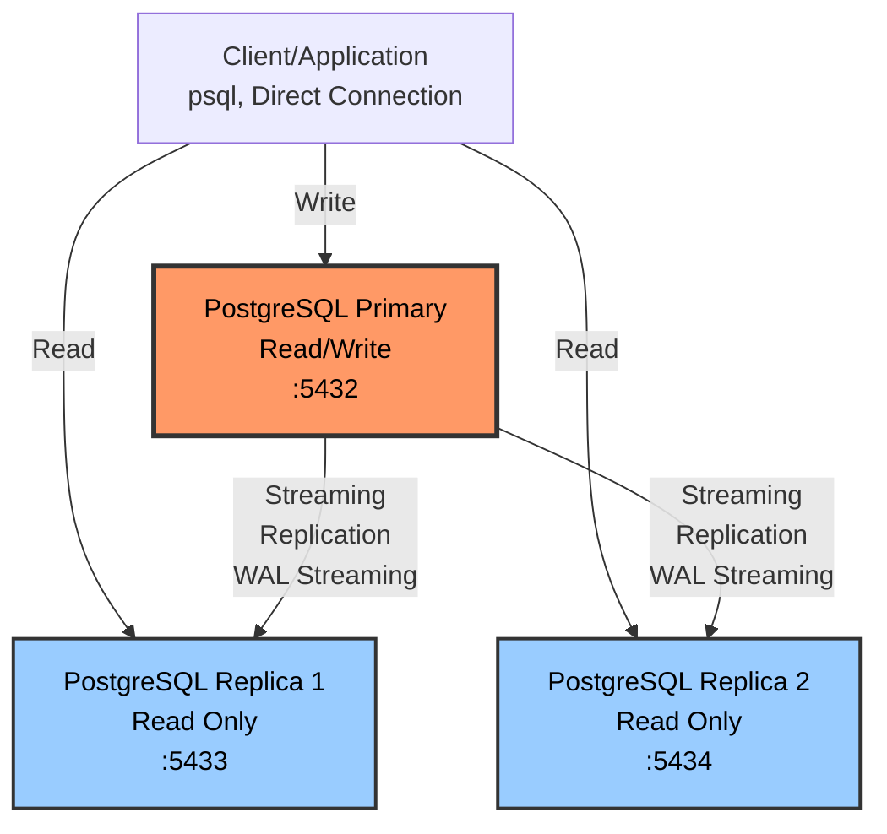

# Demo 2: Stateful Layer High Availability

Demonstrasi High Availability pada stateful layer menggunakan PostgreSQL Streaming Replication.

> 📖 **Documentation:** Untuk copy-paste commands & demo praktis, lihat **[QUICKSTART.md](QUICKSTART.md)**

## Arsitektur



## Konsep HA yang Didemonstrasikan

### Core Concepts:
- **Streaming Replication**: WAL (Write-Ahead Log) streaming ke replica
- **Hot Standby**: Replica dapat melayani read queries
- **Replication Slots**: Prevent WAL deletion sebelum replica consume
- **Asynchronous Replication**: Replica bisa sedikit lag behind primary
- **Read Scaling**: Offload read queries ke replica
- **Manual Failover**: Promote replica menjadi primary

### Data Durability:
- **Replication Lag**: Monitor keterlambatan replica
- **Data Loss Window**: Potential data loss saat failover
- **Recovery Point Objective (RPO)**: Target maksimal data loss
- **Recovery Time Objective (RTO)**: Target waktu recovery

---

## Implementation Details

### Configuration Files & Locations

**Primary Configuration (`docker-compose.yml`):**
```yaml
postgres-primary:
  command: >
    postgres
    -c wal_level=replica              # Enable WAL for replication
    -c hot_standby=on                 # Allow read queries on standby
    -c max_wal_senders=10             # Max concurrent WAL sender (1 per replica + spare)
    -c max_replication_slots=10       # Max replication slots
    -c hot_standby_feedback=on        # Prevent query conflicts
```

**Replica Startup (`start-replica.sh`):**
```bash
# Clone from primary using pg_basebackup
PGPASSWORD=postgres pg_basebackup \
    -h postgres-primary \              # Primary hostname
    -D $PGDATA \                       # Target directory
    -U postgres \                      # User with REPLICATION privilege
    -R \                               # Write recovery config automatically
    -X stream \                        # Stream WAL during backup
    -S replica1_slot                   # Use replication slot
```

**Generated Files in Replica:**
```bash
# /var/lib/postgresql/data/standby.signal
# Empty file marking this as standby

# /var/lib/postgresql/data/postgresql.auto.conf
primary_conninfo = 'host=postgres-primary port=5432 user=replicator password=replicator123'
primary_slot_name = 'replica1_slot'
hot_standby = on
```

**Authentication (`pg_hba.conf`):**
```conf
# Allow replication connections
host    replication     replicator      0.0.0.0/0               md5

# Allow regular connections
host    all             all             0.0.0.0/0               md5
```

### Key Monitoring Queries

**Check Replication Status (Primary):**
```sql
SELECT
    application_name,
    client_addr,
    state,                        -- streaming/catchup/startup
    sync_state,                   -- async/sync
    replay_lag                    -- Replication delay
FROM pg_stat_replication;
```

**Check Recovery Status (Replica):**
```sql
-- Returns: t = replica, f = primary
SELECT pg_is_in_recovery();

-- Replication lag
SELECT now() - pg_last_xact_replay_timestamp() AS lag;
```

**Check Replication Slots (Primary):**
```sql
SELECT
    slot_name,
    active,                       -- t = connected
    pg_size_pretty(
        pg_wal_lsn_diff(pg_current_wal_lsn(), restart_lsn)
    ) AS retained_wal             -- WAL retained for this slot
FROM pg_replication_slots;
```

### File Locations

**Primary:**
```
/var/lib/postgresql/data/
  ├── postgresql.conf          # Main config
  ├── pg_hba.conf             # Authentication
  ├── pg_wal/                 # WAL files
  ├── pg_replslot/            # Replication slots
  │   └── replica1_slot/
  └── base/                   # Database files
```

**Replica:**
```
/var/lib/postgresql/data/
  ├── standby.signal          # Standby mode marker
  ├── postgresql.auto.conf    # Auto-generated config
  ├── pg_wal/                 # Streamed WAL files
  └── base/                   # Replicated data
```

**Scripts (mounted to `/workspace`):**
```
./test-replication.sh         # Automated tests
./generate-load.sh            # Load generator
./promote-replica-client.sh   # Promote replica to primary
```

### Manual Promotion Methods

Semua promotion dilakukan dari dalam psql-client container:

**Method 1 - Using Script:**
```bash
# From psql-client
./promote-replica-client.sh
```

**Method 2 - Using pg_promote() (PostgreSQL 12+):**
```sql
-- From psql-client
psql -h postgres-replica1 -d postgres -c "SELECT pg_promote();"
```

### Re-joining Old Primary as Replica

Setelah failover, old primary perlu di-rejoin ke cluster sebagai replica baru.

**Konsep Role Reversal:**

Setelah failover, **role berubah tapi nama container tidak**:

```
SEBELUM Failover:
  postgres-primary (PRIMARY - Write)
    └─> postgres-replica1 (REPLICA - Read)

SETELAH Failover:
  postgres-replica1 (PRIMARY - Write) ← NEW PRIMARY!

SETELAH Re-join:
  postgres-replica1 (PRIMARY - Write)
    └─> postgres-primary (REPLICA - Read) ← OLD PRIMARY, sekarang replica!
```

**Key Points:**
- Container names **tidak berubah** (masih postgres-primary, postgres-replica1)
- Container **roles berubah** (primary ↔ replica)
- Aplikasi harus **update connection** dari postgres-primary ke postgres-replica1
- Old primary memiliki data yang **diverged** dari new primary
- **Tidak bisa** langsung start old primary (akan menjadi split-brain: 2 primaries!)
- **Harus** rebuild old primary dengan fresh copy dari new primary

**Process:**

1. **Stop old primary** (prevent split-brain)
2. **Remove old data** (diverged data)
3. **Clone dari new primary** (pg_basebackup)
4. **Configure sebagai standby** (primary_conninfo → new primary)
5. **Start sebagai replica**
6. **Verify role reversal** (old primary sekarang read-only)

**Implementation:**

```bash
# 1. Stop old primary
docker stop postgres-primary

# 2. Remove diverged data
rm -rf data/primary/*

# 3. Clone from new primary (replica1)
PGPASSWORD=replicator123 pg_basebackup -h postgres-replica1 -D data/primary -U replicator -R -X stream

# 4. Create standby.signal
touch data/primary/standby.signal

# 5. Configure primary_conninfo
echo "primary_conninfo = 'host=postgres-replica1 ...'" >> data/primary/postgresql.auto.conf

# 6. Start sebagai replica
docker start postgres-primary
```

**Verification:**

```sql
-- Check 1: Verify Role Reversal
-- postgres-replica1 sekarang PRIMARY
psql -h postgres-replica1 -d postgres -c "SELECT pg_is_in_recovery();"
-- Should return: f (false = PRIMARY)

-- postgres-primary sekarang REPLICA
psql -h postgres-primary -d postgres -c "SELECT pg_is_in_recovery();"
-- Should return: t (true = REPLICA)

-- Check 2: Replication Status
-- Di postgres-replica1 (new primary):
SELECT application_name, state, sync_state FROM pg_stat_replication;
-- Should show 'walreceiver' (postgres-primary) streaming

-- Check 3: Write Direction
-- Write HANYA berhasil di postgres-replica1
INSERT INTO users (name, email) VALUES ('Test', 'test@example.com');
-- Success on postgres-replica1 ✅
-- FAIL on postgres-primary (read-only) ❌

-- Check 4: Replication Works
-- Write di postgres-replica1, read di postgres-primary
-- Data harus muncul (replicated)
```

**Timeline setelah re-join:**

```
Before Failover:
  postgres-primary (P) → postgres-replica1 (R)

After Failover + Re-join:
  postgres-replica1 (P) → postgres-primary (R)   ← Old primary, now replica!

Note: (P) = PRIMARY, (R) = REPLICA
      Container names sama, ROLES berubah!
```

> **Praktik:** Lihat [QUICKSTART.md - Demo 4b](QUICKSTART.md#demo-4b-re-join-old-primary-as-replica) untuk step-by-step commands

---

## PostgreSQL Client Access

Demo ini menggunakan containerized PostgreSQL client (`psql-client`) sehingga tidak perlu instalasi lokal.

**Konsep:**
- Container `psql-client` menyediakan `psql`, `pg_basebackup`, dan tools PostgreSQL lainnya
- Environment variables pre-configured (`PGPASSWORD`, `PGUSER`)
- Working directory di-mount ke `/workspace` untuk akses scripts
- Queries & monitoring commands dijalankan dari psql-client
- Container management (stop/start/logs) dijalankan dari HOST

**Implementation:**
```yaml
# docker-compose.yml
psql-client:
  image: postgres:17-alpine
  command: sleep infinity
  environment:
    PGPASSWORD: postgres
    PGUSER: postgres
  volumes:
    - .:/workspace
```

**Usage Pattern:**
```bash
# Akses psql-client
docker exec -it psql-client sh

# Di dalam psql-client, connect ke database
psql -h postgres-primary -d demodb -c "SELECT COUNT(*) FROM users;"
```

> **Praktik:** Lihat [QUICKSTART.md](QUICKSTART.md) untuk step-by-step setup dan demo instructions

---

## Monitoring Queries

### Replication Status (Primary)
```sql
SELECT
    application_name,
    client_addr,
    state,
    sync_state,
    replay_lag,
    pg_size_pretty(pg_wal_lsn_diff(sent_lsn, replay_lsn)) AS lag_bytes
FROM pg_stat_replication;
```

### Replication Lag (Replica)
```sql
SELECT
    now() - pg_last_xact_replay_timestamp() AS replication_lag,
    pg_is_in_recovery() AS is_replica;
```

### Check if Primary or Replica
```sql
SELECT pg_is_in_recovery();  -- true = replica, false = primary
```

### Replication Slot Status (Primary)
```sql
SELECT
    slot_name,
    active,
    pg_size_pretty(pg_wal_lsn_diff(pg_current_wal_lsn(), restart_lsn)) AS retained_wal
FROM pg_replication_slots;
```

### Database Size & Activity
```sql
-- Database size
SELECT pg_size_pretty(pg_database_size('demodb'));

-- Table size
SELECT pg_size_pretty(pg_total_relation_size('users'));

-- Active connections
SELECT count(*) FROM pg_stat_activity WHERE state = 'active';
```

---

## Troubleshooting

### Replica not connecting

```bash
# Check replica logs
docker logs postgres-replica1

# Check primary allows connections
docker exec postgres-primary cat /etc/postgresql/pg_hba.conf

# Test network connectivity
docker exec postgres-replica1 pg_isready -h postgres-primary -U replicator
```

### Replication lag too high

```bash
# Check WAL generation rate (di dalam psql-client)
psql -h postgres-primary -d postgres -c \
  "SELECT pg_size_pretty(pg_wal_lsn_diff(pg_current_wal_lsn(), '0/0')) AS total_wal_generated;"

# Check disk I/O on replica (dari HOST)
docker stats postgres-replica1

# Increase replica resources or reduce primary load
```

### Replica data diverged

```bash
# Stop replica
docker stop postgres-replica1

# Remove replica data
docker exec postgres-replica1 rm -rf /var/lib/postgresql/data/*

# Restart replica (will re-clone from primary)
docker start postgres-replica1
```

### Promote failed

```bash
# Check if replica is caught up (di dalam psql-client)
psql -h postgres-replica1 -d postgres -c \
  "SELECT pg_last_wal_receive_lsn() = pg_last_wal_replay_lsn() AS caught_up;"

# Force promote (dari HOST)
docker exec postgres-replica1 pg_ctl promote -D /var/lib/postgresql/data
```

### Container IP Changes (Docker/Podman DHCP Behavior)

When containers restart, they may receive new IP addresses from the container network's DHCP. **PostgreSQL streaming replication handles this gracefully**:

**How it works**:
- Replica uses `primary_conninfo = 'host=postgres-primary ...'` (hostname, not IP)
- PostgreSQL automatically performs DNS resolution on each connection attempt
- Built-in retry mechanism reconnects after primary IP changes
- WAL streaming resumes automatically after reconnection

**Expected behavior after primary restart**:
1. Primary stops → Replica detects disconnection
2. Primary starts with new IP → Replica tries to reconnect
3. DNS resolves new IP → Connection established
4. Replication resumes (may take 10-30 seconds)

**Verify recovery**:
```bash
# 1. Restart primary (gets new IP) - dari HOST
docker restart postgres-primary

# 2. Watch replica reconnect - di dalam psql-client
watch -n2 'psql -h postgres-primary -d postgres -c "SELECT application_name, state, client_addr FROM pg_stat_replication;"'

# 3. Check replica lag - di dalam psql-client
psql -h postgres-replica1 -d postgres -c \
  "SELECT now() - pg_last_xact_replay_timestamp() AS lag;"
```

**If replica doesn't reconnect**:
```bash
# Check primary_conninfo uses hostname (not IP) - dari HOST
docker exec postgres-replica1 cat /var/lib/postgresql/data/postgresql.auto.conf | grep primary_conninfo

# Should show: host=postgres-primary (NOT host=172.x.x.x)

# Check DNS resolution works - dari HOST
docker exec postgres-replica1 getent hosts postgres-primary

# Check PostgreSQL logs for connection errors - dari HOST
docker logs postgres-replica1 | grep -i "could not connect"
```

**Key difference from HAProxy**: PostgreSQL's libpq library performs DNS lookup on each connection attempt, making it resilient to IP changes without additional configuration.

---

## Production Best Practices

### Replication Configuration

**Synchronous Replication** (untuk critical data):
```sql
-- On primary
ALTER SYSTEM SET synchronous_commit = 'remote_apply';
ALTER SYSTEM SET synchronous_standby_names = 'postgres-replica1';
SELECT pg_reload_conf();
```

**Trade-off**:
- ✓ Zero data loss (RPO = 0)
- ✗ Higher write latency
- ✗ Primary waits for replica acknowledgment

**Asynchronous Replication** (current demo):
- ✓ Low write latency
- ✗ Potential data loss (RPO > 0)

### Monitoring & Alerting

**Key metrics to monitor**:
```bash
# Alert if lag > 10 seconds
SELECT EXTRACT(EPOCH FROM replay_lag) > 10 FROM pg_stat_replication;

# Alert if replica disconnected
SELECT count(*) < 1 FROM pg_stat_replication WHERE state = 'streaming';

# Alert if WAL retention too high (disk space)
SELECT pg_wal_lsn_diff(pg_current_wal_lsn(), restart_lsn) > 10737418240
FROM pg_replication_slots WHERE not active;  -- 10GB
```

### Backup Strategy

Replication ≠ Backup!

```bash
# Di dalam psql-client terminal:

# Physical backup using pg_basebackup
mkdir -p /workspace/backup
pg_basebackup -h postgres-primary -U postgres -D /workspace/backup/$(date +%Y%m%d)

# Or use pg_dump for logical backup
pg_dump -h postgres-primary -d demodb > /workspace/backup.sql

# Restore from backup
psql -h postgres-primary -d demodb < /workspace/backup.sql
```

### Automatic Failover

For production, use automatic failover tools:
- **Patroni** (recommended): Automatic failover dengan etcd/consul
- **repmgr**: Replication manager for PostgreSQL
- **Stolon**: Cloud-native PostgreSQL HA

Example Patroni setup in future demo (optional).

---

## Cleanup

```bash
# Stop all containers
docker compose down

# Remove all data (WARNING: deletes all PostgreSQL data)
rm -rf data/

# Or keep data for next run
docker compose down
```

---

## Comparison: Stateless vs Stateful HA

| Aspect | Stateless (Demo 1) | Stateful (Demo 2) |
|--------|-------------------|-------------------|
| **Failover Time** | < 3 seconds | 30-60 seconds |
| **Data Loss Risk** | None | Possible (RPO > 0) |
| **Complexity** | Low | High |
| **State Consistency** | Not applicable | Critical concern |
| **Automatic Failover** | Easy (Keepalived) | Complex (needs coordination) |
| **Split-Brain Risk** | Low | High |
| **Scale Out** | Easy | Harder |

---

## Next Steps

- Explore **Patroni** for automatic PostgreSQL failover
- Learn **pgBackRest** for advanced backup/restore
- Study **Logical Replication** for multi-master scenarios
- Setup **Monitoring with Prometheus + Grafana**

---

## Referensi

- [PostgreSQL Replication Documentation](https://www.postgresql.org/docs/current/runtime-config-replication.html)
- [PostgreSQL High Availability](https://www.postgresql.org/docs/current/high-availability.html)
- [Patroni Documentation](https://patroni.readthedocs.io/)
- [Understanding WAL](https://www.postgresql.org/docs/current/wal-intro.html)
