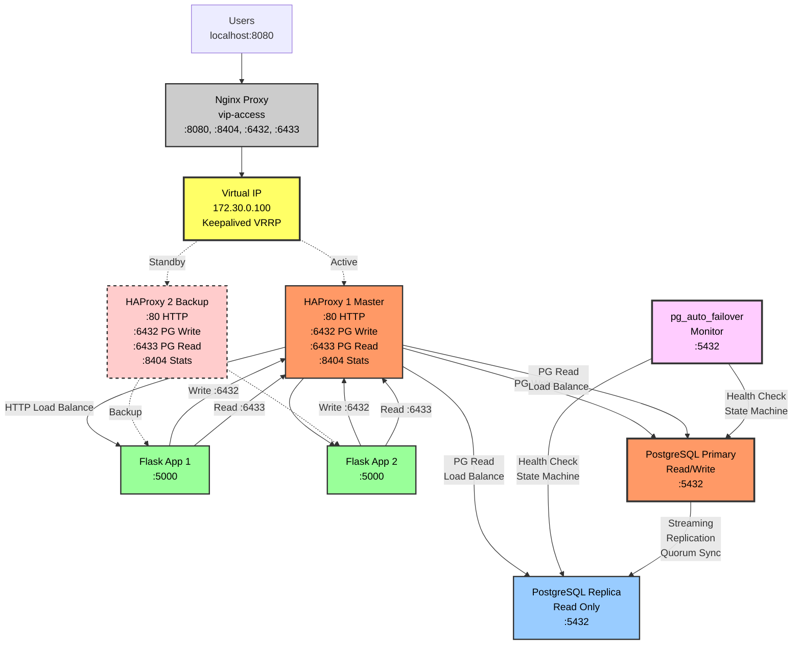

# Demo 3: Full Stack High Availability dengan Automatic Failover

Demonstrasi end-to-end yang menggabungkan semua layer HA: Load Balancer, Application, dan Database dengan **automatic failover**.

> 📖 **Documentation:** Untuk copy-paste commands & demo praktis, lihat **[QUICKSTART.md](QUICKSTART.md)**

## Prerequisites

### Building Custom PostgreSQL 17 Image

Demo ini menggunakan PostgreSQL 17 dengan pg_auto_failover. Karena official Docker images di Docker Hub hanya tersedia sampai PostgreSQL 15, kita perlu build custom image dari source repository.

**Quick build:**
```bash
./scripts/build-pg-image.sh
```

**Manual build:**
```bash
cd /tmp
git clone --depth 1 https://github.com/citusdata/pg_auto_failover.git
cd pg_auto_failover
podman build --platform linux/amd64 -t pg_auto_failover:pg17 -f Dockerfile .
```

Build process memakan waktu 5-10 menit karena compile PostgreSQL 17 from source.

> **Note:** Script `build-pg-image.sh` akan melakukan clone repository dan build image secara otomatis. Image yang dihasilkan: `pg_auto_failover:pg17`

## Arsitektur



## Konsep HA yang Didemonstrasikan

### Load Balancer Layer

**Single HAProxy untuk Multiple Services**
- Satu set HAProxy menangani HTTP dan PostgreSQL traffic
- Implementasi: `haproxy.cfg` memiliki frontend untuk port 80 (HTTP), 6432 (PostgreSQL write), 6433 (PostgreSQL read)

**Virtual IP Failover**
- Keepalived VRRP untuk transparent failover
- Implementasi: `keepalived-master.conf` dan `keepalived-backup.conf` mengelola VIP 172.30.0.100

**Health Check Monitoring**
- HAProxy melakukan health check ke backends untuk automatic detection
- Implementasi HTTP: `option httpchk GET /health` di `haproxy.cfg:50`
- Implementasi PostgreSQL: `option pgsql-check user postgres` di `haproxy.cfg:76` dan `haproxy.cfg:88`

**DNS Resolution**
- Handle dynamic container IPs yang berubah saat restart
- Implementasi: `resolvers docker` di `haproxy.cfg:7-18` dengan `init-addr libc,none` di server definitions

### Application Layer

**Stateless Design**
- Multiple instances tanpa session affinity
- Implementasi: HAProxy load balancing `roundrobin` tanpa session persistence

**Database Routing via HAProxy**
- Apps connect via HAProxy, bukan direct ke PostgreSQL
- Implementasi: Environment variables di `docker-compose.yml:143-149`
  - `DB_WRITE_HOST: haproxy1`
  - `DB_WRITE_PORT: 6432`
  - `DB_READ_HOST: haproxy1`
  - `DB_READ_PORT: 6433`

**Read/Write Traffic Separation**
- Write ke primary, read ke load balanced
- Implementasi: `app.py:22-54` dengan parameter `for_write`

**Connection Retry Logic**
- Automatic reconnection saat failover
- Implementasi: `app.py:42-54` dengan fallback logic

### Database Layer

**pg_auto_failover**
- Automatic failure detection dan promotion
- Implementasi: `docker-compose.yml:6-32` (pg-monitor) dan nodes dengan `pg_autoctl create postgres`

**Monitor-based Consensus**
- Single monitor yang menentukan state, tidak perlu quorum seperti etcd/consul
- Implementasi: Monitor node di `docker-compose.yml:6-32` menjalankan `pg_autoctl create monitor`

**Automatic Rejoin**
- Failed nodes otomatis menjadi standby setelah recovery
- Implementasi: Node command di `docker-compose.yml:58-71` dengan logic `if [ ! -f postgresql.conf ]`

**Split-brain Protection**
- Monitor memastikan hanya satu primary
- Implementasi: pg_auto_failover state machine di `pgautofailover.node` table

**Streaming Replication**
- Physical replication untuk data consistency
- Implementasi: pg_auto_failover otomatis setup replication dengan `pg_basebackup`

### Timeline Failover

**PostgreSQL Primary Failure:**
```
T+0s:  Primary crashes/stops
T+10s: Monitor detects failure (health check timeout di pg_autoctl)
T+15s: Monitor assigns 'prepare_promotion' state ke standby
T+20s: Standby melakukan pg_promote(), menjadi primary
T+23s: HAProxy pgsql-check mendeteksi new primary (3s interval × 3 retries)
T+30s: Applications writing ke new primary via HAProxy

Total Write Downtime: ~30 detik
Read Availability: Continuous (standby tetap serve reads selama promotion)
```

**HAProxy Master Failure:**
```
T+0s: haproxy1 (master) crashes
T+2s: Keepalived detects failure (VRRP timeout di keepalived.conf)
T+3s: VIP 172.30.0.100 pindah ke haproxy2
T+5s: All traffic flows through haproxy2

Total Downtime: <5 detik
Application Impact: Brief connection resets
```

---

## Implementation Details

### File Structure

```
demo-3-full-stack-ha/
├── docker-compose.yml           # Orchestration semua services
├── README.md                    # Dokumentasi lengkap
├── QUICKSTART.md                # Quick start guide dengan demo scenarios
├── app/
│   ├── Dockerfile
│   ├── app.py                   # Flask application dengan DB routing
│   └── requirements.txt
├── db/
│   ├── pg_hba.conf              # PostgreSQL access control
│   └── migrations/              # Flyway migrations
│       ├── V1__grant_permissions.sql
│       └── V2__create_schema.sql
├── haproxy/
│   ├── haproxy.cfg              # HAProxy config untuk HTTP & PostgreSQL
│   ├── keepalived-master.conf   # Keepalived config untuk haproxy1
│   └── keepalived-backup.conf   # Keepalived config untuk haproxy2
├── nginx/
│   └── nginx-proxy.conf         # Nginx proxy untuk external access
└── scripts/
    ├── build-pg-image.sh        # Build custom PostgreSQL 17 image
    ├── check-cluster.sh         # Helper: check pg_auto_failover state
    ├── test-auto-failover.sh    # Helper: test automatic failover
    ├── manual-failover.sh       # Helper: trigger manual switchover
    ├── chaos-test.sh            # Helper: chaos testing scenarios
    ├── generate-load.sh         # Helper: generate traffic load
    └── test-fullstack.sh        # Helper: test full stack
```

---

## Konfigurasi Load Balancer (HAProxy)

### Multi-Service Frontend Configuration

**File:** `haproxy.cfg`

**HTTP Traffic (`haproxy.cfg:42-45`):**
```haproxy
frontend http_front
    bind *:80
    default_backend app_backend
```
- Bind ke port 80 untuk menerima HTTP traffic
- Route semua request ke `app_backend`

**PostgreSQL Write Traffic (`haproxy.cfg:59-64`):**
```haproxy
frontend postgres_write
    bind *:6432
    mode tcp
    option tcplog
    default_backend postgres_primary
```
- Bind ke port 6432 untuk PostgreSQL write operations
- Mode TCP karena PostgreSQL bukan HTTP protocol
- Route ke `postgres_primary` backend yang hanya serve primary node

**PostgreSQL Read Traffic (`haproxy.cfg:66-71`):**
```haproxy
frontend postgres_read
    bind *:6433
    mode tcp
    option tcplog
    default_backend postgres_replicas
```
- Bind ke port 6433 untuk PostgreSQL read operations
- Route ke `postgres_replicas` backend yang load balance ke semua nodes

### DNS Resolver Configuration

**File:** `haproxy.cfg:7-18`

```haproxy
resolvers docker
    nameserver dns1 127.0.0.11:53
    nameserver dns2 172.30.0.1:53
    resolve_retries 3
    timeout resolve 1s
    timeout retry 1s
    hold other 30s
    hold refused 30s
    hold nx 30s
    hold timeout 30s
    hold valid 10s
    hold obsolete 30s
```

**Penjelasan:**
- `nameserver dns1 127.0.0.11:53`: Docker embedded DNS server
- `nameserver dns2 172.30.0.1:53`: Network gateway DNS sebagai fallback
- `resolve_retries 3`: Retry DNS query 3× jika gagal
- `hold valid 10s`: Cache valid DNS result selama 10 detik (short duration untuk dynamic IPs)
- `hold obsolete 30s`: Keep obsolete DNS 30 detik untuk graceful transition

### HTTP Backend dengan Health Checks

**File:** `haproxy.cfg:47-57`

```haproxy
backend app_backend
    balance roundrobin
    option httpchk GET /health
    http-check expect status 200

    # Health check configuration
    default-server inter 2s fall 3 rise 2 check

    server app1 app1:5000 check resolvers docker init-addr libc,none
    server app2 app2:5000 check resolvers docker init-addr libc,none
```

**Penjelasan baris-per-baris:**
- `balance roundrobin`: Load balancing algorithm, distribute evenly
- `option httpchk GET /health`: Health check via HTTP GET request ke `/health` endpoint
- `http-check expect status 200`: Expect HTTP 200 response untuk consider server healthy
- `default-server inter 2s`: Health check interval setiap 2 detik
- `fall 3`: Mark server DOWN setelah 3 consecutive failed checks (2s × 3 = 6 detik)
- `rise 2`: Mark server UP setelah 2 consecutive successful checks (2s × 2 = 4 detik)
- `check`: Enable health checks untuk server ini
- `resolvers docker`: Gunakan DNS resolver yang didefinisikan di `haproxy.cfg:7`
- `init-addr libc,none`: Pada startup, resolve DNS via libc; jika gagal, jangan gunakan IP default (prevent stale IPs)

### PostgreSQL Write Backend (Primary Only)

**File:** `haproxy.cfg:73-82`

```haproxy
backend postgres_primary
    mode tcp
    option pgsql-check user postgres

    # Health check configuration
    default-server inter 3s fall 3 rise 2 check

    server pg1 postgres-primary:5432 check resolvers docker init-addr libc,none
    server pg2 postgres-replica1:5432 check backup resolvers docker init-addr libc,none
```

**Penjelasan konsep penting:**
- `mode tcp`: TCP mode karena PostgreSQL protocol
- `option pgsql-check user postgres`: PostgreSQL-specific health check, connect dengan user postgres
  - HAProxy melakukan PostgreSQL handshake untuk verify server operational
  - Lebih reliable daripada simple TCP check
- `inter 3s fall 3 rise 2`: Health check setiap 3s, DOWN setelah 9s (3×3), UP setelah 6s (3×2)
- `server pg1 ... check`: Primary server, always active jika healthy
- `server pg2 ... check backup`: **Backup server**, hanya digunakan jika pg1 DOWN
  - Konsep penting: HAProxy automatic failover via `backup` directive
  - Ketika pg1 DOWN (failover terjadi), traffic otomatis ke pg2
  - Setelah pg_auto_failover promote pg2 ke primary, traffic sudah flowing → seamless!

### PostgreSQL Read Backend (Load Balanced)

**File:** `haproxy.cfg:84-94`

```haproxy
backend postgres_replicas
    mode tcp
    balance roundrobin
    option pgsql-check user postgres

    # Health check configuration
    default-server inter 3s fall 3 rise 2 check

    server pg1 postgres-primary:5432 check resolvers docker init-addr libc,none
    server pg2 postgres-replica1:5432 check resolvers docker init-addr libc,none
```

**Perbedaan dengan write backend:**
- Tidak ada `backup` directive: kedua servers active simultaneously
- `balance roundrobin`: Distribute read load evenly
- Primary dan replica sama-sama serve reads → read scaling

---

## Konfigurasi Keepalived (VRRP Failover)

### Master Configuration

**File:** `keepalived-master.conf`

```conf
global_defs {
    enable_script_security
    script_user root
}

vrrp_script check_haproxy {
    script "/usr/bin/killall -0 haproxy"
    interval 2
    weight 2
    user root
}

vrrp_instance VI_1 {
    state MASTER
    interface eth0
    virtual_router_id 51
    priority 101
    advert_int 1

    authentication {
        auth_type PASS
        auth_pass secret123
    }

    virtual_ipaddress {
        172.30.0.100
    }

    track_script {
        check_haproxy
    }
}
```

**Penjelasan konfigurasi:**

**Global Definitions (`global_defs`):**
- `enable_script_security`: Keepalived 2.x requirement untuk execute scripts
- `script_user root`: Scripts dijalankan sebagai root user

**Health Check Script (`vrrp_script`):**
- `script "/usr/bin/killall -0 haproxy"`: Check apakah HAProxy process alive
  - `killall -0` mengirim signal 0 (tidak kill), hanya check process existence
  - Return code 0 jika alive, non-zero jika dead
- `interval 2`: Check setiap 2 detik
- `weight 2`: Jika script fail, decrease priority by 2
- **Full path `/usr/bin/killall` required** untuk security (prevent path injection)

**VRRP Instance (`vrrp_instance VI_1`):**
- `state MASTER`: Initial state (haproxy1 start sebagai master)
- `interface eth0`: Network interface untuk VRRP advertisements
- `virtual_router_id 51`: VRRP router ID (must match between master/backup)
- `priority 101`: Master priority (higher than backup's 100)
- `advert_int 1`: Send VRRP advertisements setiap 1 detik
- `virtual_ipaddress { 172.30.0.100 }`: VIP yang akan di-manage
- `track_script { check_haproxy }`: Monitor HAProxy via script, trigger failover jika fail

### Backup Configuration

**File:** `keepalived-backup.conf`

Sama dengan master, kecuali:
- `state BACKUP`: Initial state
- `priority 100`: Lower priority (master wins election)

**Failover mechanism:**
1. Master HAProxy crash → `check_haproxy` script fails
2. Master priority drops: 101 - 2 = 99 (lower than backup's 100)
3. Backup menjadi master, assign VIP ke eth0
4. Traffic flows to backup HAProxy

---

## Konfigurasi pg_auto_failover

### Monitor Node

**File:** `docker-compose.yml:6-32`

```yaml
pg-monitor:
  image: citusdata/pg_auto_failover:2.1
  container_name: pg-monitor
  hostname: pg-monitor
  environment:
    PGDATA: /var/lib/postgresql/data
    PG_AUTOCTL_MONITOR: "true"
  command: >
    sh -c "
    if [ ! -f /var/lib/postgresql/data/postgresql.conf ]; then
      pg_autoctl create monitor --pgdata /var/lib/postgresql/data --auth trust --run;
    else
      pg_autoctl run --pgdata /var/lib/postgresql/data;
    fi
    "
```

**Penjelasan command logic:**
- Check `postgresql.conf` untuk determine apakah monitor sudah initialized
- **First run:** `pg_autoctl create monitor` membuat monitor PostgreSQL database
  - Database `pg_auto_failover` untuk store formation state
  - User `autoctl_node` untuk node connections
  - `--auth trust` untuk simplify demo (production gunakan password/cert)
  - `--run` langsung start monitor setelah create
- **Subsequent runs:** `pg_autoctl run` start existing monitor

### PostgreSQL Node (Primary/Replica)

**File:** `docker-compose.yml:34-71`

```yaml
postgres-primary:
  image: citusdata/pg_auto_failover:2.1
  environment:
    PGDATA: /var/lib/postgresql/data
    PG_AUTOCTL_NODE_NAME: postgres-primary
  volumes:
    - ./data/primary:/var/lib/postgresql/data
    - ./init-schema.sql:/docker-entrypoint-initdb.d/init-schema.sql
  command: >
    sh -c "
    if [ ! -f /var/lib/postgresql/data/postgresql.conf ]; then
      pg_autoctl create postgres \
        --pgdata /var/lib/postgresql/data \
        --auth trust \
        --monitor 'postgres://autoctl_node@pg-monitor:5432/pg_auto_failover?sslmode=prefer' \
        --hostname postgres-primary \
        --name postgres-primary \
        --run;
    else
      pg_autoctl run --pgdata /var/lib/postgresql/data;
    fi
    "
```

**Penjelasan registration process:**
- **First run:** `pg_autoctl create postgres` register node ke monitor
  - Connect ke monitor via connection string
  - Monitor assigns initial state (primary/secondary)
  - Jika assigned secondary, automatic `pg_basebackup` dari primary
  - Setup streaming replication automatically
  - `--run` start PostgreSQL setelah setup
- **Subsequent runs:** `pg_autoctl run` start dengan existing config
  - Read state dari local config
  - Reconnect ke monitor
  - Resume sebagai primary/secondary sesuai last state

**Automatic rejoin logic:**
- Jika node crash dan restart, `pg_autoctl run` otomatis:
  1. Contact monitor untuk current formation state
  2. Jika masih in formation → resume normal operation
  3. Jika evicted (primary sekarang di node lain) → enter `rejoin` state
  4. Perform `pg_rewind` atau re-clone jika needed
  5. Start streaming dari new primary
  6. Transition ke `secondary` state

### Database Schema Initialization

**Automated Database Creation:**

Demo ini menggunakan environment variables untuk automatic database creation:

```yaml
# docker-compose.yml
postgres-primary:
  environment:
    PGUSER: app_user          # Membuat user ini secara otomatis
    PGDATABASE: demodb        # Membuat database ini secara otomatis
    POSTGRES_PASSWORD: postgres
```

**Flyway Migrations:**

Schema initialization menggunakan Flyway untuk versioned migrations:

**File:** `db/migrations/V1__grant_permissions.sql`
```sql
-- Grant permissions ke app_user (sudah dibuat oleh pg_auto_failover)
GRANT ALL PRIVILEGES ON ALL TABLES IN SCHEMA public TO app_user;
GRANT ALL PRIVILEGES ON ALL SEQUENCES IN SCHEMA public TO app_user;
GRANT USAGE, CREATE ON SCHEMA public TO app_user;

-- Set default privileges untuk tabel yang akan dibuat
ALTER DEFAULT PRIVILEGES IN SCHEMA public GRANT ALL ON TABLES TO app_user;
ALTER DEFAULT PRIVILEGES IN SCHEMA public GRANT ALL ON SEQUENCES TO app_user;
```

**File:** `db/migrations/V2__create_schema.sql`
```sql
-- Create demo table
CREATE TABLE IF NOT EXISTS users (
    id SERIAL PRIMARY KEY,
    name VARCHAR(100) NOT NULL,
    email VARCHAR(100) NOT NULL UNIQUE,
    created_at TIMESTAMP DEFAULT CURRENT_TIMESTAMP
);

-- Insert initial sample data
INSERT INTO users (name, email) VALUES
    ('Alice Admin', 'alice@example.com'),
    ('Bob Builder', 'bob@example.com'),
    ('Charlie Chef', 'charlie@example.com'),
    ('Diana Developer', 'diana@example.com'),
    ('Eve Engineer', 'eve@example.com');
```

**Init Container Configuration:** `docker-compose.yml:144-166`
```yaml
db-migrate:
  image: flyway/flyway:11-alpine
  environment:
    FLYWAY_URL: jdbc:postgresql://postgres-primary:5432/demodb
    FLYWAY_USER: docker
    FLYWAY_PASSWORD: ""
    FLYWAY_BASELINE_ON_MIGRATE: "true"
    FLYWAY_CONNECT_RETRIES: 60
  volumes:
    - ./db/migrations:/flyway/sql:ro
  depends_on:
    postgres-primary:
      condition: service_healthy
  command: migrate
  restart: "no"
```

**Kapan executed:**
- Init container `db-migrate` runs setelah PostgreSQL cluster healthy
- Flyway executes all migrations in order (V1, V2, ...)
- Migrations tracked di `flyway_schema_history` table
- Idempotent: safe to re-run, skips executed migrations
- Replica tidak menjalankan migrations (data replicated dari primary)

---

## Konfigurasi Application

### Database Connection via HAProxy

**File:** `app/app.py:12-20`

```python
# Configuration - Connect via HAProxy
DB_WRITE_HOST = os.getenv('DB_WRITE_HOST', 'haproxy1')
DB_WRITE_PORT = os.getenv('DB_WRITE_PORT', '6432')
DB_READ_HOST = os.getenv('DB_READ_HOST', 'haproxy1')
DB_READ_PORT = os.getenv('DB_READ_PORT', '6433')
DB_NAME = os.getenv('DB_NAME', 'demodb')
DB_USER = os.getenv('DB_USER', 'postgres')
DB_PASSWORD = os.getenv('DB_PASSWORD', 'postgres')
```

**Implementasi di docker-compose:** `docker-compose.yml:142-149`
```yaml
environment:
  DB_WRITE_HOST: haproxy1
  DB_WRITE_PORT: 6432
  DB_READ_HOST: haproxy1
  DB_READ_PORT: 6433
```

**Konsep penting:**
- Application **tidak tahu** node mana yang primary
- Application **tidak perlu** handle failover logic
- HAProxy handles:
  - Routing ke correct node (primary untuk write, any untuk read)
  - Failover detection via health checks
  - Automatic rerouting saat primary change

### Connection Function dengan Read/Write Separation

**File:** `app/app.py:22-54`

```python
def get_db_connection(for_write=False):
    """
    Get database connection via HAProxy
    - Write operations: route to HAProxy postgres_write (primary)
    - Read operations: route to HAProxy postgres_read (load balanced)
    """
    try:
        host = DB_WRITE_HOST if for_write else DB_READ_HOST
        port = DB_WRITE_PORT if for_write else DB_READ_PORT

        conn = psycopg2.connect(
            host=host,
            port=port,
            dbname=DB_NAME,
            user=DB_USER,
            password=DB_PASSWORD,
            connect_timeout=3
        )

        return conn, f"{host}:{port}"
    except Exception as e:
        # Fallback to write endpoint if read fails
        if not for_write:
            conn = psycopg2.connect(
                host=DB_WRITE_HOST,
                port=DB_WRITE_PORT,
                ...
            )
            return conn, f"{DB_WRITE_HOST}:{DB_WRITE_PORT} (fallback)"
        raise e
```

**Usage dalam endpoints:**

**Write operation** (`app/app.py:239-272`):
```python
@app.route('/api/users', methods=['POST'])
def create_user():
    conn, db_host = get_db_connection(for_write=True)  # → haproxy1:6432
    cur = conn.cursor()
    cur.execute('INSERT INTO users ...')
    conn.commit()
```

**Read operation** (`app/app.py:212-237`):
```python
@app.route('/api/users', methods=['GET'])
def get_users():
    conn, db_host = get_db_connection(for_write=False)  # → haproxy1:6433
    cur = conn.cursor()
    cur.execute('SELECT * FROM users ...')
```

**Fallback mechanism:**
- Jika read endpoint fail (semua replicas down), fallback ke write endpoint
- Guarantees availability (primary masih bisa serve reads)
- Trade-off: primary jadi overloaded jika replicas down

### Health Check Endpoint

**File:** `app/app.py:146-168`

```python
@app.route('/health')
def health():
    """Health check endpoint for HAProxy"""
    try:
        # Check database connectivity
        conn, db_host = get_db_connection()
        cur = conn.cursor()
        cur.execute('SELECT 1')
        cur.close()

        return jsonify({
            'status': 'healthy',
            'instance': APP_NAME,
            'timestamp': datetime.now().isoformat(),
            'database': db_host
        }), 200
    except Exception as e:
        return jsonify({
            'status': 'unhealthy',
            'instance': APP_NAME,
            'error': str(e),
            'timestamp': datetime.now().isoformat()
        }), 503
```

**Digunakan oleh:** `haproxy.cfg:50` → `option httpchk GET /health`

**Health check logic:**
- Return HTTP 200 jika app dan database connection OK
- Return HTTP 503 jika database unreachable
- HAProxy remove instance dari pool jika receive 503 atau timeout

---

## Konfigurasi External Access (Nginx Proxy)

### HTTP Traffic

**File:** `nginx-proxy.conf:5-35`

```nginx
http {
    upstream haproxy_vip {
        server 172.30.0.100:80;
    }

    upstream haproxy_stats {
        server 172.30.0.100:8404;
    }

    server {
        listen 80;
        location / {
            proxy_pass http://haproxy_vip;
            ...
        }
    }

    server {
        listen 8404;
        location / {
            proxy_pass http://haproxy_stats;
        }
    }
}
```

**Fungsi:** Expose HAProxy VIP ke external (localhost:8080)

### PostgreSQL Traffic (TCP Stream)

**File:** `nginx-proxy.conf:37-58`

```nginx
stream {
    upstream postgres_write {
        server 172.30.0.100:6432;
    }

    upstream postgres_read {
        server 172.30.0.100:6433;
    }

    server {
        listen 6432;
        proxy_pass postgres_write;
        proxy_connect_timeout 3s;
    }

    server {
        listen 6433;
        proxy_pass postgres_read;
        proxy_connect_timeout 3s;
    }
}
```

**Fungsi:**
- Expose PostgreSQL via HAProxy VIP ke external
- `localhost:6432` → HAProxy VIP write endpoint
- `localhost:6433` → HAProxy VIP read endpoint

**Port mapping di docker-compose:** `docker-compose.yml:243-247`
```yaml
vip-access:
  ports:
    - "8080:80"       # HTTP traffic
    - "8404:8404"     # HAProxy stats
    - "6432:6432"     # PostgreSQL write
    - "6433:6433"     # PostgreSQL read
```

---

## Mekanisme Automatic Failover

### State Machine pg_auto_failover

**Normal Operation:**
```
Node 1: init → wait_standby → primary
Node 2: init → wait_standby → catchingup → secondary
```

**Failover (Primary Unreachable):**
```
T+0s:   Node 1: primary → (unreachable)
T+10s:  Monitor detect timeout
T+12s:  Node 2: secondary → prepare_promotion
T+18s:  Node 2: prepare_promotion → stop_replication
T+20s:  Node 2: stop_replication → wait_primary
T+22s:  Node 2: wait_primary → primary (pg_promote executed)
```

**Failover (Primary Masih Reachable):**
```
T+0s:   Monitor commands: Node 1 demote
T+2s:   Node 1: primary → draining (reject new connections)
T+5s:   Node 1: draining → demote_timeout (wait for transactions)
T+8s:   Node 1: demote_timeout → demoted
T+10s:  Node 2: secondary → prepare_promotion
T+15s:  Node 2: prepare_promotion → primary
T+20s:  Node 1: demoted → catchingup (start replication from Node 2)
T+30s:  Node 1: catchingup → secondary
```

**Automatic Rejoin (Old Primary Restart):**
```
T+0s:   Node 1 starts, pg_autoctl run reads local config
T+2s:   Contact monitor dengan last known state
T+5s:   Monitor response: "you are no longer primary"
T+7s:   Node 1: (offline) → rejoin
T+10s:  Determine if pg_rewind sufficient atau need full re-clone
T+15s:  Execute pg_rewind -D $PGDATA --source-server=Node2
T+25s:  Node 1: rejoin → fast_forward (catching up WAL)
T+40s:  Node 1: fast_forward → catchingup
T+60s:  Node 1: catchingup → secondary (rejoin complete!)
```

**Stored di:** PostgreSQL table `pgautofailover.node` di monitor database

### HAProxy Health Check Integration

**Write Backend Failover Detection:**

1. **Normal state:**
   - `pg1 (postgres-primary:5432)`: UP, active, serving traffic
   - `pg2 (postgres-replica1:5432)`: UP, backup, not serving traffic

2. **Primary fails (T+0s):**
   - postgres-primary container stops atau PostgreSQL crashes

3. **HAProxy detects (T+3s, T+6s, T+9s):**
   - `pgsql-check user postgres` ke pg1 fails
   - After 3 consecutive failures (9 seconds): pg1 marked DOWN

4. **HAProxy failover (T+9s):**
   - pg2 (backup server) activated
   - Traffic rerouted to postgres-replica1:5432
   - **Meskipun masih replica**, HAProxy sudah route traffic kesini

5. **pg_auto_failover promotes (T+20s):**
   - postgres-replica1 promoted ke primary
   - Traffic yang sudah route ke pg2 now hitting new primary
   - **Seamless transition** karena HAProxy sudah ahead!

6. **Old primary restart (T+120s):**
   - postgres-primary container starts
   - pg_autoctl mendeteksi, rejoin sebagai secondary
   - HAProxy health check success: pg1 marked UP
   - pg1 tetap BACKUP (pg2 masih active sebagai primary)
   - **Role reversal handled gracefully**

**Read Backend Load Balancing:**
- Kedua servers active simultaneously
- Health check failures → remove dari pool
- Health check success → add kembali ke pool
- No concept of "backup" → pure load balancing

---

## PostgreSQL Client Access

Demo ini menyediakan containerized PostgreSQL client (`psql-client`) dengan tools untuk management.

**Konfigurasi:** `docker-compose.yml:114-132`

```yaml
psql-client:
  image: citusdata/pg_auto_failover:2.1
  command: sleep infinity
  environment:
    PGPASSWORD: postgres
    PGUSER: postgres
  volumes:
    - .:/workspace
  working_dir: /workspace
```

**Tools yang tersedia:**
- `psql`: PostgreSQL interactive terminal
- `pg_autoctl`: Cluster management commands
- `pg_basebackup`, `pg_dump`, `pg_restore`: Backup/restore tools
- Scripts di `/workspace`: `check-cluster.sh`, `test-auto-failover.sh`, dll

**Akses pattern:**
```bash
# Dari HOST, exec ke dalam container
docker exec -it psql-client sh

# Di dalam container, akses database via HAProxy
psql -h haproxy1 -p 6432 -U postgres -d demodb  # Write endpoint
psql -h haproxy1 -p 6433 -U postgres -d demodb  # Read endpoint

# Atau check cluster state
pg_autoctl show state --monitor 'postgres://autoctl_node@pg-monitor/pg_auto_failover'
```

> **Demo praktis:** Lihat [QUICKSTART.md](QUICKSTART.md) untuk hands-on scenarios

---

## Production Considerations

### Synchronous vs Asynchronous Replication

**Default config (Asynchronous):**
- Commits tidak wait for replica acknowledgment
- Low latency writes
- Potential data loss saat failover (beberapa detik terakhir)

**Untuk zero data loss:**
Modify primary configuration untuk enable synchronous replication:
```sql
ALTER SYSTEM SET synchronous_standby_names = 'postgres-replica1';
SELECT pg_reload_conf();
```

**Trade-offs:**

| Konfigurasi | Write Latency | Data Loss Risk | Availability |
|------------|---------------|----------------|--------------|
| Async | Low (~1ms) | High (detik) | High (tidak tergantung replica) |
| Sync | Medium (~10-50ms) | None (RPO=0) | Medium (tergantung replica health) |

**Pilihan tergantung:**
- **Financial transactions:** Sync (data loss unacceptable)
- **Logging, analytics:** Async (performance more important)
- **E-commerce orders:** Sync during checkout, async untuk browsing

### Monitoring Metrics

**Metrics penting:**
- **Replication lag:** `pg_stat_replication.replay_lag`
- **Node health:** `pg_autoctl show state --json | jq '.nodes[].health'`
- **HAProxy backend status:** curl http://localhost:8404/ atau stats socket
- **Connection pool utilization:** Active connections via `pg_stat_activity`

**Alert thresholds:**
- Replication lag > 10 seconds
- Node reported unhealthy oleh pg_auto_failover
- HAProxy backend DOWN > 30 seconds
- Failover events (track frequency)

### Backup Strategy

**Replication bukan backup!**

Scenarios yang tidak protected oleh replication:
- Accidental `DROP TABLE` (replicated!)
- Application bug yang corrupt data
- Ransomware attack
- Datacenter-level failure

**Backup requirements:**
- **Physical backup:** `pg_basebackup` daily
- **WAL archiving:** Continuous untuk PITR (Point-in-Time Recovery)
- **Off-site storage:** S3, GCS, atau remote datacenter
- **Backup testing:** Regular restore drills

**Tools untuk production:**
- **pgBackRest:** Advanced backup/restore, compression, encryption
- **WAL-G:** Cloud-native backup tool
- **Barman:** Backup and Recovery Manager for PostgreSQL

### Connection Pooling

**Application-Level Pooling (Recommended First)**

Modern frameworks have built-in connection pooling:
- **Python**: psycopg3 pool, SQLAlchemy
- **Java**: HikariCP, Apache DBCP
- **Node.js**: pg-pool, Sequelize
- **Go**: database/sql (built-in)
- **.NET**: Entity Framework

**Demo 3 Implementation:**
```python
# psycopg3 supports connection pooling
from psycopg_pool import ConnectionPool

pool = ConnectionPool(
    conninfo="host=haproxy1 port=6432 dbname=demodb",
    min_size=2,
    max_size=10
)
```

**When Application Pooling Is Sufficient:**
- Single monolithic application
- Moderate concurrent connections (< 100)
- Long-lived application processes
- Connection reuse within same process

**When PgBouncer Is Needed:**

Use PgBouncer (server-side pooling) for:
1. **Serverless/Lambda**: Short-lived functions creating many connections
2. **Microservices**: Many small services, each with their own pool
3. **Legacy apps**: No built-in pooling support
4. **Transaction pooling**: More aggressive pooling than session pooling

Architecture with PgBouncer:
```
Serverless Functions (1000+) or Microservices (100+)
    ↓
HAProxy (connection routing)
    ↓
PgBouncer (transaction pooling, max 20 connections)
    ↓
PostgreSQL (max_connections = 100)
```

**Trade-offs:**
- **Application pooling**: Simpler, sufficient for most cases
- **PgBouncer**: Additional component, needed for specific architectures

---

## Perbandingan dengan Demo 2

| Aspek | Demo 2 (Manual) | Demo 3 (Automatic) |
|-------|----------------|-------------------|
| **Failover Type** | Manual `pg_promote()` | Automatic via pg_auto_failover |
| **Failover Time** | Menit (manual steps) | < 30 detik |
| **Detection** | Manual observation | Automatic (10s timeout) |
| **Promotion** | Execute `SELECT pg_promote()` | State machine transition |
| **Rejoin** | Manual `pg_basebackup` & config | Automatic rejoin via pg_rewind |
| **Split-brain Risk** | High (operator error) | Low (monitor-based consensus) |
| **Operational Overhead** | High (manual intervention) | Low (hands-off) |
| **Production Ready** | ❌ Butuh automation layer | ✅ Production-ready |
| **Complexity** | Medium (concepts simple) | Medium-High (more moving parts) |
| **Dependencies** | None (pure PostgreSQL) | Monitor node (SPOF risk) |
| **Multi-replica** | Manual management | Automatic (N replicas supported) |
| **Application Integration** | Demo 2: Direct DB connection<br>Demo 3: Via HAProxy | Transparent failover |

**Kapan gunakan Demo 2 approach:**
- Learning PostgreSQL replication fundamentals
- Development environment
- Budget constraints (monitor node = extra cost)

**Kapan gunakan Demo 3 approach:**
- Production workloads
- SLA requirements (uptime, RTO)
- Multiple replicas
- Integration dengan load balancer

---

## Langkah Selanjutnya

- **Patroni:** Alternative to pg_auto_failover using etcd/consul for distributed consensus
- **Application Connection Pooling:** Implement psycopg3 ConnectionPool, SQLAlchemy pooling
- **PgBouncer:** Server-side pooling for serverless/microservices architectures
- **Logical Replication:** Multi-datacenter dengan selective replication
- **pgBackRest:** Production-grade backup/restore solution
- **Prometheus + Grafana:** Monitoring dan alerting
- **Kubernetes + Operator:** Cloud-native PostgreSQL HA (Zalando, CrunchyData, CloudNativePG)

---

## Referensi

- [pg_auto_failover Documentation](https://pg-auto-failover.readthedocs.io/)
- [PostgreSQL High Availability](https://www.postgresql.org/docs/current/high-availability.html)
- [HAProxy Configuration Manual](http://docs.haproxy.org/2.9/configuration.html)
- [Keepalived User Guide](https://keepalived.readthedocs.io/)
- [PostgreSQL Replication](https://www.postgresql.org/docs/current/runtime-config-replication.html)
