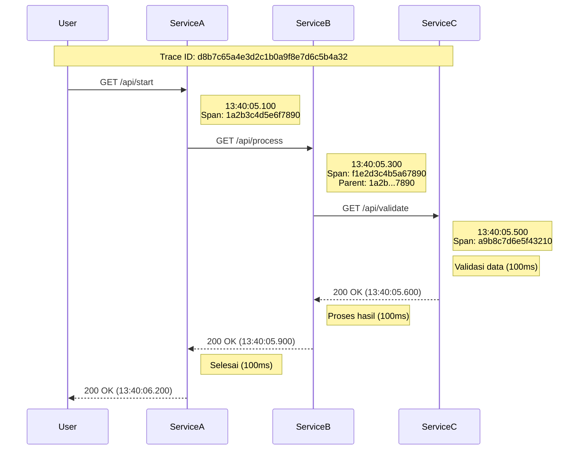
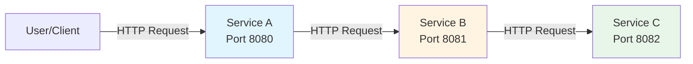

# Contoh Log Parsing

Folder ini berisi contoh-contoh log parsing untuk berbagai jenis aplikasi menggunakan Grok pattern. Grok adalah cara untuk mem-parsing log yang tidak terstruktur menjadi format terstruktur (JSON) sehingga lebih mudah untuk dianalisis dan dimonitoring.

## Apa itu Grok Pattern?

Grok pattern adalah syntax pattern matching yang digunakan untuk mengekstrak data dari log text yang tidak terstruktur. Grok menggunakan regular expression yang diberi nama untuk memudahkan parsing log. Pattern ini sangat berguna untuk:

- Mengubah log text menjadi data terstruktur (JSON)
- Memudahkan indexing dan searching log
- Menganalisis log secara programmatic
- Membuat dashboard monitoring dari log

## Struktur File

Setiap contoh log parsing dalam folder ini terdiri dari 3 komponen:

1. **File Log** (`.log`) - File log asli yang akan di-parse
2. **Grok Pattern** (`.txt`) - Pattern untuk mem-parsing log
3. **Parse Result** (`.json`) - Hasil parsing dalam format JSON

## Daftar Contoh

### 1. Nginx Access Log

**File-file:**
- `nginx-access.log` - Contoh access log dari Nginx web server
- `nginx-access-grok-pattern.txt` - Grok pattern untuk mem-parsing nginx access log
- `nginx-access-parse-result.json` - Hasil parsing dalam format JSON

**Deskripsi:**
Nginx access log mencatat semua request yang masuk ke web server. Log ini berisi informasi penting seperti:
- IP address client
- Timestamp request
- HTTP method (GET, POST, dll)
- Request path/URL
- HTTP status code (200, 404, 500, dll)
- Response size
- User agent (browser/aplikasi yang digunakan)
- Referrer (dari mana user datang)

**Contoh log:**
```
192.168.1.10 - - [04/Nov/2025:14:45:01 +0700] "GET /api/products/123 HTTP/1.1" 200 154 "-" "PostmanRuntime/7.26.8"
```

**Field yang di-extract:**
- `client_ip`: IP address client yang melakukan request
- `timestamp`: Waktu request
- `request_method`: Method HTTP (GET, POST, dll)
- `request_path`: Path yang direquest
- `http_version`: Versi HTTP protocol
- `status`: HTTP status code
- `body_bytes_sent`: Ukuran response dalam bytes
- `referrer`: URL referrer
- `user_agent`: Browser atau aplikasi yang digunakan

### 2. Nginx Error Log

**File-file:**
- `nginx-error.log` - Contoh error log dari Nginx web server
- `nginx-error-grok-pattern.txt` - Grok pattern untuk mem-parsing nginx error log
- `nginx-error-parse-result.json` - Hasil parsing dalam format JSON

**Deskripsi:**
Nginx error log mencatat berbagai error dan warning yang terjadi di web server. Log ini sangat penting untuk troubleshooting masalah seperti:
- Error koneksi ke upstream (PHP-FPM, backend server)
- Access denied/forbidden
- File not found
- Configuration issues
- Performance warnings

**Contoh log:**
```
2025/11/04 14:52:05 [error] 1234#1234: *55 access forbidden by rule, client: 192.168.1.20, server: example.com, request: "GET /app/storage/logs/laravel.log HTTP/1.1"
```

**Field yang di-extract:**
- `timestamp`: Waktu error terjadi
- `severity`: Level error (error, crit, warn, dll)
- `pid`: Process ID Nginx worker
- `tid`: Thread ID
- `connection_id`: ID koneksi
- `message`: Pesan error
- `client_ip`: IP client yang terkait dengan error
- `server`: Server name
- `request`: HTTP request yang menyebabkan error
- `upstream`: Informasi upstream jika ada
- `host`: Hostname

### 3. Spring Boot Log (One Line Format)

**File-file:**
- `spring-boot.log` - Contoh log lengkap dari aplikasi Spring Boot (format multiline)
- `spring-boot-oneline.log` - Contoh log Spring Boot format one line
- `spring-boot-grok-pattern-oneline.txt` - Grok pattern untuk mem-parsing spring boot log format one line
- `spring-boot-oneline-parse-result.json` - Hasil parsing dalam format JSON

**Deskripsi:**
Spring Boot adalah framework Java populer untuk membuat aplikasi enterprise. Log Spring Boot mencatat:
- Application lifecycle events (startup, shutdown)
- Request processing
- Database queries
- Error dan exception
- Custom application logs

Format one line memudahkan parsing karena setiap log entry ada dalam satu baris (tidak seperti stack trace yang multiline).

**Contoh log:**
```
2025-11-04 13:37:30.100  INFO 7890 --- [           main] c.e.d.DemoApplication                    : Starting DemoApplication using Java 21 with PID 7890 (started by user in /app)
```

**Field yang di-extract:**
- `timestamp`: Waktu log
- `log_level`: Level log (INFO, WARN, ERROR, DEBUG, dll)
- `pid`: Process ID aplikasi
- `thread`: Thread name yang menulis log
- `logger`: Nama class logger
- `message`: Pesan log

### 4. Distributed Tracing Log (Spring Boot Sleuth/Micrometer)

**File-file:**
- `distributed-tracing/service-a.log` - Log dari Service A (entry point)
- `distributed-tracing/service-b.log` - Log dari Service B (middle service)
- `distributed-tracing/service-c.log` - Log dari Service C (downstream service)
- `distributed-tracing/distributed-tracing-grok-pattern.txt` - Grok pattern untuk parsing
- `distributed-tracing/distributed-tracing-parse-result.json` - Hasil parsing dalam format JSON
- `distributed-tracing/grokdebugger-test-result.png` - Screenshot hasil testing di grokdebugger.com

**Deskripsi:**
Distributed tracing adalah teknik untuk tracking request yang melewati multiple microservices. Spring Boot Sleuth/Micrometer menambahkan informasi tracing ke log:
- **Trace ID**: ID unik untuk satu request flow yang melewati semua service
- **Span ID**: ID unik untuk satu unit kerja dalam satu service
- **Parent Span ID**: ID span dari service pemanggil

Informasi ini sangat berguna untuk:
- Debugging issues di microservices architecture
- Performance analysis
- Dependency mapping antar service
- End-to-end request monitoring

**Grok Pattern:**
```
%{TIMESTAMP_ISO8601:timestamp} %{LOGLEVEL:log_level} %{NUMBER:pid} \[%{DATA:service_name},%{DATA:trace_id},%{DATA:span_id}\] \[%{DATA:thread}\] %{DATA:logger}: %{GREEDYDATA:message}
```

**Testing Result:**
Pattern ini telah ditest menggunakan [grokdebugger.com](https://grokdebugger.com) dengan hasil **10/10 logs berhasil di-parse** dari ketiga service. Screenshot hasil testing tersedia di `distributed-tracing/grokdebugger-test-result.png`.

**Contoh log:**
```
2025-11-04 13:40:05.100 INFO 7890 [service-a,d8b7c65a4e3d2c1b0a9f8e7d6c5b4a32,1a2b3c4d5e6f7890] [nio-8080-exec-1] c.e.d.c.StartController: Menerima GET request /api/start. Memanggil Service B.
```

**Contoh log tanpa tracing context:**
```
2025-11-04 13:40:00.100 INFO 7890 [service-a,,] [main] c.e.d.DemoApplication: Starting DemoApplication (Service A) using Java 21 with PID 7890
```

**Field yang di-extract:**
- `timestamp`: Waktu log (format ISO8601)
- `log_level`: Level log (INFO, WARN, ERROR, DEBUG, dll)
- `pid`: Process ID aplikasi (number)
- `service_name`: Nama service (service-a, service-b, service-c)
- `trace_id`: Trace ID untuk correlating logs antar service (optional, kosong jika tidak ada tracing context)
- `span_id`: Span ID untuk unit kerja dalam service ini (optional, kosong jika tidak ada tracing context)
- `thread`: Thread name yang menulis log
- `logger`: Nama class logger
- `message`: Pesan log

**Request Flow Diagram:**



**Service Dependency Graph:**



**Penjelasan Tracing:**

Semua service menggunakan **Trace ID** yang sama: `d8b7c65a4e3d2c1b0a9f8e7d6c5b4a32`. Trace ID ini digunakan untuk menghubungkan semua log yang berkaitan dengan satu request dari user, walaupun request tersebut melewati banyak service.

Setiap service memiliki **Span ID** yang unik:
- Service A: `1a2b3c4d5e6f7890` (root span)
- Service B: `f1e2d3c4b5a67890` (child dari Service A span)
- Service C: `a9b8c7d6e5f43210` (child dari Service B span)

**Total Duration:** 1.1 detik (dari 13:40:05.100 sampai 13:40:06.200)

## Cara Menggunakan Grok Pattern

### 1. Menggunakan Logstash

Logstash adalah tool populer untuk processing log. Contoh konfigurasi:

```ruby
filter {
  grok {
    match => { "message" => "%{IPORHOST:client_ip} - - \[%{HTTPDATE:timestamp}\] \"%{WORD:request_method} %{URIPATHPARAM:request_path}(?: HTTP/%{NUMBER:http_version})?\" %{NUMBER:status:int} (?:%{NUMBER:body_bytes_sent:int}|-) \"(?:%{DATA:referrer}|-)\" \"(?:%{DATA:user_agent}|-)\"" }
  }
}
```

### 2. Menggunakan Online Grok Debugger

Anda bisa test grok pattern secara online di:
- https://grokdebugger.com/
- https://grokconstructor.appspot.com/

**Cara testing:**
1. Copy isi file grok pattern (`.txt`)
2. Copy sample log dari file `.log`
3. Paste di grok debugger
4. Verify hasil parsing sesuai dengan file `.json`

### 3. Menggunakan Filebeat dengan Elasticsearch

Filebeat juga support grok pattern:

```yaml
processors:
  - dissect:
      tokenizer: "%{client_ip} - - [%{timestamp}] \"%{request_method} %{request_path} HTTP/%{http_version}\" %{status} %{body_bytes_sent}"
      field: "message"
```

## Tips Parsing Log

1. **Identifikasi format log** - Pahami struktur log sebelum membuat pattern
2. **Gunakan built-in patterns** - Grok sudah menyediakan banyak pattern seperti `IPORHOST`, `HTTPDATE`, `NUMBER`, dll
3. **Test pattern secara iteratif** - Test dengan sample log yang berbeda-beda
4. **Perhatikan performance** - Pattern yang kompleks bisa mempengaruhi performance
5. **Handle edge cases** - Pastikan pattern bisa handle variasi log (misalnya field yang optional)

## Manfaat Log Parsing

1. **Monitoring Real-time** - Data terstruktur mudah dimonitor dengan dashboard
2. **Troubleshooting** - Lebih mudah mencari error spesifik
3. **Analytics** - Bisa menganalisis trend dan pattern dari log
4. **Alerting** - Bisa membuat alert berdasarkan kondisi spesifik di log
5. **Compliance** - Memudahkan audit dan compliance requirements

## Tools untuk Log Parsing dan Monitoring

- **ELK Stack** (Elasticsearch, Logstash, Kibana)
- **Grafana Loki** - Log aggregation system
- **Fluentd** - Open source data collector
- **Prometheus** dengan **Loki** - Untuk metrics dan logs
- **Graylog** - Log management platform
- **Splunk** - Enterprise log management (commercial)

## Referensi

- [Grok Pattern Documentation](https://www.elastic.co/guide/en/logstash/current/plugins-filters-grok.html)
- [Built-in Grok Patterns](https://github.com/logstash-plugins/logstash-patterns-core/tree/main/patterns)
- [Nginx Log Format](https://nginx.org/en/docs/http/ngx_http_log_module.html)
- [Spring Boot Logging](https://docs.spring.io/spring-boot/docs/current/reference/html/features.html#features.logging)

## Latihan

Untuk latihan, coba:
1. Modifikasi grok pattern untuk menambahkan field baru
2. Buat grok pattern untuk format log custom
3. Test pattern dengan log production yang sebenarnya
4. Setup Logstash atau Filebeat untuk parse log secara real-time
5. Buat dashboard di Kibana atau Grafana untuk visualisasi log

---

**Catatan:** File-file dalam folder ini adalah contoh untuk keperluan pembelajaran. Untuk production environment, pastikan untuk:
- Handle log rotation
- Manage disk space
- Setup proper retention policy
- Secure sensitive information dalam log
- Monitor performance log processing
