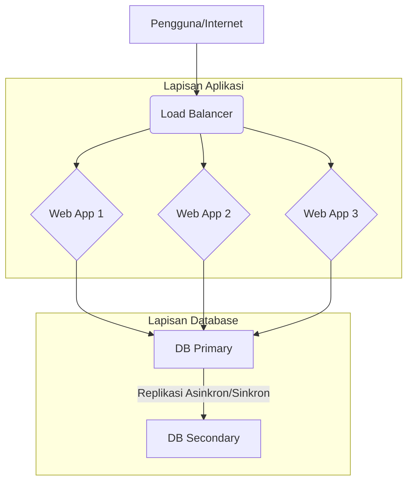

# 🚀 DigitalOcean HAProxy & Database Cluster (100% Droplet)

## 📖 Deskripsi Proyek

Proyek ini menggunakan **Terraform** untuk menyediakan arsitektur aplikasi web berdaya tahan tinggi (High Availability/HA) di DigitalOcean. Topologi ini dirancang dengan isolasi jaringan maksimum menggunakan **Virtual Private Cloud (VPC)**, memastikan hanya Load Balancer yang terekspos ke publik.

### **Spesifikasi Topologi:**

| Komponen | Jumlah | Role | Eksposur IP |
| :--- | :--- | :--- | :--- |
| **Load Balancer** | 1 Droplet | HAProxy (Titik masuk publik) | **Publik & Privat** |
| **Aplikasi Web** | 3 Droplet | Node Web Server (Nginx) | Hanya **Privat** (VPC) |
| **Database** | 2 Droplet | Primary & Secondary (Replikasi Manual) | Hanya **Privat** (VPC) |




-----

## 🔒 Arsitektur Jaringan (VPC)

Semua komunikasi internal (Load Balancer ke Aplikasi, Aplikasi ke Database) dilakukan melalui **IP Privat** di dalam DigitalOcean VPC. Hal ini secara signifikan meningkatkan keamanan karena node aplikasi dan database tidak dapat diakses langsung dari internet.

| Komponen | Koneksi Masuk | Koneksi Keluar |
| :--- | :--- | :--- |
| **Pengguna** | $\rightarrow$ HAProxy (Port 80 Publik) | N/A |
| **HAProxy** | $\rightarrow$ Web App Node (Port 80 Privat) | $\leftarrow$ Web App Node (Port 80 Privat) |
| **Web App Node** | $\rightarrow$ DB Primary (Port DB Privat) | $\leftarrow$ DB Primary (Port DB Privat) |

-----

## ⚙️ Persyaratan

Sebelum menjalankan skrip Terraform ini, pastikan Anda memiliki:

1.  **Terraform CLI** terinstal.
2.  **DigitalOcean API Token.** Token ini harus diekspor sebagai *environment variable*:
    ```bash
    export DIGITALOCEAN_TOKEN="YOUR_DO_TOKEN"
    ```
3.  **Kunci SSH** publik (`~/.ssh/id_rsa.pub`) di mesin lokal Anda (atau sesuaikan jalurnya di `main.tf`).

-----

## 💾 File Konfigurasi (`main.tf`)

File utama Terraform (`main.tf`) berisi langkah-langkah provisi berikut:

1.  **digitalocean\_vpc.private\_network**: Membuat jaringan pribadi yang aman untuk semua sumber daya.
2.  **digitalocean\_ssh\_key.default**: Mengunggah kunci SSH untuk akses ke Droplet.
3.  **digitalocean\_droplet.database\_node** (count = 2): Membuat dua Droplet DB (Primary & Secondary). Mereka hanya memiliki IP Privat dan merupakan target untuk replikasi database (konfigurasi replikasi harus dilakukan secara manual setelah *deployment*).
4.  **digitalocean\_droplet.web\_app** (count = 3): Membuat tiga Droplet aplikasi web. Hanya memiliki IP Privat dan menjalankan Nginx sederhana melalui `user_data`. Mereka dikonfigurasi untuk mengarahkan permintaan database ke IP Privat Primary DB.
5.  **digitalocean\_droplet.haproxy\_lb**: Droplet Load Balancer. Ini adalah satu-satunya Droplet yang memiliki IP Publik. `user_data` di sini menginstal dan mengkonfigurasi **HAProxy** untuk menyeimbangkan beban lalu lintas HTTP (Port 80) ke IP Privat ketiga node aplikasi web menggunakan algoritma **Round Robin**.

-----

## 🛠️ Cara Menggunakan

### 1. Inisialisasi

Masuk ke direktori yang berisi `main.tf` dan inisialisasi *provider* DigitalOcean:

```bash
terraform init
```

### 2. Rencana dan Terapkan

Tinjau rencana eksekusi untuk memastikan sumber daya yang dibuat sudah benar:

```bash
terraform plan
```

Jika rencana sudah sesuai, terapkan konfigurasi:

```bash
terraform apply
```

Ketik `yes` untuk mengonfirmasi.

### 3. Akses

Setelah proses `apply` selesai, Terraform akan mencetak alamat IP Publik dari HAProxy Load Balancer:

```
Outputs:

haproxy_public_ip = "XXX.XXX.XXX.XXX"
```

Akses aplikasi Anda melalui alamat IP publik tersebut di *browser* Anda. Setiap kali Anda memuat ulang, HAProxy akan mengarahkan Anda ke node aplikasi yang berbeda.

### 4. Pembersihan

Untuk menghapus semua sumber daya yang dibuat dan menghindari biaya berkelanjutan, jalankan:

```bash
terraform destroy
```

Ketik `yes` untuk mengonfirmasi penghapusan.